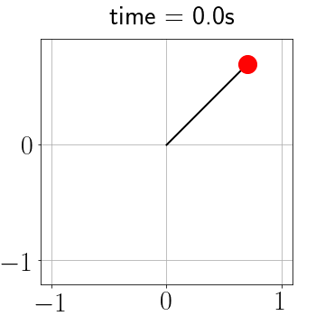

<link rel="stylesheet" href="https://maxcdn.bootstrapcdn.com/font-awesome/4.7.0/css/font-awesome.min.css">

{style="width: 600px;"}

# Scientific computation with Python

---

## Contact details

Dr William Rushworth

Email me via [william.rushworth@ncl.ac.uk](mailto:william.rushworth@ncl.ac.uk)

My office is Herschel 2.15 (the main building, not the annex)

Office hours are by appointment: please don't hesitate to contact me to arrange a meeting, either in-person or via Zoom. Also please feel free to knock on my door, even if you haven't made an appointment (I'm normally in the office 08:30 to 16:30, Monday to Friday).

---

### Lecture notes and materials

* The lectures for MAS2806-PHY2039 are recorded and will be posted to Canvas.

* All slides and other lecture materials will also be posted to Canvas.

* It's therefore not necessary for you to make extensive notes during lectures. 

* However, in future lectures you may wish to follow along by coding on a personal laptop.

---

### Today

This lecture is split into two halves:

**1) Some administration and motivation**

Structure of the module and some examples of the benefits of programming skills

**2) Week 1 content overview**

Description of what's covered in this week's practical session.

---

    <h2>Module introduction</h2>

---

### Module content

{style="width: 14%"}

This module covers the programming language **Python** and its use in tackling a variety of numerical methods, useful in particular to applied mathematics and physics.

Three levels of Python background in the module: some students have taken a semester of Python, some half a semester, and some have done no Python at university yet.

The module is designed to accommodate this: we will cover all necessary background, and by the second or third week it won't make much difference how much Python you have studied previously.

---

### Timetable

One lecture and one practical sesssion each week.

There are too many students to fit into the Herschel Cluster at once, so there are two practical sessions scheduled. Only one will appear on your timetable; please attend your timetabled session to avoid overcrowding the cluster.

<table class="table"  style="font-size: 0.8em;">
	<tr><th rowspan="2">Monday </th><td>Lecture </td><td>12:00-13:00</td><td>Herschel Curtis Auditorium</td></tr>
    <tr><td>Practical (some students)</td><td>16:00-18:00</td><td>Herschel Cluster</td></tr>
    <tr><th>Thursday</th><td>Practical (some students)</td><td>11:00-13:00</td><td>Herschel Cluster</td></tr>
</table>

---

## Full timetable

<table style="line-height: 1.05em; font-size: 0.75em;">
    <tbody>
        <tr >
            <th>Week No</th>
            <th>Week Begin</th>
            <th>Topic</th>
            <th>Assessment</th>
        </tr>
        <tr >
            <td>1</td>
            <td>23th Sept</td>
            <td>Foundations + Curve Fitting I</td>
            <td></td>
        </tr>
        <tr >
            <td>2</td>
            <td>30th Sept</td>
            <td>Curve Fitting II</td>
            <td>Assessment 1 opens Friday 16:00</td>
        </tr>
        <tr >
            <td>3</td>
            <td>7th Oct</td>
            <td>Matrices and Linear Algebra</td>
            <td></td>
        </tr>
        <tr >
            <td>4</td>
            <td>14th Oct</td>
            <td>Algorithms + Root Finding I</td>
            <td>Assessment 1 due Friday 16:00</td>
        </tr>
        <tr >
            <td>5</td>
            <td>21st Oct</td>
            <td>Root Finding II</td>
            <td></td>
        </tr>
        <tr >
            <td>6</td>
            <td>28th Oct</td>
            <td>Advanced Plotting</td>
            <td>Assessment 2 opens Friday 16:00</td>
        </tr>
        <tr >
            <td style="background-color: #ced4d9; text-align: center;" colspan="4"><em><strong>Enrichment week</strong></em></td>
        </tr>
        <tr >
            <td>7</td>
            <td>11th Nov</td>
            <td>Numerical differentiation and integration</td>
            <td></td>
        </tr>
        <tr >
            <td>8</td>
            <td>18th Nov</td>
            <td>Differential equations I</td>
            <td>Assessment 2 due Friday 16:00</td>
        </tr>
        <tr >
            <td>9</td>
            <td>25th Nov</td>
            <td>Differential equations II</td>
            <td></td>
        </tr>
        <tr >
            <td>10</td>
            <td>2nd Dec</td>
            <td>Looking forward</td>
            <td></td>
        </tr>
        <tr >
            <td>11</td>
            <td>9th Dec</td>
            <td>Revision</td>
            <td></td>
        </tr>
        <tr >
            <td style="background-color: #ced4d9; text-align: center;" colspan="5"><em><strong>Christmas break</strong></em></td>
        </tr>
    </tbody>
</table>

---

### Assessment

{style="width: 100%;"}

---

### Canvas page

The module Canvas page is organised into a dashboard for each week.

. . .

Each week contains:

* ReCap recording
* Lecture slides
* The virtual handout for the practical session, containing notes and exercises 
* Test yourself quiz

---

### Canvas overview

[{style="height:450px; border: 2px solid #AAA !important;"}](https://ncl.instructure.com/courses/53586){target="_blank"}

---

## Student voice

School modules have evolved over a number of years thanks to the feedback and input of students. 

See our [Student voice page](https://ncl.instructure.com/courses/59162/pages/student-voice){target="_blank"} for more information.

* You can send feedback to me any time via email or anonymously via the suggestions form (linked on the above page)
* Survey will be released around Week 4
* End of stage student evaluation at the end of the semester

---

### Suggestions when working on MAS2806-PHY2039

**There are no stupid questions:** please don't hesitate to ask questions during or after lectures and practical sessions, by email, by visiting my office. Questions of any type and at any level are welcome:

* Tech support e.g. 'my cursor has disappeared'
* Technical e.g. 'my code won't compile' or 'I get this error'
* Abstract e.g. 'can I accomplish this task with a shorter program?'
* Outlook e.g. 'what will I need these programming skills for?'

Also be prepared to have a go at diagnosing problems with your code. Code almost never works first time, and debugging a crucial skill.

---

    <h2>MAS2806/PHY2039 off-piste</h2>

---

### Off-piste section

The module Canvas page contains an Off-piste section: these are **optional** and **not testable** extra activities that use some of the skills developed in MAS2806-PHY2039.

There is no expectation or requirement that you look at this material, but you may find it interesting.

---

## Motivation

---

    <h3>Research </h3>

---

The vast majority of modern mathematics and physics research involves programming to some degree.

A good way to get some examples of this is by asking lecturers in your other modules, or the postgraduate demonstrators in the MAS2806-PHY2039 practical sessions: how do they use programming in their research work?

---

    <h3>Programming in your course </h3>

---

We could spend hours discussing the many ways in which programming will be useful to you as you progress through your degree.

We'll suffice ourselves by making the following observation:

> Computer implementation of mathematics often has a low price and a (very) high payoff

---

    <h2>An example</h2>

---

### Simple pendulum 

Consider the following differential equation:

$$ 
\frac{d^2\theta}{dt^2}+\theta =0 
$$

    

        
    

    

        
    

Pen and paper difficulty: 🌶 &nbsp;&nbsp;&nbsp;Computer difficulty: 🌶🌶

---

### Nonlinear pendulum

$$ 
\frac{d^2\theta}{dt^2}+\sin \left( \theta \right) =0 
$$

    

        
    

    

        
    

Pen and paper difficulty: 🌶🌶🌶 &nbsp;&nbsp;&nbsp;Computer difficulty: 🌶🌶

---

### Damped nonlinear pendulum 

$$ 
\frac{d^2\theta}{dt^2}+c\frac {d\theta }{dt} + \sin \theta =0 
$$

    

        
    

    

        
    

Pen and paper difficulty: 🌶🌶🌶🌶🌶 &nbsp;&nbsp;&nbsp;Computer difficulty: 🌶🌶🌶

---

### Driven damped nonlinear pendulum 

$$ 
\frac{d^2\theta}{dt^2}+c\frac {d\theta }{dt} + \sin \theta = a\cos(bt)  
$$

    

        
    

    

        
    

Pen and paper difficulty: &infin; &nbsp;&nbsp;&nbsp;Computer difficulty: 🌶🌶🌶

---

    <h2>Outside academia</h2>

---

As with the world of research, many careers pursued by mathematics and physics graduates involve a programming element.

E.g. an increasing number of undergraduates go on to MSc courses and internships in data science or analytics.

Newcastle graduates are in an excellent position to succeed in these roles.

