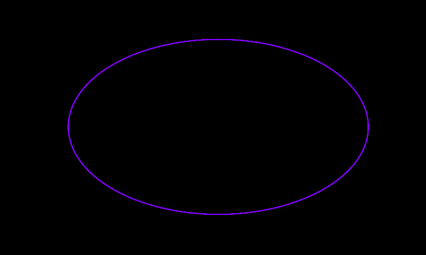
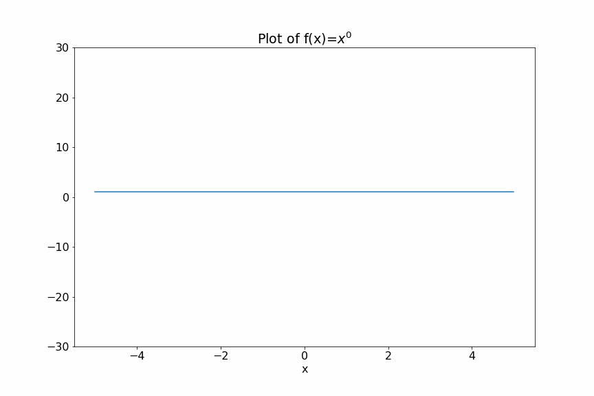
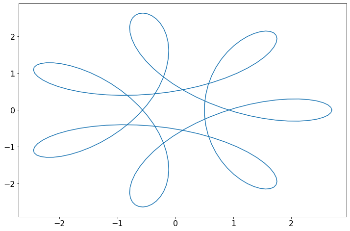
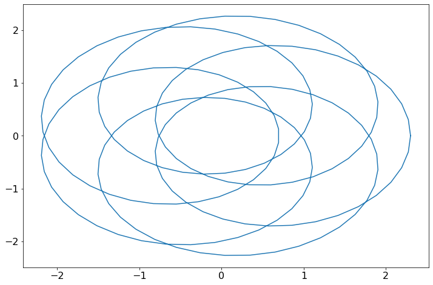
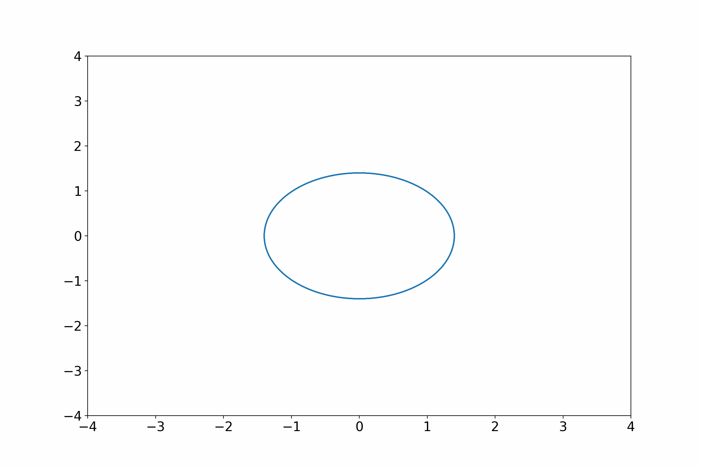
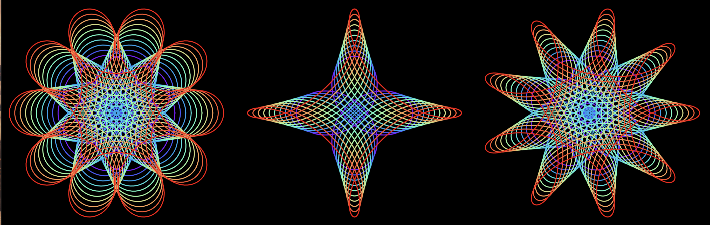

[Click here to open this handout in a new browser tab](#){target="_blank"}

<div class="interlude">
    <p>The material on this page is outside the scope of the module, and is not testable in the assignments or examinations. There is no requirement or expectation to read any of this material: it is presented to provide a selection of interesting things related to the skills and techniques covered in MAS2806-PHY2039.</p>
</div>

<h1><span style="font-size: 25px;">MAS2806/PHY2039 Off-Piste II:</span><br/>Animation Procrastination</h1>

Welcome to our second "off-piste". We're going to make an animation like this one (now my Google screensaver)

{style="width: 700px;"}


## Motivation

This page was motivated by a few different things:

1) Stage 3 students e-mailing me to ask how to do animations as part of their group project. They're often a great way to visualise.

2) Cool videos on the web like this one which illustrates trends in games consoles 

<iframe style="width: 450px; height: 280px;" src="https://www.youtube.com/embed/cbQVQnWfDvs" title="YouTube video player" frameborder="0" allow="accelerometer; autoplay; clipboard-write; encrypted-media; gyroscope; picture-in-picture" allowfullscreen></iframe> 

3) [This really cool applet of complex exponentials](https://cindyjs.org/gallery/main/Spiro/){target=_blank"} that I thought would turn into a shiny screensaver (which is what we're going to do today!)


## Basic Animation

Let's run through creating a basic animation

<iframe src="https://campus.recap.ncl.ac.uk/Panopto/Pages/Embed.aspx?id=3711d0f6-dc50-4dd0-a02c-af2f011531e0&autoplay=false&offerviewer=true&showtitle=true&showbrand=false&captions=false&interactivity=all" height="405" width="720" style="width: 720px; border: 1px solid #464646; margin: 20px 0;" allowfullscreen allow="autoplay"></iframe>

Below is the code that I created. Run the following command **in the console** first

```
%matplotlib qt
```

to open the animation in a new window.


```python
import numpy as np
import matplotlib.pyplot as plt
from matplotlib.animation import FuncAnimation, PillowWriter

# Create a figure
fig = plt.figure(figsize=(10, 6))
plt.rcParams['font.size'] = 14

x = np.linspace(-5,5,100)

def animate(i):
	# clear current axes
    plt.cla()
    # Create a plot
    plot = plt.plot(x,x**i)
    # Make it pretty
    plt.ylim([-30,30])
    plt.title('Plot of f(x)=$x^{}$'.format(i))
    plt.xlabel('x')
    return plot

# Creates an animation
anim = FuncAnimation(fig,func=animate,frames=10)

# Saves an animation
#anim.save("animation.gif", writer=PillowWriter(fps=2))
```

The commands `%matplotlib qt` and `%matplotlib inline` switch between using the plot tab and a new window (useful for previewing animations). These are called **magic commands**. They should be run in the console rather than your code or they'll trigger an error.

{style="width: 700px;"}


### Oscillation example

The above is not particularly inspiring, so in the next vid I'm going to use the above to create an animation of a damped oscillation:

<iframe src="https://campus.recap.ncl.ac.uk/Panopto/Pages/Embed.aspx?id=a51b9592-e223-477a-8729-af2f0115e1ff&autoplay=false&offerviewer=true&showtitle=true&showbrand=false&captions=false&interactivity=all" height="405" width="720" style="width: 720px; border: 1px solid #464646;" allowfullscreen allow="autoplay"></iframe>

Here's the code I created:

```python
import numpy as np
import matplotlib.pyplot as plt
from matplotlib.animation import FuncAnimation, PillowWriter

# Create a figure
fig = plt.figure(figsize=(10, 6))
plt.rcParams['font.size'] = 14

# The function that we're illustrating
t = np.linspace(0,30,200)
f = 2*np.exp(-0.1*t)*np.cos(t)

def animate(i):
	# Clear the axes
    plt.cla()

    # Add the full function to our plot in a faint colour
    plot = plt.plot(t,f,color="lightgrey")
    # Animate up to point i
    plt.plot(t[:i+1],f[:i+1])
    plt.plot(t[i],f[i],'o')
    # Make pretty
    plt.xlim([0,30])
    plt.ylim([-2.5,2.5])
    plt.xlabel('t')
    plt.title("t = {:.2f}".format(t[i]))
  
    return plot

# Create the animation 
anim = FuncAnimation(fig,func=animate,frames=200)

#anim.save("animation.gif", writer=PillowWriter(fps=20))
```

{style="width: 700px;"}


## Creating our screensaver

I was inspired by [this really neat applet ](https://cindyjs.org/gallery/main/Spiro/){target="_blank"} of complex exponentials

$$ z = r_1 e^{n_1i\phi}+r_2 e^{n_2i\phi}$$

for parameters $r_1$, $r_2$, $n_1$, $n_2$, illustrated in the complex plane... like this one:

```python
import numpy as np
import matplotlib.pyplot as plt

def complex_exp(phi,n,r):
    """
    Function to compute a complex exponential
    """
    return r*np.exp(-n*complex(0,1)*phi)

# choose some parameters
phi = np.linspace(0,2*np.pi,200)
n1 = -5
n2 = 2
r1 = 1.1
r2 = 1.6

# Add the two complex exponentials
f = complex_exp(phi,n1,r1)+complex_exp(phi,n2,r2)

plt.plot(f.real,f.imag)
```
{style="width: 600px;"}

Try changing the parameters to different values. Here is:

```python
n1 = 6
n2 = 1
r1 = 1.5
r2 = 0.8
```

{style="width: 600px;"}

I thought this would look very cool as an animation.

So let's use our animation code from earlier to animate this. I've adapted the animation code to include the function and parameters above, and I am varying just `r1` inside the `animate` function, by setting it up as an array

```python
r1 = np.linspace(0,2.2,100)
```

and then using the `r1[i]` value at each iteration `i` inside `animate`.

```python
import numpy as np
import matplotlib.pyplot as plt
from matplotlib.animation import FuncAnimation, PillowWriter

fig = plt.figure(figsize=(10, 6))

def complex_exp(phi,n,r):
    """
    Function to compute a complex exponential
    """
    return r*np.exp(-n*complex(0,1)*phi)

# choose some parameters
phi = np.linspace(0,2*np.pi,500)
n1 = -2
n2 = 5
r1 = np.linspace(0,2.2,100)
r2 = 1.4

def animate(i):
    plt.cla()
    z = complex_exp(phi,n1,r1[i])+complex_exp(phi,n2,r2)
    plot = plt.plot(z.real,z.imag)
    plt.xlim([-4,4])
    plt.ylim([-4,4])
    return plot

anim = FuncAnimation(fig,func=animate,frames=100)

#anim.save("animation.gif", writer=PillowWriter(fps=10))
```

{style="width: 700px;"}


### Finishing touches

The following sets the background completely black

```python
ax = fig.add_subplot()
ax.set_facecolor('black')
plt.axis('off')
fig.set_facecolor('black')
```


It's useful to create a variable for the number of frames, since I'm now re-using it in several places. And whilst I'm at it, I've increased the number of frames to slow down the animation.

```python
nframes = 400
```

I've set the animation to return back to its orginal frame by letting `r1`  grow and then shrink again, such that the gif makes a seamless loop. 


```python
# Values 0 to 2.5
r1_vals = np.linspace(0,2.5,int(nframes/2))
# Values 0 to 2.5 then back ro 0
r1 = np.concatenate([r1_vals,np.flip(r1_vals)]) 
```

I've done the same with some colours to create a rainbow effect which starts at purple, moves to red, then back again using the "rainbow" colour map (this is for aesthetic pleaseure only!)

```python
# Get rainbow colour map
rainbow = cm.get_cmap('rainbow')
# Get an array of colours from the colour map
vals = np.linspace(0,1,int(nframes/2))
rainbow_colours = rainbow(np.concatenate([vals,np.flip(vals)]))

```

Finally since I now have no axes, letting the plot scale to the figure by removing the axis limits (`plt.xlim` and `plt.ylim`) gives a nice plot that fills the screen

{style="width: 700px;"}

Here's the full code

```python
import numpy as np
import matplotlib.pyplot as plt
from matplotlib.animation import FuncAnimation, PillowWriter
from matplotlib import cm

# No of frames to use
nframes = 800

# Create a figure
fig = plt.figure(figsize=(10, 6))

# Set background to black
ax = fig.add_subplot()
ax.set_facecolor('black')
plt.axis('off')
fig.set_facecolor('black')

def complex_exp(phi,n,r):
    return r*np.exp(-n*complex(0,1)*phi)

phi = np.linspace(0,2*np.pi,500)
n1 = -2
n2 = 5
r1_vals = np.linspace(0,2.5,int(nframes/2))
r1 = np.concatenate([r1_vals,np.flip(r1_vals)])
r2 = 1.4

# Get some colours
rainbow = cm.get_cmap('rainbow')
vals = np.linspace(0,1,int(nframes/2))
rainbow_colours = rainbow(np.concatenate([vals,np.flip(vals)]))

# Function for the animation
def animate(i):
    plt.cla()
    z = complex_exp(phi,n1,r1[i])+complex_exp(phi,n2,r2)
    plot = plt.plot(z.real,z.imag,color=rainbow_colours[i])
    return plot

anim = FuncAnimation(fig,func=animate,frames=nframes)

anim.save("animation.gif", writer=PillowWriter(fps=8))
```


<div class="exercise" markdown=true>

### Not an exercise

Try changing around other parameters to see what you can create... here I've also changed `n2`:

{style="width: 700px;"}

What other animations can you make with Python? I would love to hear from you!

</div>


<!--

	import numpy as np
import matplotlib.pyplot as plt
from matplotlib.animation import FuncAnimation, PillowWriter
from matplotlib import cm

rainbow = cm.get_cmap('rainbow')
rainbow_colours = rainbow(np.concatenate([np.linspace(0,1,300),np.linspace(1,0,300)]))


fig = plt.figure(figsize=(6, 4))

def complex_exp(phi,n,r):
    return r*np.exp(-n*complex(0,1)*phi)

phi = np.linspace(0,2*np.pi,500)
n1 = -8
n2 = np.concatenate([np.linspace(1,5,300),np.linspace(5,1,300)])
r1 = np.concatenate([np.linspace(0,2.5,300),np.linspace(2.5,0,300)])
r2 = 1.4

# Set background to black
ax = fig.add_subplot()
ax.set_facecolor('black')
plt.axis('off')
fig.set_facecolor('black')

def animate(i):
    plt.cla()
    z = complex_exp(phi,n1,r1[i])+complex_exp(phi,n2[i],r2)
    plot = plt.plot(z.real,z.imag,color=rainbow_colours[i])
    return plot

anim = FuncAnimation(fig,func=animate,frames=600)

anim.save("animation.gif", writer=PillowWriter(fps=8))
-->


## Addendum

If you replace the animation function with a for loop to plot multiple instances together, then you get some very pretty images...


{style="width: 100%;"}

Here's the code. Edit the parameters to create your own!

```python
import numpy as np
import matplotlib.pyplot as plt
from matplotlib import cm

# No of frames to use
nframes = 10

# Create a figure
fig = plt.figure(figsize=(6, 6))

# Set background to black
ax = fig.add_subplot()
ax.set_facecolor('black')
plt.axis('off')
fig.set_facecolor('black')

def complex_exp(phi,n,r):
    return r*np.exp(-n*complex(0,1)*phi)

# Parameters
phi = np.linspace(0,2*np.pi,500)
n1 = -5
n2 = 2
r1 = np.linspace(1.2,1.6,nframes)
r2 = 1.4

# Get some colours
rainbow = cm.get_cmap('rainbow')
rainbow_colours = rainbow(np.linspace(0,1,nframes))

# Add to plot
for i in range(nframes):
    z = complex_exp(phi,n1,r1[i])+complex_exp(phi,n2,r2)
    plt.plot(z.real,z.imag,color=rainbow_colours[i])
```
