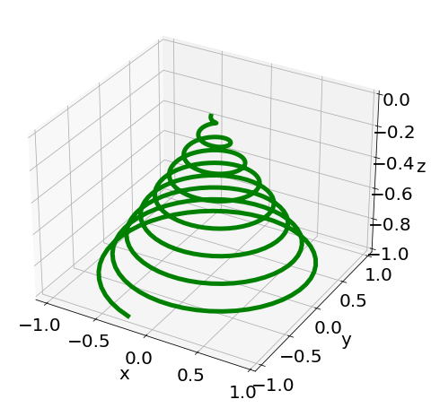

[Click here to open this handout in a new browser tab](#){target="_blank"}

<div class="interlude">
	<p>The material on this page is outside the scope of the module, and is not testable in the assignments or examinations. There is no requirement or expectation to read any of this material: it is presented to provide a selection of interesting things related to the skills and techniques covered in MAS2806-PHY2039.</p>
</div>

<h1><span style="font-size: 25px;">MAS2806/PHY2039 Off-Piste 8:</span><br/>Christmas Trees</h1>

In this edition of MAS2806/PHY2039 off-piste, I have one goal, and that is to make a shiny Christmas Tree. 🎄

To get there, I'm going to introduce you to the Barnsley Fern: arguably the coolest thing that you can plot in 30 lines of Python code!

##  Barnsley Fern

The Barnsley Fern (named after the mathematician Michael Barnsley, rather than the South Yorkshire Town) is a fractal pattern generated through what's known as an [iterated function system](https://en.wikipedia.org/wiki/Iterated_function_system){target="_blank"}.

The way it works is not difficult to code up: we generate a series of $(x,y)$ coordinates through a number of different transformations to go from $(x_n,y_n)$ to $(x_{n+1},y_{n+1})$, weighted by probability.

The Barnsley fern is specifically generated through the following:

* This generates points on the leaf stem (used with probability 0.01)
  $${\displaystyle f_{1}(x,y)={\begin{pmatrix}\ 0.00&\ 0.00\ \\0.00&\ 0.16\end{pmatrix}}{\begin{pmatrix}\ x\\y\end{pmatrix}}}$$

* This generates successsively smaller ferns (used with probability 0.85)
  $${\displaystyle f_{2}(x,y)={\begin{pmatrix}\ 0.85&\ 0.04\ \\-0.04&\ 0.85\end{pmatrix}}{\begin{pmatrix}\ x\\y\end{pmatrix}}+{\begin{pmatrix}\ 0.00\\1.60\end{pmatrix}}}$$

* This generates leaves on the left (probability 0.07)
  $${\displaystyle f_{3}(x,y)={\begin{pmatrix}\ 0.20&\ -0.26\ \\0.23&\ 0.22\end{pmatrix}}{\begin{pmatrix}\ x\\y\end{pmatrix}}+{\begin{pmatrix}\ 0.00\\1.60\end{pmatrix}}}$$

* This generates leaves on the right (probability 0.07)
  $${\displaystyle f_{4}(x,y)={\begin{pmatrix}\ -0.15&\ 0.28\ \\0.26&\ 0.24\end{pmatrix}}{\begin{pmatrix}\ x\\y\end{pmatrix}}+{\begin{pmatrix}\ 0.00\\0.44\end{pmatrix}}}$$

There are some lovely short videos which illustrate each of the transformations on [this page, around half way down](https://www.algorithm-archive.org/contents/barnsley/barnsley.html){target="_blank"}.

Coding this is relatively straightforward: we create some arrays (`x` and `y`), use a for loop and choose how to transform based on a random value (`r`) generated at each iteration. Here's some code.

```python
import matplotlib.pyplot as plt 
import numpy as np 

# Nice big plot 
plt.figure(figsize=(20,30)) 
  
# initialize x and y
nmax = 1000000
x = np.zeros(nmax) 
y = np.zeros(nmax) 

for n in range(nmax-1): 

    # generates a random number in [0,1] 
    r = np.random.rand()

    # Get the next value based on r
    if r <= 0.01: 
        x[n+1] = 0 
        y[n+1] = 0.16*y[n] 
    elif r > 0.01 and r <= 0.86: 
        x[n+1] = 0.85*x[n] + 0.04*y[n]
        y[n+1] = -0.04*x[n] + 0.85*y[n] + 1.6 
    elif r > 0.86 and r <= 0.93: 
        x[n+1] = 0.2*x[n] - 0.26*y[n] 
        y[n+1] = 0.23*x[n] + 0.22*y[n] + 1.6
    else:
        x[n+1] = -0.15*x[n] + 0.28*y[n] 
        y[n+1] = 0.26*x[n] + 0.24*y[n] + 0.44 

plt.plot(x, y, 'o', color='#4d9e3a', markersize = 0.5) 
plt.axis('off') 
```

How amazing is this!

{width=60%}

If you'd like a higher-res image, increase `nmax` and reduce the `markersize` in `plt.plot`.

<div class="exercise" markdown=true>

### Not an exercise 

Have a go at just changing some of the parameters, probabilities etc to see how it changes the look. That's exactly what I did in the next section.

</div>

## Christmas Tree!

So to make the Christmas tree below, I did the following:

* Messed around with the parameters in the Barnsley Fern til I had something that looked Christmas-tree-like. Even added in a power e.g. $x^{4/5}$ to add a bit of curve.
* Added baubles using some colours and coordinates. At first I tried to be clever about generating positions for these, but it looked weird, so I ended up just hand picking them more randomly.
* The baubles have a "thread" to hang from the tree using an additional `|` marker and a second marker overlaying the bauble adds a bit of shadow!
* Added a star on top!

Enjoy... 

```python
import matplotlib.pyplot as plt 
import numpy as np 

# Nice big plot 
plt.figure(figsize=(20,30)) 
  
# initialize x and y
nmax = 1000000
x = np.zeros(nmax) 
y = np.zeros(nmax) 

for n in range(nmax-1): 

    # generates a random number in [0,1] 
    r = np.random.rand()

    # Get the next value based on r
    if r <= 0.05: 
        x[n+1] = 0 
        y[n+1] = 0.2*y[n] 
    elif r > 0.05 and r <= 0.87: 
        x[n+1] = 0.7*x[n] + 0.005*y[n]
        y[n+1] = -0.02*x[n] + 0.83*y[n] + 0.9
    elif r > 0.87 and r <= 0.93: 
        x[n+1] = 0.3*x[n] - 0.28*y[n]**(4/5) 
        y[n+1] = 0.3*x[n] + 0.28*y[n] + 0.2
    else:
        x[n+1] = -0.3*x[n] + 0.28*y[n]**(4/5) 
        y[n+1] = 0.3*x[n] + 0.28*y[n] + 0.2

plt.plot(x, y, 'o', color='#4d9e3a', markersize = 0.5) 
plt.axis('off') 

# Add some baubles
baubles = [[-1.025,1.455],[1.025,1.455],[0.73,2.05],
           [-0.69,2.05], [-0.31,3],[0.5,1.5],
           [-0.3,1.23],[0.3,0.31],[0.2,1.85],
           [0.1,2.8],[-0.6,0.68],[-0.07,3.9],
           [0.21,3.59],[-0.25,2.0],[0.06,0.9],
           [0.6,0.7],[-0.07,2.3],[0.3,2.75]]

# Various colours for baubles
colors = ["silver","goldenrod","indianred","firebrick","lightsteelblue"]

for b in baubles:
    # Get a colour
    c = np.random.choice(colors)
    # Add bauble thread
    plt.plot(b[0],b[1]+0.1,'|',color=c,markersize=80)
    # Add bauble
    plt.plot(b[0],b[1],'o',color=c,markersize=40)
    # Add bauble shadow
    plt.plot(b[0]+0.01,b[1]-0.01,'o',color='white',markersize=30,alpha=0.2)

# Star on the top!
plt.plot(0.08,5.1,'*',color='goldenrod',markersize=150)
plt.plot(0.08,5.1,'*',color='white',markersize=100,alpha=0.3)
```

{width=60%}

Finally, just the icing on the cake, a little bit of animation to make the baubles more like twinkling lights...

```python
bauble_colours = np.random.choice(colors,len(baubles))


def animate(i):
    n = 0
    for b in baubles:
        # Re-draw bauble
        plt.plot(b[0],b[1],'o',color=bauble_colours[n],markersize=40)
        # Add bauble shadow randomly
        if np.random.choice([0,1]):
            plt.plot(b[0],b[1],'o',color='white',markersize=40,alpha=0.4)
        n += 1


anim = FuncAnimation(fig,func=animate,frames=20)
anim.save("animation.gif", writer=PillowWriter(fps=2))
```

I've even grabbed some [royalty free music](https://pixabay.com/music/search/genre/christmas/){target="_blank"} to play whilst you enjoy looking at this one!

<audio controls>
  <source src="../../static/mp3/happy-jingle-bells-128756.mp3" type="audio/mpeg">
Your browser does not support the audio element.
</audio>


{width=60%}

Thanks everyone, hope you have happy holidays and good luck with the exam in January!

<div class="exercise" markdown=true>


### Not an exercise: decorate my door! 

Send me your Python-made Christmas tree (and the code to make it). Or if you're just celebrating winter/holidays, a snow flake / snowman / whatever and I'll put you on my door to brighten up the 3rd floor of Herschel.

You could check out [Sierpiński triangles](https://en.wikipedia.org/wiki/Sierpi%C5%84ski_triangle){target="_blank"}, or [Koch Snowflakes](https://en.wikipedia.org/wiki/Koch_snowflake){target="_blank"}, try your own parameters with the Barnsley Fern or add some baubles to the Test Yourself in week 6...

{width=60%}

</div>
