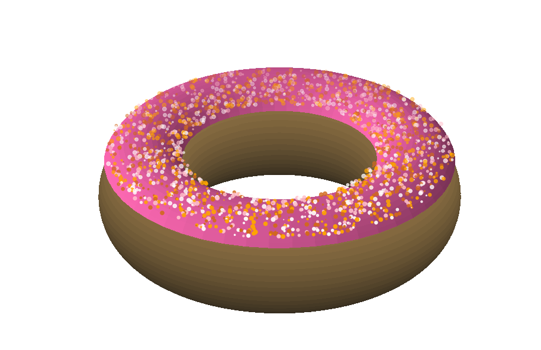

[Click here to open this handout in a new browser tab](#){target="_blank"}

<div class="interlude">
    <p>The material on this page is outside the scope of the module, and is not testable in the assignments or examinations. There is no requirement or expectation to read any of this material: it is presented to provide a selection of interesting things related to the skills and techniques covered in PHY2039.</p>
</div>

<h1><span style="font-size: 25px;">PHY2039 Off-Piste III:</span><br/>Cooking better doughnuts!</h1>

A fun topic for this off-piste, but one with lots of interesting applications of plotting...

## Video walk through

<iframe src="https://campus.recap.ncl.ac.uk/Panopto/Pages/Embed.aspx?id=9734c493-2d19-4832-af48-af420088c3cc&autoplay=false&offerviewer=true&showtitle=true&showbrand=false&captions=false&interactivity=all"  style="height: 405px; width: 720px; border: 1px solid #464646;" allowfullscreen allow="autoplay"></iframe>

## The code


I added some comments and tidied up the code a bit. Here goes...

```python
"""
Create a donut made up of a torus
and some random sprinkles
"""
import numpy as np
import matplotlib.pyplot as plt
from matplotlib.colors import LinearSegmentedColormap

def pol2cart(rho, phi):
    """
    Converts polar to cartesian
    """
    x = rho * np.cos(phi)
    y = rho * np.sin(phi)
    return(x, y)

# Create some custom colormap gradients
brown = LinearSegmentedColormap.from_list("Custom", ['#2b251a','#967747'], N=256)
pink = LinearSegmentedColormap.from_list("Custom", ['#de59d1','#ff4aed'], N=256)

# Create a 3D figure and turn off the axis
# Computed_zorder overwrites matplotlib trying to cleverly order things, allowing us to use zorder
fig = plt.figure(figsize=(20,20))
ax = fig.add_subplot(projection='3d', computed_zorder=False)
plt.axis('off')

# Meshgrid of theta and phi for computing X,Y,Z
theta = np.linspace(0,2*np.pi,200)
phi = np.linspace(0,2*np.pi,200)
THETA,PHI = np.meshgrid(theta,phi)

# Create our doughnut!
X = (3 + np.cos(PHI)) * np.cos(THETA)
Y = (3 + np.cos(PHI)) * np.sin(THETA)
Z = np.sin(PHI)
ax.plot_surface(X, Y, Z, cmap=brown, antialiased=False, zorder=1)

# Add icing!
ZTOP = np.sin(PHI)+0.3
ZTOP[ZTOP<0.8]=None 
ax.plot_surface(X, Y, ZTOP, color='hotpink', antialiased=False,  zorder=2)

# Add some sprinkles!

# Coordinates for sprinkles
no_sprinkles = 2000
rho = 2.1+1.8*np.random.rand(no_sprinkles)
phi = 2*np.pi*np.random.rand(no_sprinkles)
x,y = pol2cart(rho,phi)
z = np.ones(x.shape)

# Random colours and sizes
colours = np.random.choice(["pink", "snow", "chocolate", "orange"], no_sprinkles)
sizes = np.random.randint(1, 100, no_sprinkles)

# Let's sprinkle
ax.scatter(x, y, z, c=colours, s=sizes, marker='o', zorder=3)

# Make our doughnut doughnut-y
ax.set_zlim([-3,3])
```

{style="width: 80%; max-width: 600px;"}


## Resources and comments

Here are a few comments, particularly on the aspects that took us beyond the course material.

### Colours

A surfce plot can use either a [colour](https://matplotlib.org/stable/gallery/color/named_colors.html){target="_blank"} (`colour=`) or a [colour map](https://matplotlib.org/stable/tutorials/colors/colormaps.html){target="_blank"} (`cmap = `).

In the video I used HTML colour codes: you can use these instead of a Matplotlib name - there's a [useful colour picker here](https://www.w3schools.com/colors/colors_picker.asp){target="_blank"}.

These were used to create a custom "colour map", which was a gradient from dark to lighter brown in the following line (and I also added one for pinks)

```python
from matplotlib.colors import LinearSegmentedColormap

brown = LinearSegmentedColormap.from_list("Custom", ['#2b251a','#967747'], N=256)
```

### Antialiasing 

To make the surface look leess like a plot and more like an image, I used `antialiased=False`. This changes the way that surface point values are interpolated. You can read [more about aliasing here](https://matplotlib.org/stable/gallery/images_contours_and_fields/image_antialiasing.html){target="_blank"}.


### Z order

Specifying the order of graphics made from different layers is a common task in things like graphic design and web design. 

When multiple things are plotted on axes, Matplotlib tries to decide what it should show to the user automatically. In this case I wanted to make sure that the scatter was on top of my icing which was on top of my doughnut. 

The following additional option (`computed_zorder=False`) told Matplotlib to stop trying to be so clever:

```python
ax = fig.add_subplot(projection='3d', computed_zorder=False)
```

and then I used the `zorder` option to determine the layer order.  The `zorder` value is relative to other layers (only matters which is larger, not the value), and a larger value of `zorder` puts it higher. For example

```python
ax.plot_surface(X, Y, Z, cmap=brown, antialiased=False, zorder=1)
ax.scatter(x, y, z, c=colours, s=sizes, marker='o', zorder=2)
```

Puts the scatter plots on top of the surface plot

<div class="exercise" markdown=true>

### Not an exercise {: .exercise}

Maybe you can make me a plate of doughnuts... (lots of use of `zorder`)? Or use surface plots to make some other food (or indeed anything else fun).

Bye for now!

</div>


