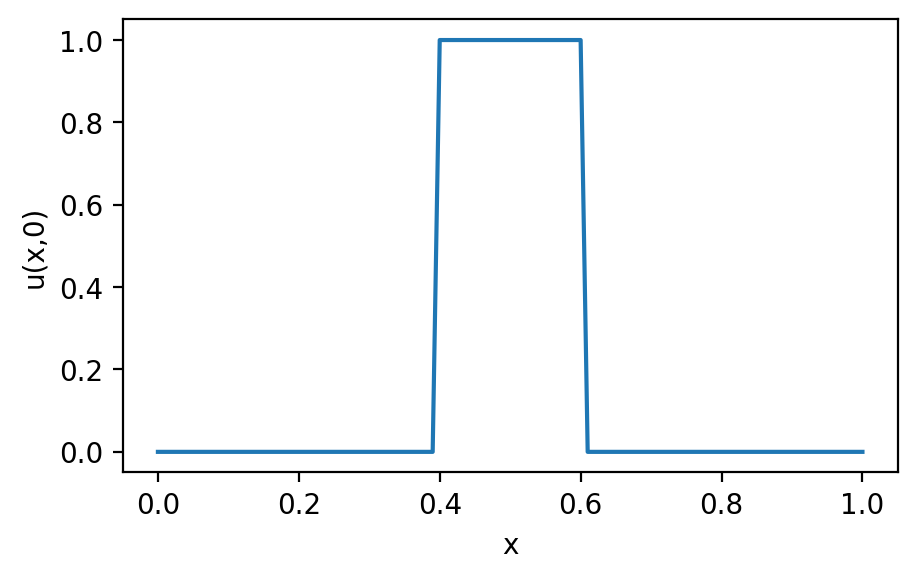
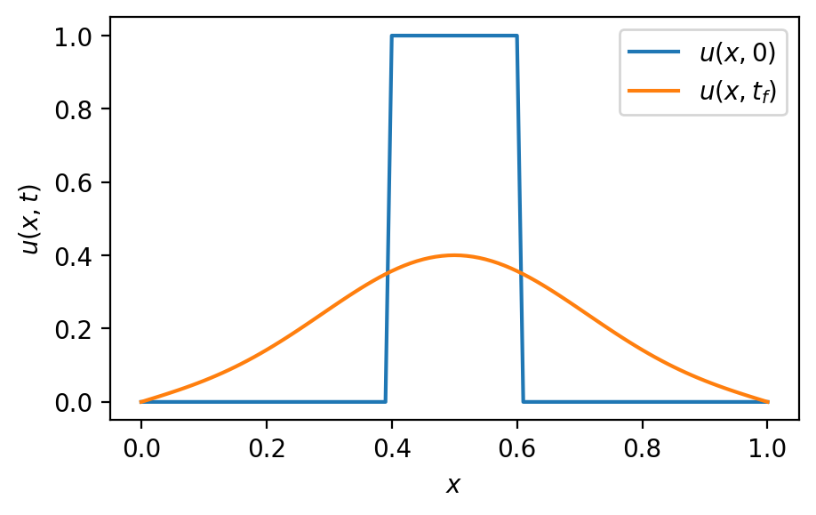
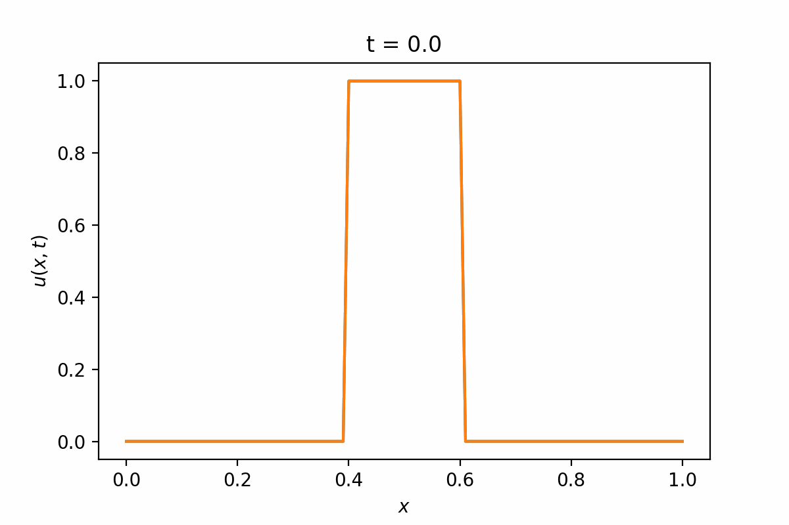

<div class="interlude">
    <p>This is an extension topic and does not form part of the MAS2806-PHY2039 exam.</p>
</div>

# Partial Differential Equations

In the lectures, I've mentioned in a couple of places that the methods we're using to tackle numerical differentiation and ordinary differential equations, will be useful later in your degree for solving partial differential equations.

This is a huge topic... we used to have the best part of a whole module on numerical solutions to PDEs! So this is really just a small flavour - it might be useful to refer back to if you come across this sort of thing in a project later in your degree.

## Partial Differential Equations

You'll meet analytic solutions to Partial Differential Equations in stage 3. We're going to look at the one-dimensional Heat (or Diffusion) Equation

\[ \frac{\partial u}{\partial t} = \alpha \frac{\partial^2 u}{\partial x^2} \]

The equation describes how heat diffuses through a medium, with temperature $u(x,t)$. The constant $\alpha > 0$ (a in my code) is a constant and represents the thermal diffusivity of the medium being studied.

### Link to the Euler Method

You can see a link to the Euler Method (and similar e.g. RK4), in that we solved equations like

\[ \frac{\mathrm{d}y}{\mathrm{d}t} = f(y,t) \]

in our module. Using methods like

\[ u_{n+1} = u_n + hf(y,t) \]

The difference here is that $u$ is a function of $x$ and $y$, and what is written above as $f(u,t)$ contains a second derivative of $u$ with respect to $x$. Nonetheless, in the code below you'll see a step that looks just like this.

### Link to numerical differentiation

You may also see a link to the finite difference methods that we studied in our module. 

In particular, we need a second derivative, for which we had an equation in handout 7:

\[ \frac{\mathrm{d}^2f}{\mathrm{d}x^2} = \frac{f(x+h)-2f(x)+f(x-h)}{h^2} + \mathcal{O}(h^2)  \]

### Pulling these together

Let's rewrite the heat equation problem in terms of these methods...

We'll let the step in time use the index n (which I'll put as superscript) and the index for the spatial derivative be i (which Ill put as subscript).

We'll call the $h$ in the Euler Equation $\Delta x$ and the $h$ in the central difference method $\Delta x$

This would look like

\begin{align} 
u_{i}^{n+1} &= u_{i}^n + \Delta t \; a\; \frac{u_{i-1}^n-2u_{i}^n+u_{i+1}^n}{\Delta t^2} \\
&= u_{i}^n + \frac{a\Delta x}{\Delta t^2}\left(u_{i-1}^n-2u_{i}^n+u_{i+1}^n\right)
\end{align}

### Initial / boundary conditions

So we're going to need two arrays (one for $x$ and one for $t$) to represent the grid we're looking for a solution on. 

```python
# x domain of interest
dx = 0.01
x = np.arange(0,1+dx,dx)

# t array
dt = 0.01
t = np.arange(0,20+dt,dt)
```

What about initial conditions? A typical problem like this would specify the initial distribution $u(x,0)$. I'm going to make a "hat function".

```python
# Initialize u(x,t)
u = np.zeros([len(x),len(t)])

# Fill with ones in the middle to make a step
u[40:-40, 0] = 1

# Plot initial u(x,0) 
plt.plot(x, u[:, 0], label='$u(x,0)$')
plt.xlabel('x')
plt.ylabel('u(x,0)')
```

{width="70%"}

The other conditions that we might are boundary conditions. Here we're going to assume that $u(0,t) = u(1,t) = 0$, i.e. at the edges of our x range, we assume that $u$ is zero. 

This will be convenient, because it saves me using a finite difference method at the boundaries (recall the left and right sided that we used): I just won't update values at these edges.

### Finding a solution

Here's a piece of code to now proceed. The outer loop handles the time step (moving from index n to n+1) whilst the inner one handles the spatial derivative.

```python
# thermal diffusivity
a = 0.001  

# Outer for loop is the time step
for n in range(len(t)-1):
    # Inner loop is space step
    for i in range(1,len(x)-1):
        # This is the 2nd derivative central difference
        u[i, n+1] = u[i, n] + a * dt/dx**2  * (u[i+1, n] - 2*u[i, n] + u[i-1, n])
```

Finally let's plot

```python
plt.plot(x, u[:, -1], label='$u(x,t_f)$') 
```

### Full code

Here's the full code and plot

```python
import numpy as np
import matplotlib.pyplot as plt

# Create a figure
plt.figure(figsize=(5,3),dpi=200)

# x domain of interest
dx = 0.01
x = np.arange(0,1+dx,dx)

# t array
dt = 0.01
t = np.arange(0,20+dt,dt)

# Initialize u(x,t)
u = np.zeros([len(x),len(t)])

# Fill with ones in the middle to make a step
u[40:-40, 0] = 1

# Plot initial u(x,0) 
plt.plot(x, u[:, 0], label='$u(x,0)$')
#plt.xlabel('x')
#plt.ylabel('u(x,0)')

# thermal diffusivity
a = 0.001  

# Outer for loop is the time step
for n in range(len(t)-1):
    # Inner loop is space step
    for i in range(1,len(x)-1):
        # This is the 2nd derivative central difference
        u[i, n+1] = u[i, n] + a * dt/dx**2  * (u[i+1, n] - 2*u[i, n] + u[i-1, n])
        
# Plot the final solution
plt.plot(x, u[:, -1], label='$u(x,t_f)$')
plt.xlabel('$x$')
plt.ylabel('$u(x,t)$')
plt.legend()
```

{width="70%"}


### Animation

A nice way to visualise this is an animation. Returning to my "go to" code for animations in the Off-Piste section, this could look like:

```python
# Assumes u is already set

from matplotlib.animation import FuncAnimation, PillowWriter

# Create a figure
fig = plt.figure(figsize=(6,4),dpi=200)


def animate(i):
    """ 
    This function is called for each frame
    plot i*20 to skip past some frames
    """
    plt.cla()  
    plt.plot(x, u[:,0])                 
    plt.plot(x, u[:,(i*20)])   
    plt.title(f"t = {round(t[(i*20)],1)}")    
    plt.xlabel('$x$')
    plt.ylabel('$u(x,t)$')

# Create an animation
anim = FuncAnimation(fig,func=animate,frames=100)

# Save as a gif file
anim.save("animation.gif", writer=PillowWriter(fps=20))

```

{width="70%"}

Or alternatively, since this is 1D, we could think of it like a thin bar, heated initially in the middle. Here I've modified the animation to use `imshow` with a colourmap to illustrate:

{width="100%"}

Here's the modified function:

```python
def animate(i):
    """ 
    This function is called for each frame
    """
    plt.cla()  
    plt.imshow([u[:,(i*20)],u[:,(i*20)]],vmin=0, vmax=1, cmap='coolwarm')
    plt.title(f"t = {round(t[(i*20)],1)}")    
    plt.xlabel('$x$')
    plt.yticks([])
```

## Next steps

Hopefully this taster of solving PDEs will be useful to you some day! As I mentioned earlier, this is a massive topic with an awful lot more to it than this!

For more, see your future modules or pick yourself up any numerical methods for maths/physics/engineering book.


