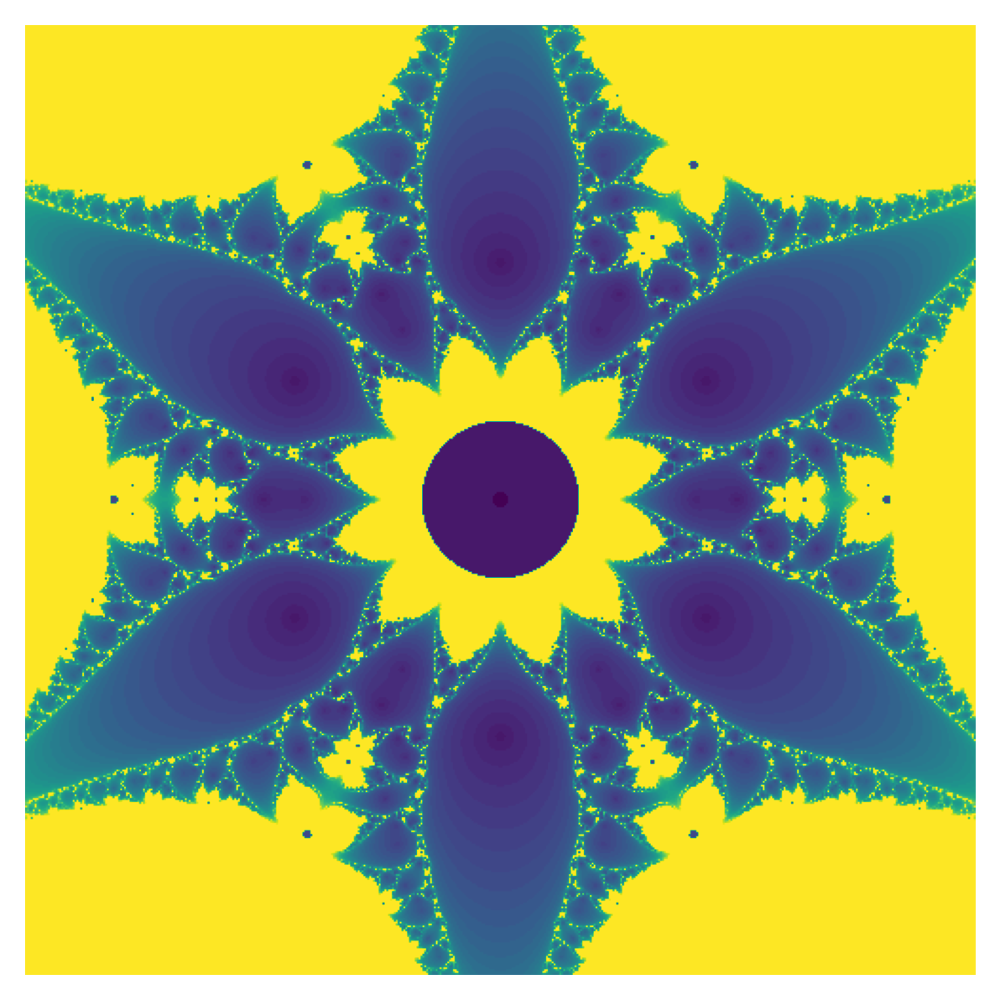
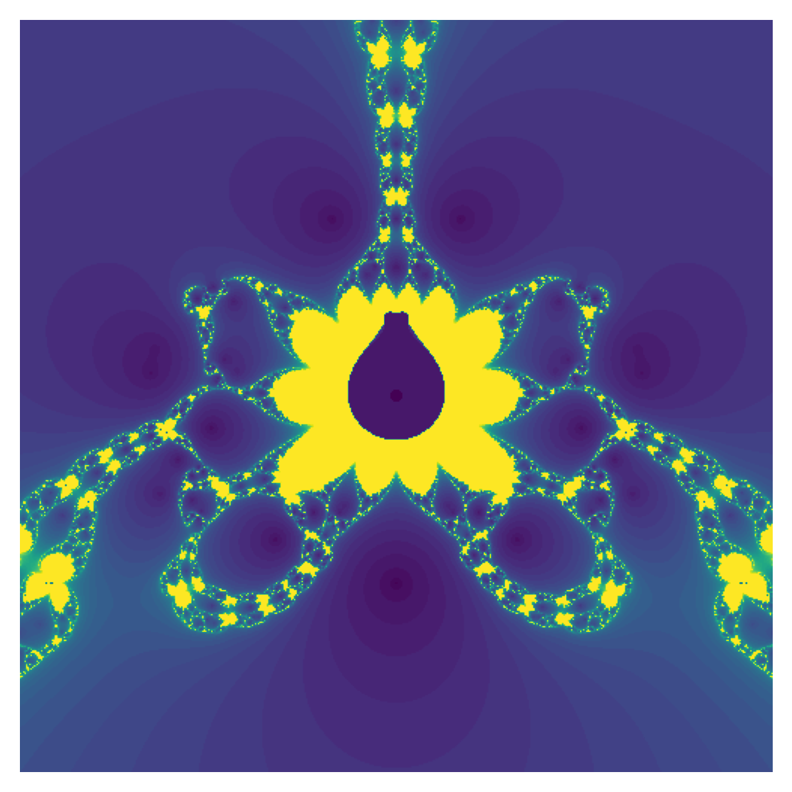
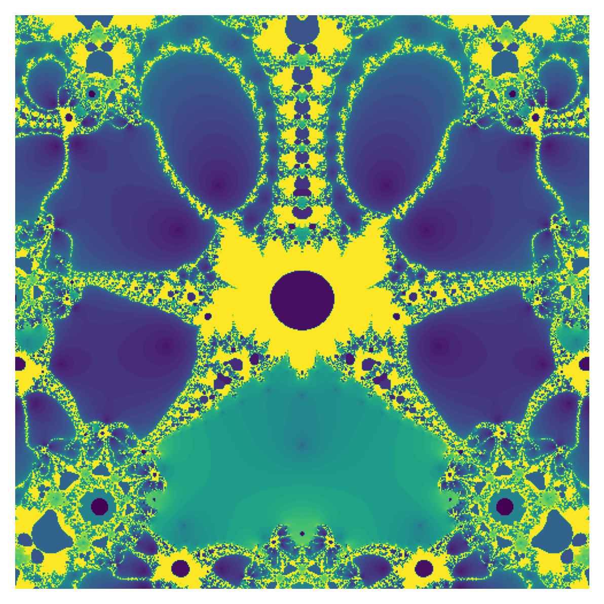
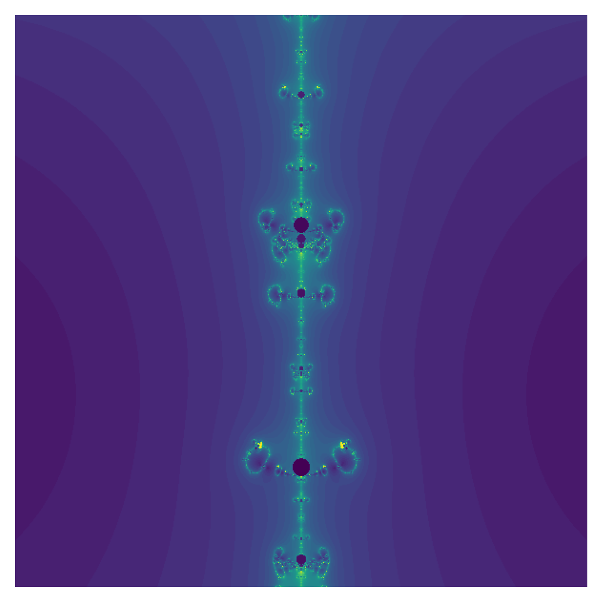

[Click here to open this handout in a new browser tab](#){target="_blank"}

<div class="interlude">
    <p>The material on this page is outside the scope of the module, and is not testable in the assignments or examinations. There is no requirement or expectation to read any of this material: it is presented to provide a selection of interesting things related to the skills and techniques covered in MAS2806-PHY2039.</p>
</div>

<h1><span style="font-size: 25px;">MAS2806/PHY2039 Off-Piste 4:</span><br/>Secant Fractals</h1>


## Introduction

This week we're looking at some other ways that fractal images drop out of root finding methods. In particular, we're going to create them by looking at the number of iterations to find a root when the starting value is changed. This is related of course to the stuff we've done with the Newton-Raphson method to create the Newton fractals, but this time we're interested in the number of iterations and will disregard which roots we're actually finding.

It turns out that it's better to use the Secant Method for this task, as it converges less quickly than Newton-Raphson, and in the context of creating pretty images, that is actually more desirable.

We'll start with the Secant Method function from lecture/handout 5:

```python
def secant(f,x0,x1,eps):
	"""
	Find the root of f(x) with starting values x0 and x1
	using the Secant method. Uses tolerance eps.
	""" 
    n = 0
    
    while abs(x1 - x0) > eps:
        x2 = x1 - f(x1)*(x1-x0)/(f(x1)-f(x0))
        x0 = x1
        x1 = x2
        n += 1
        
    return x1, n
```

Our intention will be to store the number of iterations for several starting conditions, across a 2D grid of complex numbers, similar to our approach in handout 5.

The first thing we're going to do is add an extra input argument: we're really going to be pushing the algorithm to its limits, so it will be desirable to put a cap on the number of iterations that we run. If we end up running to an extraordinary large number than we're going to end up losing a lot of the more intricate detail in the fractals. The colours that we see in our colourmap are determined by the values in the matrix of iterations we're going to create, and if we have very large numbers then it will make all of the interesting values look very similar in terms of colour.

So let's add that extra argument and give it a default value, say 80. I'm also giving the tolerance a default value that's not too small. These are values that we can play around with later on.

```python
def secant(f,x0,x1,eps = 1e-4, nmax = 80):
	"""
	Find the root of f(x) with starting values x0 and x1
	using the Secant method. Uses tolerance eps
	and max iterations nmax
	"""
    n = 0
    
    while abs(x1 - x0) > eps and n < nmax:
        x2 = x1 - f(x1)*(x1-x0)/(f(x1)-f(x0))
        x0,x1 = x1,x2
        n += 1
        
    return x1, n
```

So the largest value that we get back for `n` will be capped at `nmax`.

## Storing the number of iterations

Let's look at an example from handout 5:

\[ f(z) = z^3 - 1 \]

where $z = a+ib$ and we will vary $a$ and $b$ across some values.

As in handout 5, we could create arrays for $a$ and $b$

```python
m = 100
a = np.linspace(-3,3,m)
b = np.linspace(-3,3,m)
```

where $m$ is a parameter that will effectively determine the resolution of our final image. As we'll see, the time taken will scale as $\mathcal{O}(m^2)$, so be careful with this value. When I was trying things out I was using $m \sim 100$ and for creating final plots $m \sim 1000$.

At each iteration we're going to change one of the starting guesses and store the `n` value that comes back from the Secant Method, so this might look like

```python
# m x m array
M = np.zeros([m,m])

# Fix z1
z1 = 0

# Loop through
for i in range(m):
	for j in range(m):
		# New z0 value
		z0 = complex(a[i],b[j])
		r,n = secant(lambda z : z**3-1, z0, z1)
		M[i,j] = n
```

In this example, I've fixed the other starting guess to $z_1 = 0$. This could be anything and turns out that it changes the plot considerably. It could also be set to depend on $z_0$ e.g. `r,n = secant(lambda z : z**3-1, z0, z0**2)`.

### $z^3-1$ fractal

The final piece of the puzzle is Matplotlib's `imshow`. I've chosen `viridis` as the colourmap (feel free to experiment).

```python
plt.imshow(M,cmap="viridis") 
```

Let's put this together and see what we get. I've put all of the parameters at the top of the script so that we can change them to try out different things.

```python
import numpy as np
import matplotlib.pyplot as plt

# Parameters - experiment with values to change the fractal
m = 500                          # m x m array
a = np.linspace(-2,2,m)          # z0 a value
b = np.linspace(-2,2,m)          # z0 b value
z1 = 0                           # z1 value
nmax = 50                        # Cap on iterations
eps = 1e-6  					 # Tolerance

# Create a big figure
plt.figure(figsize=(20,20))
plt.axis('off')


# Initialise m x m array
M = np.zeros([m,m])

# Loop through
for i in range(m):
	for j in range(m):
		# New z0 value
		z0 = complex(a[i],b[j])
		r,n = secant(f, z0, z1)
		# Store root iterations
		M[i,j] = n

# 2D array as an image
plt.imshow(M,cmap="viridis") 		
```

{style="width: 500px;"}

Here are the same parameters, but setting `z1` to `z0**2`, i.e.

```pythoon
r,n = secant(f, z0, z0**2)
```

{style="width: 500px;"}

and setting `z1` to `z0**3`

```python
r,n = secant(f, z0, z0**2)
```

{style="width: 500px;"}

### Other functions

Here's $(z^3-1)(z^5-1)$, which, it turns out, has an extraordinary level of detail and I'm going to use for the animation later... 

```python
m = 500                          # m x m array
a = np.linspace(-2,2,m)          # z0 a value
b = np.linspace(-2,2,m)          # z0 b value
z1 = -2                          # z1 value
nmax = 50                        # Cap on iterations
eps = 1e-6                       # Tolerance to find a root
f = lambda z : (z**3-1)*(z**5-1) # Function we're interested in
```
{style="width: 500px;"}

And here's one more, $e^z-z$

```python
m = 600                          # m x m array
a = np.linspace(-1,1,m)          # z0 a value
b = np.linspace(-1,1,m)          # z0 b value
z1 = 2                           # z1 value
nmax = 50                        # Cap on iterations
eps = 1e-6                       # Tolerance to find a root
f = lambda z : np.exp(z)-z       # Function we're interested in
```
{style="width: 500px;"}

<div class="interlude" markdown=true>

## Have a go!

Feel free to explore different functions and tweak the parameters to create your own.

</div>

## Fractal animation

Here's some code to create an animation, zooming in towards a target point. I've commented the lines to explain each step. See also Off Piste 2 on animations.

```python
import numpy as np
import matplotlib.pyplot as plt
from matplotlib.animation import FuncAnimation, PillowWriter
import time

# Start a timer
start = time.time()

# No of frames to use
nframes = 100

# Set the target values
atarget = -2.0003652825
btarget = -1.0174922698

# Resolution to use in M
m=500

# Create a figure
fig = plt.figure(figsize=(5,5), dpi=300)
plt.tight_layout()

def secant(f,x0,x1,eps,nmax):
	"""
	Find a rot using the secant method
	"""
    n = 0
    
    while abs(x1 - x0) > eps and n < nmax:
        x2 = x1 - f(x1)*(x1-x0)/(f(x1)-f(x0))
        x0 = x1
        x1 = x2
        n += 1
        
    return x1, n
      
diff_ab = np.flip(1e-10*np.logspace(0, 10, nframes))

# Function for the animation
def animate(frame):

    # Print some info about time elapsed
    current = time.time()
    print(f"Iteration {frame}, {round((current-start)/60,1)} mins elapsed")

    # Change a and b ranges based on frame
    a = np.linspace(atarget-diff_ab[frame],atarget+diff_ab[frame],m)
    b = np.linspace(btarget-diff_ab[frame],btarget+diff_ab[frame],m)
    
    # Initialise M
    M = np.zeros([m,m])
    
    # Loop through for this frame
    for i in range(msize):
        for j in range(msize):
            z0 = complex(a[i],b[j])
            r,n = secant(lambda z : (z**3-1)*(z**5-1), z0, -2, 1e-4, 60)
            M[i,j] = n

    # Clear the plot - very important as I found out or you're effectively
    # plotting everything at each iteration!
    plt.gca().clear()

   	# Plot this iteration
    plt.imshow(M,cmap="viridis") 

    # Turn axis off
    plt.axis('off')


# Create the animation
anim = FuncAnimation(fig,func=animate,frames=nframes)

# Save as a gif file
anim.save("animation.gif", writer=PillowWriter(fps=15))
```
The following plot used `msize = 1000` and `nframes=350`, which took around 3 hours on my device:

{width=100%}

