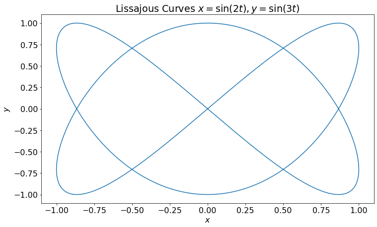
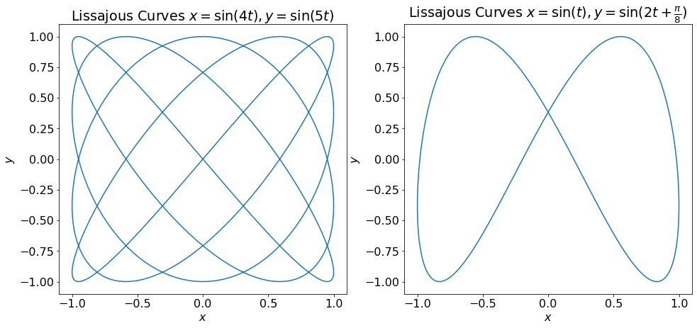
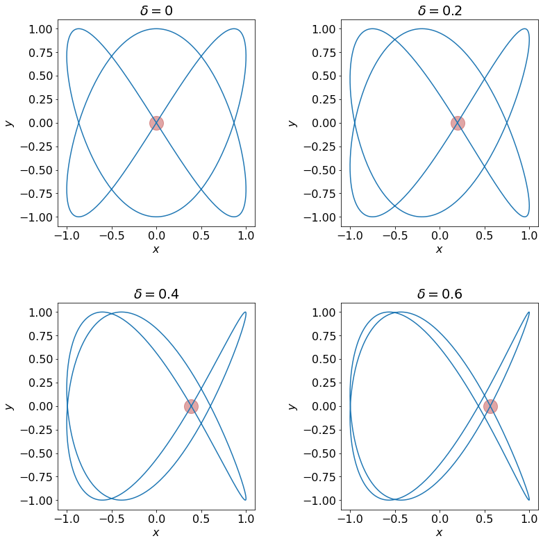
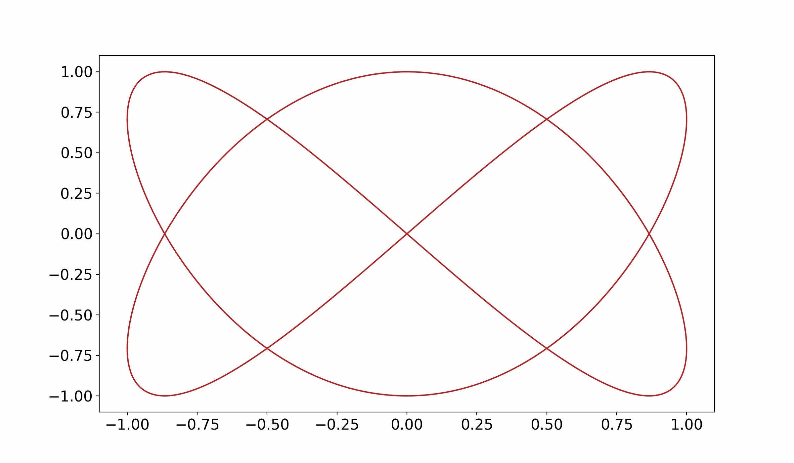
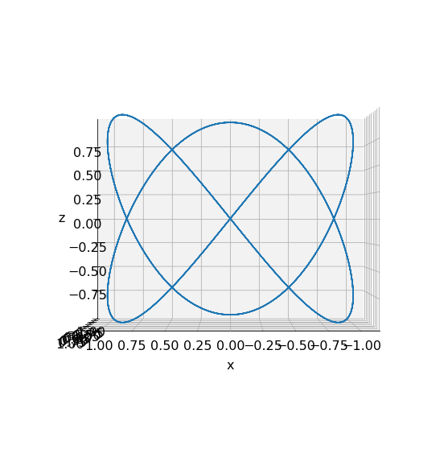
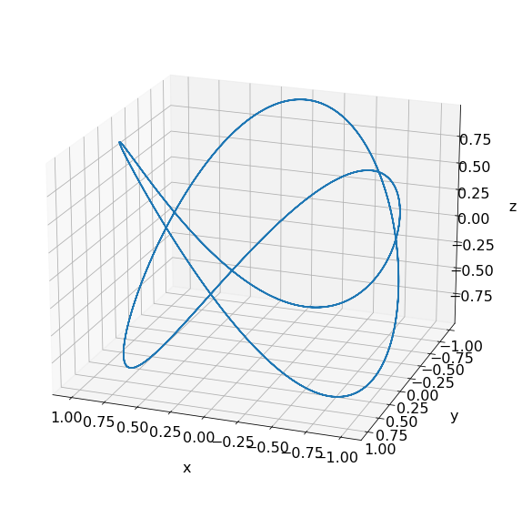
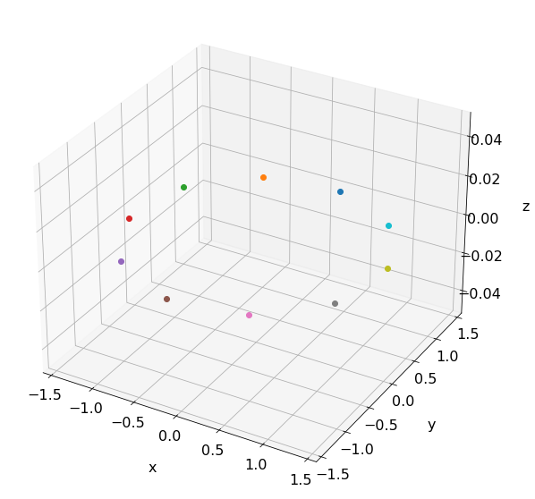
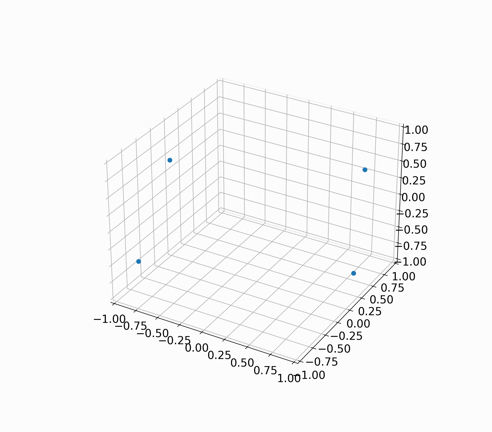
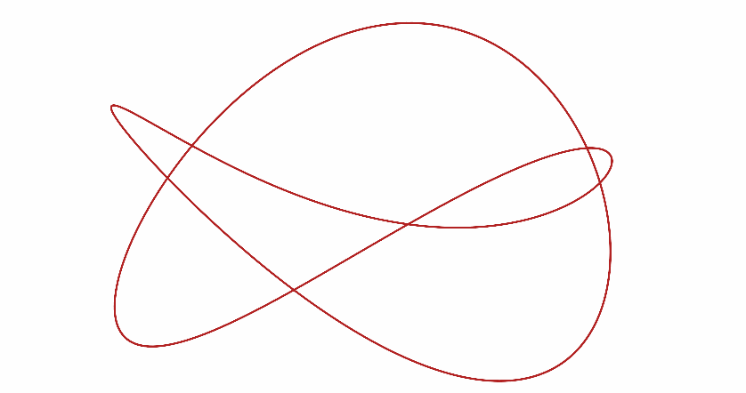
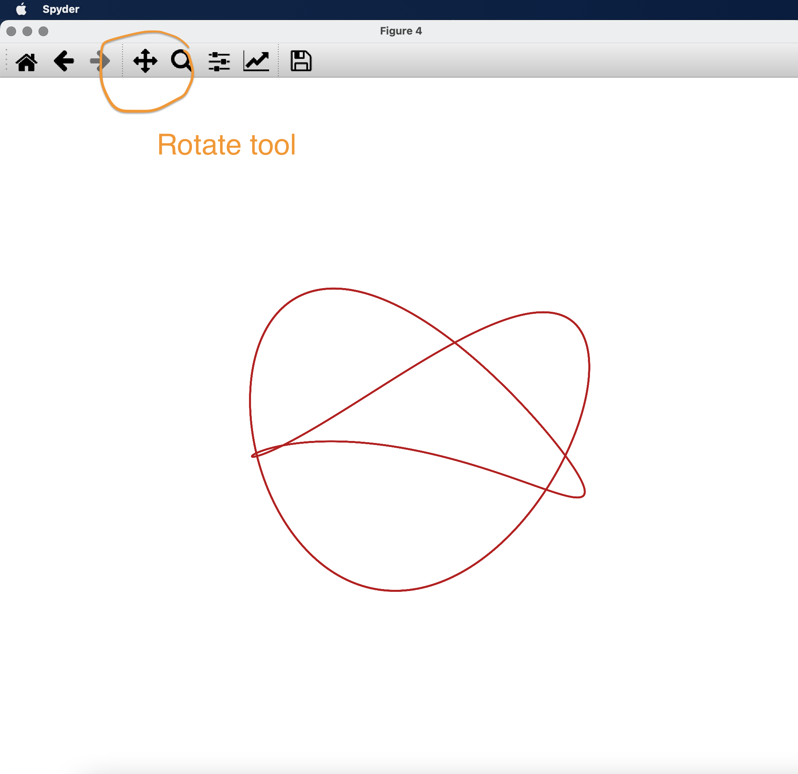

[Click here to open this handout in a new browser tab](#){target="_blank"}

<div class="interlude">
	<p>The material on this page is outside the scope of the module, and is not testable in the assignments or examinations. There is no requirement or expectation to read any of this material: it is presented to provide a selection of interesting things related to the skills and techniques covered in PHY2039.</p>
</div>

<h1><span style="font-size: 25px;">PHY2039 Off-Piste VI:</span><br/>Illusion animations</h1>

This edition of PHY2039 off-piste starts as many have, with something cool I saw on the internet. It's an optical illusion created with 'maths', but what really caught my idea was someone with a 3D model. We'll come to that...

## Lissajous Curves

Lissajous curves (named after the French physicist Jules Antoine Lissajous) are where we start. The general form of these parametric curves is 

$$x=A\sin(at+\delta ),\quad y=B\sin(bt).$$

This is the one I'm interested in particularly

$$x=\sin(2t),\quad y=\sin(3t),$$

the ratio (3/2) being the important feature. Let's plot it

```python
import numpy as np
import matplotlib.pyplot as plt

t = np.linspace(0,2*np.pi,500)

x = np.sin(2*t)
y = np.sin(3*t)

plt.plot(x,y)
plt.xlabel('$x$')
plt.ylabel('$y$')
plt.title('Lissojous Curves $x = \sin(2t), y = \sin(3t)$')
```



Here's a couple more - have a go creating them yourself. The left one is

$$x=\sin(4t),\quad y=\sin(5t),$$


and the right one

$$x=\sin(t),\quad y=\sin\left(2t+\frac{\pi}{8}\right),$$




Do you recognise the right one? That's pretty much the logo for [Meta](https://en.wikipedia.org/wiki/Meta_Platforms){target="_blank"}.

## Illusion

So the illusion that originally peaked my interest is created by adjusting $\delta$ in the Lissajous equations, which as we'll later see, effectively gives a front on view of the curve rotating in 3D. Here are a few plots with $\delta$ changing. I've highlighted an intersection that you can see moving from left to right, in the last one actually crossing another intersection that is moving the other way.



Using the code from Off-Piste 2, here's an animation changing $\delta$ from $0$ to $2\pi$. 

You might want to use

```python
%matplotlib qt
```

(type in the console) to open a figure window (`%matplotlib inline` to revert back).

```python
import numpy as np
import matplotlib.pyplot as plt
from matplotlib.animation import FuncAnimation, PillowWriter

t = np.linspace(0,2*np.pi,500)

# Use 100 values for delta
nframes = 100
delta = np.linspace(0,2*np.pi,nframes)

def animate(i):
	# Clear the current plot
    plt.cla()
    # Add a plot with this delta
    x = np.sin(2*t+delta[i])
    z = np.sin(3*t)
    plot = plt.plot(x,z,color='firebrick')             
    return plot

# Create an animation
anim = FuncAnimation(fig,func=animate,frames=nframes)
anim.save("animation.gif", writer=PillowWriter(fps=10))
```



So if you follow the path of different intersections, you can see the curve rotating around both the x and y axis. Try moving your head from side to side and then up and down. 

To help, I've added some coloured markers on the self-intersections in the next version, and also removed the axes. I won't bore you with going off track to cover the details of the equations for the self-intersection points: feel free to do your own research - see e.g. [this paper](http://www.cchem.berkeley.edu/jehgrp/pdfs/_272.pdf){target="_blank"}. I've used if statements to delay the appearance of these in the animation and also let $\delta$ run to $4\pi$, to extend the animation.

Here's the code in full

```python 
import numpy as np
import matplotlib.pyplot as plt
from matplotlib.animation import FuncAnimation, PillowWriter

# Set figure size
fig = plt.figure(figsize=(6,6),dpi=300)

# t array
t = np.linspace(0,2*np.pi,500)

# Use 200 values for delta from 0 to 4pi
nframes = 200
delta = np.linspace(0,4*np.pi,nframes)

def add_horiz_intersections(delta):
    """
    Adds markers to the intersections which appear
    to move horizontally
    """
    for k in [0,2,4]:
        px = np.sin(np.pi*k/3+delta)
        py = 0
        plt.plot(px,py,'o',color='blue',markersize=20,alpha=0.4)    

def add_vert_intersections(delta):
    """
    Adds markers to the intersections which appear
    to move vertically
    """
    for k in [7,11]:
        px = np.cos(np.pi*2/3)
        py = np.sin(np.pi*k/4-(3/2)*delta)
        plt.plot(px,py,'o',color='green',markersize=20,alpha=0.4)
    for k in [1,5]:        
        px = np.cos(np.pi/3)
        py = np.sin(np.pi*k/4-(3/2)*delta)
        plt.plot(px,py,'o',color='green',markersize=20,alpha=0.4)
            
def animate(i):
    """
    Animate!
    """
    plt.cla()
    x = np.sin(2*t+delta[i])
    z = np.sin(3*t)
    plot = plt.plot(x,z,color='firebrick') 
    
    if i >= nframes/4 and i < nframes/2 or i > nframes*3/4:
        add_horiz_intersections(delta[i])
    if i >= nframes/2:
        add_vert_intersections(delta[i])
    # Remove axis
    ax = plt.gca()
    ax.axis('off')
    return plot

# Make the animation
anim = FuncAnimation(fig,func=animate,frames=nframes)
anim.save("animation.gif", writer=PillowWriter(fps=10))
```


## 3D animation

Now the above is pretty sweet, but it's all maths trickery. So when I saw the below video of someone with a 3d printed model, it ramped this up in interest big time!

<iframe style="width:560px; height:315px;" src="https://www.youtube.com/embed/cQVGIcM_U50" title="YouTube video player" frameborder="0" allow="accelerometer; autoplay; clipboard-write; encrypted-media; gyroscope; picture-in-picture" allowfullscreen></iframe>

Go to about 53 seconds for the 3D plot twist! 

So, if this can exist IRL, can we make it in Matplotlib!? If we can make the 3D parametric curve then we could use a rotation matrix (see week 3) to rotate the curve around the z axis and boom, we're in business!

So a small amount of research / trial and error got me the 3D Lissajous curve...


$$
\begin{align}
x &= \sin(2t) \\
y &= \cos(2t) \\
z &= \sin(3t) 
\end{align}
$$

Note that I've made what was my $y$ axis the $z$ axis, since that's now my vertical, and the additional dimension is $y$, which is just the same as $x$ but a cosine. Here's the parametric plot in 3D, firstly looking straight on at the $x-z$ plane.

```python
import numpy as np
import matplotlib.pyplot as plt

fig = plt.figure(figsize=(6,6),dpi=300)

ax = fig.add_subplot(111, projection='3d')

t = np.linspace(0,8*np.pi,500)

x = np.sin(2*t)
y = np.cos(2*t)
z = np.sin(3*t)

ax.plot(x,y,z) 
ax.view_init(0,90)
ax.set_xlabel('x', labelpad=20)
ax.set_xlabel('y', labelpad=20)
ax.set_zlabel('z', labelpad=20)
```




and with a bit of angle to see the 3d curve:

```python
ax.view_init(20,20)
```


So now all I need to do is to rotate the curve. To do that we can use a 3D rotation matrix, and the one that we are interested in is a rotation around the $z$ axis, which is given by

$$ R_{z}(\phi )={\begin{pmatrix}\cos \phi &-\sin \phi &0\\[3pt]\sin \phi &\cos \phi &0\\[3pt]0&0&1\\\end{pmatrix}} $$

Given a point with initial coordinates `x`, `y` and `x`, we can update the position as follows:

```python
P = np.array([x,y,z])
x,y,z = (R @ P)
```

Here's a little test code, moving a marker around the $z$ axis:

```python
import numpy as np
import matplotlib.pyplot as plt

fig = plt.figure(figsize=(6,6),dpi=300)
ax = fig.add_subplot(111, projection='3d')

# Rotate by this angle
phi = (2*np.pi)/10

# Rotation matrix
R = np.array([[np.cos(phi),-np.sin(phi),0],
              [np.sin(phi),np.cos(phi),0],
              [0,0,1]])

# Initial position
x,y,z = [1,1,0]

for n in range(10):
    # Update the position
    P = np.array([x,y,z])
    x,y,z = (R @ P)
    # Add marker to plot
    ax.plot(x,y,z,'o')
```



Or even better, a little animation, this time note my `x`, `y` and `z` are an array of different points.

```python
import numpy as np
import matplotlib.pyplot as plt
from matplotlib.animation import FuncAnimation, PillowWriter

fig = plt.figure(figsize=(6,6),dpi=300)
ax = fig.add_subplot(111, projection='3d')

# Rotate by this angle
phi = (2*np.pi)/30

# Rotation matrix
R = np.array([[np.cos(phi),-np.sin(phi),0],
              [np.sin(phi),np.cos(phi),0],
              [0,0,1]])

# Initial positions
P = np.array([[1,1,-1,-1],
              [1,-1,1,-1],
              [0,0,0,0]])

def animate(i):
    # Use P set outside the function
    global P
    
    # Clear the axes
    plt.cla()
    
    # Update the coordinates and plot
    x,y,z = (R @ P)
    P = np.array([x,y,z])
    plot = plt.plot(x,y,z,'o') 

    ax.set_xlim([-1,1])
    ax.set_ylim([-1,1])
    ax.set_zlim([-1,1])
            
    return plot


anim = FuncAnimation(fig,func=animate,frames=30)
anim.save("animation.gif", writer=PillowWriter(fps=20))
```




We've got everything that we need to put this together! I've set the viewing angle initially a bit above the curve and then lowering to see the illusion.

```python
import numpy as np
import matplotlib.pyplot as plt
from matplotlib.animation import FuncAnimation, PillowWriter

fig = plt.figure(figsize=(6,6),dpi=300)
ax = fig.add_subplot(111, projection='3d')
ax.view_init(20,110)


# Rotate by this angle
nframes = 80
phi = (2*np.pi)/nframes

# Rotation matrix
R = np.array([[np.cos(phi),-np.sin(phi),0],
              [np.sin(phi),np.cos(phi),0],
              [0,0,1]])

# Initial positions
t = np.linspace(0,8*np.pi,500)
x = np.sin(2*t)
y = np.cos(2*t)
z = np.sin(3*t)
P = np.array([x,y,z])


def animate(i):
    # Use P set outside the function
    global P,nframes
    
    # Clear the axes
    plt.cla()
    
    # Adjust the axis view
    angle1 = 20-20*(i/nframes)
    angle2 = 110-20*(i/nframes)
    ax.view_init(angle1,angle2)

    
    # Update the coordinates and plot
    x,y,z = (R @ P)
    P = np.array([x,y,z])
    plot = plt.plot(x,y,z,color='firebrick') 

    # Set limits on axes - these seem to work well
    ax.set_xlim([-1.2,1.2])
    ax.set_ylim([-1.2,1.2])
    ax.set_zlim([-2,2])  
    ax.set_axis_off()
            
    return plot


anim = FuncAnimation(fig,func=animate,frames=nframes)
anim.save("animation.gif", writer=PillowWriter(fps=20))
```



You can also change this line

```python
ax.view_init(20,110)
```

to change the angle, or if you use `%matplotlib qt` (type in the console before running the above) then you can use the rotate tool to rotate and explore the curve (`%matplotlib inline` to revert back).

{style="width: 70%;"}

Well, that was an adventure! Hope you enjoyed!


