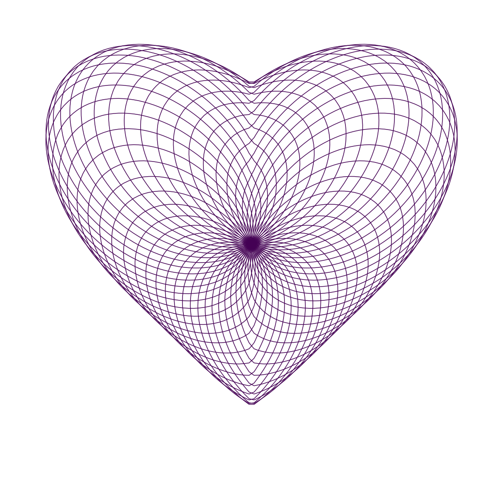
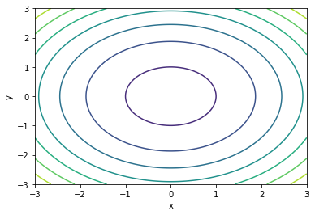
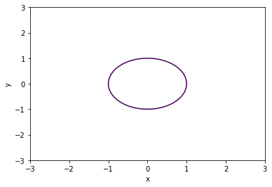
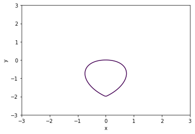
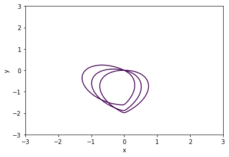
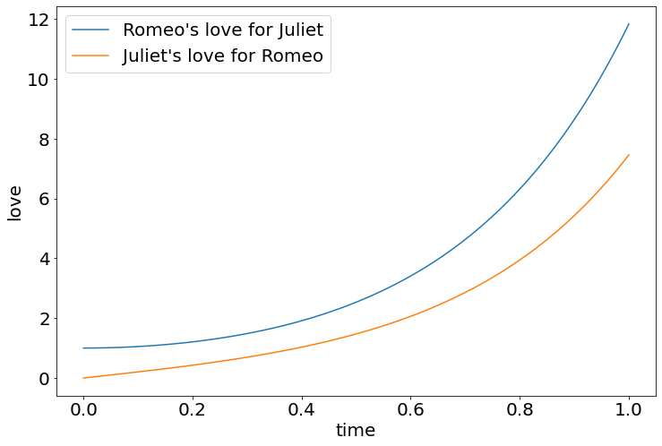

[Click here to open this handout in a new browser tab](#){target="_blank"}

<div class="interlude">
	<p>The material on this page is outside the scope of the module, and is not testable in the assignments or examinations. There is no requirement or expectation to read any of this material: it is presented to provide a selection of interesting things related to the skills and techniques covered in PHY2039.</p>
</div>

<h1><span style="font-size: 25px;">PHY2039 Off-Piste 7:</span><br/>Equations of Love</h1>

In this edition of PHY2039 off-piste, we're looking at some *equations of love*, or more specifically some *differential equations of love*. And a "love"ly plot that you can send to your partner, bff, gran or whoever.

## Differential Equations of Love and Love of Differential Equations

[Here's a link to a scientific paper](https://scholarship.claremont.edu/cgi/viewcontent.cgi?article=1549&context=jhm){target="_blank"} (yes, really) by Isaac Elishakoff (Florida Atlantic University) which looks at the differential equations that govern love, using Shakespeare's Romeo and Juliet for inspiration.

Motivation?

* It looks at very straightforward ordinary differential equations, easy to code up with what we've learnt this week using `odeint`, so great to use as practice!
* You get the chance to see how a "real" scientific paper is written and structured. This really was published, in the *Journal of Humanistic Mathematics*.
* It's a nice way of seeing where the different terms in a differential equation come from.
* And, well it's quite fun really.

I'll give you a solution to the first set of equations in the paper in a bit. First though, I spotted something on the internet that I thought would go nicely with this topic.

## Heart plot

{style="width: 70%;"}

I saw this image on Youtube, actually as an animation that I'll create below, and knew immediately it *must* be created for my off-piste pages! I did a bit of research and subsequently found an equation:

\[ (\sin(a\pi)+x)^2 + (\cos(a\pi)+y)^2 = 1+\frac{2}{3}|x|y \]

with $a\in[0,2)$, taking various values between to build up the plot. 

### Implicit plot cheat codes!

Matplotlib doesn't really have support for plotting implicit equations like that, and I really didn't want to try rearranging for $y(x)$, or introduce another complicated Python module that might accomodate this. So I found a cheat. Here's what I did...

Consider the equation of a circle, say $x^2+y^2 = 1$. If I create a meshgrid (like we did for vector plots this week and surfaces/contour plots in week 6), then plot a height $z = x^2+y^2-1$ i.e. $z$ as the right side of the equation.

```python
import matplotlib.pyplot as plt
import numpy as np

# Create a mesdhgrid
x = np.linspace(-3,3,100)
y = np.linspace(-3,3,100)
X, Y = np.meshgrid(x,y)

# Create Z using the equation
Z = X**2+Y**2-1

# Contour plot
plt.contour(X,Y,Z)
```

then I get the following:

{style="width: 400px;"}

Notice that the inner circle is the actual equation I'm interested in. Turns out that `plt.contour` has a fourth argument, which is the indices of the contours to display (in a list), so I can get just that curve with

```python
plt.contour(X,Y,Z,[0])
```

{style="width: 400px;"}

### Heart plot code

So I can apply this idea to plot the equation for our heart:

```python
import matplotlib.pyplot as plt
import numpy as np

# Create a mesdhgrid
x = np.linspace(-3,3,100)
y = np.linspace(-3,3,100)
X, Y = np.meshgrid(x,y)

# Create Z using the equation
a = 0
Z = (np.sin(a*np.pi)+X)**2 + (np.cos(a*np.pi)+Y)**2 - ((2/3)*np.abs(X)*Y + 1)

# Contour plot
plt.contour(X,Y,Z,[0])
plt.xlabel('x')
plt.ylabel('y')
```

{style="width: 400px;"}

The heart is made by varying $a$. Here's $a=0.1,0.2,0.3$ plotted together.

{style="width: 400px;"}

So I could put this in a for loop. This time also turning off the axis with `plt.axis('off')` for aesthetics:

```python
import matplotlib.pyplot as plt
import numpy as np

plt.figure(figsize=(20,20))

x = np.linspace(-3,3,100)
y = np.linspace(-3,3,100)
X, Y = np.meshgrid(x,y)

for a in np.arange(0,2,0.04):
    Z = (np.sin(a*np.pi)+X)**2 + (np.cos(a*np.pi)+Y)**2 - ((2/3)*np.abs(X)*Y + 1)
    plt.contour(X, Y, Z,[0])

plt.axis('off')
```

{style="width: 70%;"}

Finally, this one is relatively straightforward to animate using the code that I introduced in Off-Piste II. I can just add a plot using a new `a` value at each iteration. Here goes...

```python
import matplotlib.pyplot as plt
import numpy as np
from matplotlib.animation import FuncAnimation, PillowWriter

fig = plt.figure(figsize=(10,10))

# Create a meshgrid
x = np.linspace(-3,3,100)
y = np.linspace(-3,3,100)
X, Y = np.meshgrid(x,y)

# Values of a to iterate over
avals = np.arange(0,2,0.04)

# Animate
def animate(i):
    a = avals[min(i,49)]
    Z = (np.sin(a*np.pi)+X)**2 + (np.cos(a*np.pi)+Y)**2 - ((2/3)*np.abs(X)*Y + 1)
    plt.contour(X, Y, Z,[0])   

# Turn axis off
plt.axis('off')

# Save the animation
anim = FuncAnimation(fig,func=animate,frames=65)
anim.save("heart.gif", writer=PillowWriter(fps=5))
```

I've let the animation run on static for some additional frames using `a = avals[min(i,49)]`, which sets the max value of `a` (`a[49]`) once the index goes beyond 49.

{style="width: 70%;"}


## Romeo and Juliet

OK, now that we're suitably in the mood, let's get back to the [paper](https://scholarship.claremont.edu/cgi/viewcontent.cgi?article=1549&context=jhm){target="_blank"}

In the second chapter, "Hyperbolic Love According to Shakespeare", the author argues for a model for Romeo and Juliet's love for eachother ($R(t)$ and $J(t)$ respectively) in which Romeo is initially transfixed by Juliet ($R(0)=1$), but he is a stranger to Juliet ($J(0)=0$) and their love then evolves such that the rate of change of Romeo's love for Juliet ($\frac{\mathrm{d}R}{\mathrm{d}t}$) is proportional to Juliet's love for him ($aJ$) and vice versa. This is described by the system of differential equations:

\begin{align} 
\frac{\mathrm{d}R}{\mathrm{d}t}=aJ,\\[0.8em] 
\frac{\mathrm{d}J}{\mathrm{d}t}=bR. 
\end{align}

Let's solve this with Python (it's also solved analytically in the paper to get a solution in terms of hyperbolic cosine/sine, which we can use to check our solutions). I've used the author's suggested parameters:

```python
import numpy as np
import matplotlib.pyplot as plt
from scipy.integrate import odeint

t = np.linspace(0,10,100)

def love(y, t, a, b):
    R, J = y      # reads in y and assigns to R and J
    dRdt = a*J    # rhs of dJ/dt
    dJdt = b*R    # rhs of dR/dt 
    return [dRdt, dJdt]   # important: this way around!

# Parameters
a = 5
b = 2

# Initial conditions
y0 = [1,0]

# Time points
t = np.linspace(0,1,100)

# Solve ODEs
y = odeint(love,y0,t,args=(a,b))

plt.plot(t,y[:,0],label='Romeo\'s love for Juliet')  
plt.plot(t,y[:,1],label='Juliet\'s love for Romeo')   
plt.legend()
plt.xlabel('time')
plt.ylabel('love')

# Optional check of solutions
#R_exact = np.cosh(np.sqrt(10)*t)
#J_exact = (np.sqrt(10)/5)*np.sinh(np.sqrt(10)*t)
#plt.plot(t,R_exact,t,J_exact)
```

{style="width: 60%;"}

The author concludes that when Juliet says

> "My love as deep. The more I give to thee<br>
   The more I have, for both are infinite."

She really means

> "My love for you is hyperbolic. It intensifies as the hyperbolic sine."


<div class="exercise" markdown=true>


### Not an exercise

I'll leave you to explore the other models: trigonometric love, love triangles etc...

All of them can be solved in a similar way by modifying a system of differential equations.

Enjoy and see you next time!

</div>
