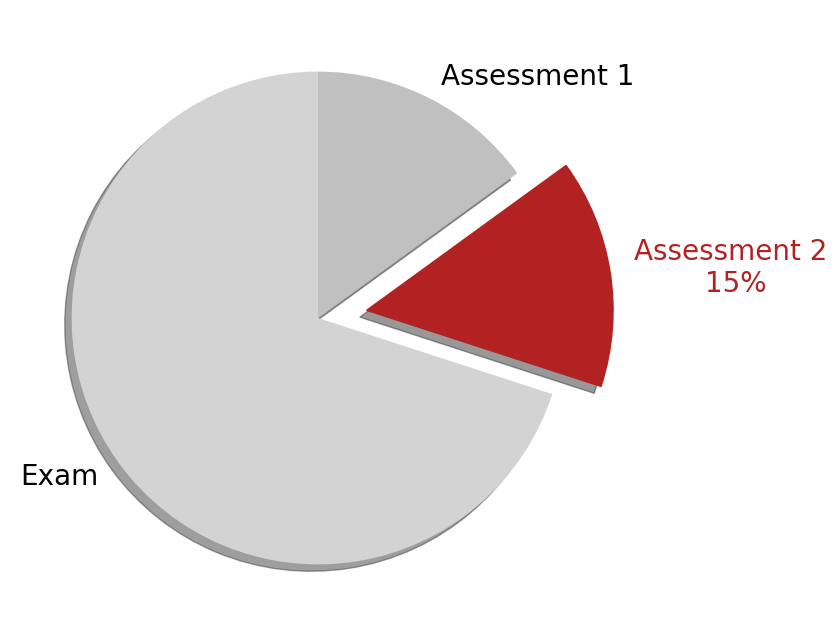
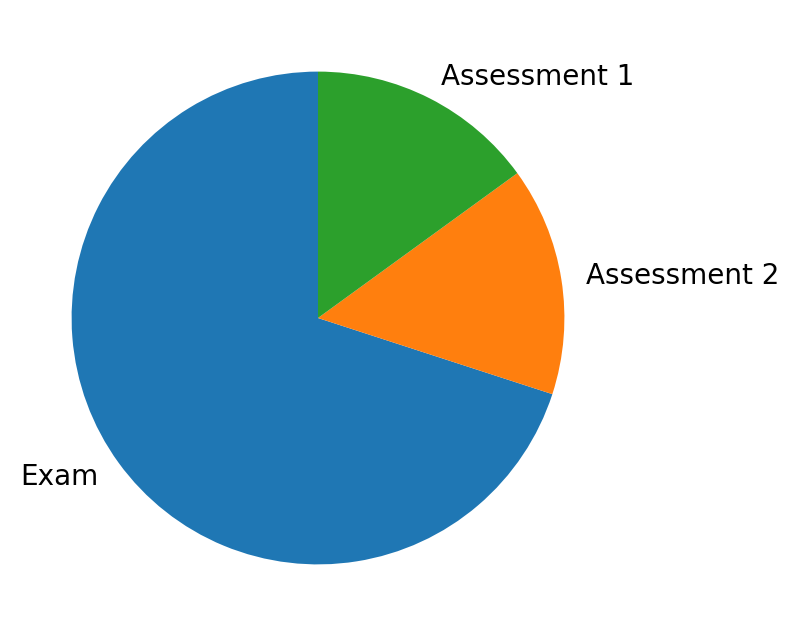
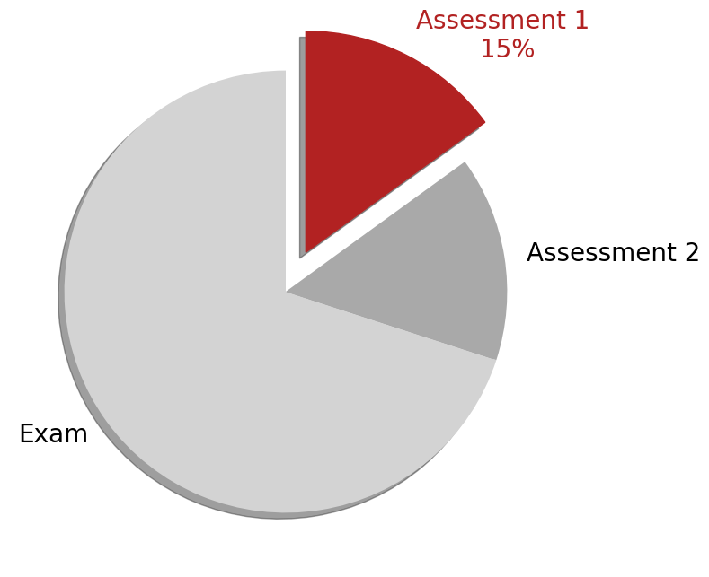
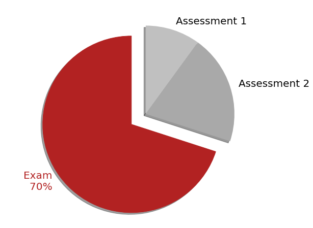
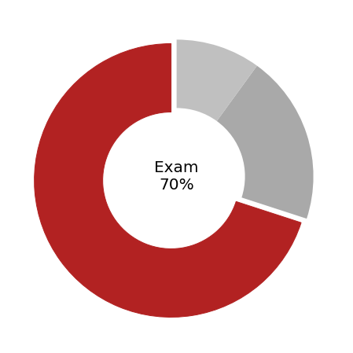
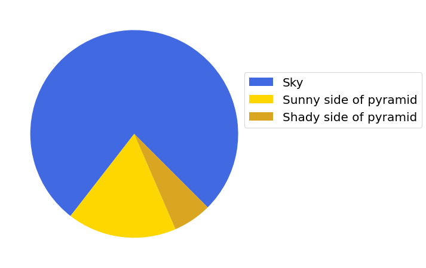
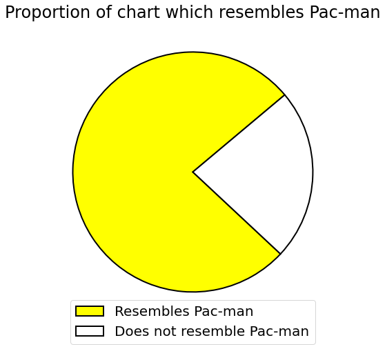
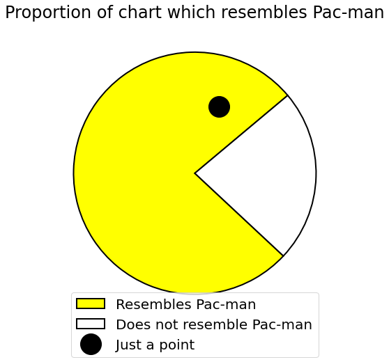
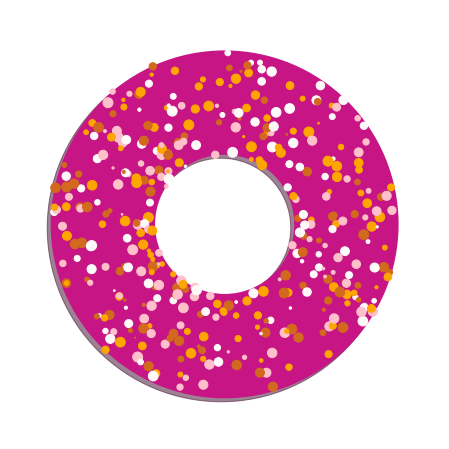

[Click here to open this handout in a new browser tab](#){target="_blank"}

<div class="interlude">
    <p>The material on this page is outside the scope of the module, and is not testable in the assignments or examinations. There is no requirement or expectation to read any of this material: it is presented to provide a selection of interesting things related to the skills and techniques covered in MAS2806-PHY2039.</p>
</div>

<h1><span style="font-size: 25px;">MAS2806/PHY2039 Off-Piste I:</span><br/>A short adventure with pie charts</h1>

{style="float: right; width: 300px;"}


On the assessment page, I added some pie charts to give a visual reminder of the relative weightings of our assessments. We don't look at pie charts in this course, so thought a good way\* to kick off the *off piste* section would be to show you how I made these.

*\* In fact, I was on a train home from a conference with countless other things that I really should have been doing, but were less fun.*

## A basic pie chart

Creating pie charts with Matplotlib isn't too difficult. Here's a basic pie chart:


```python
import matplotlib.pyplot as plt

weightings = [70,20,10] 
titles = ["Exam","Assessment 2","Assessment 1"]

plt.pie(weightings, labels = titles, startangle = 90)
```

The `startangle` option isn't reaquired, but is setting the start angle of the first wedge to the top. Here's the output:

{style="max-width: 450px;"}

## Customised pie charts for each assessment

My train journey was going pretty slowly, so I decided that an individual plot per assessment would be pretty neat, with features that exaggerate the highlighted "wedge". 

{style="float: left; width: 360px;"}
{style="float: left; width: 340px;"}
{style="float: left; width: 360px;"}

<br style="clear:both;">

Here are the new ingredients of the code that follows:

* A loop over the number of assessments (so there's a plot for each one): `for n in range(len(weightings)):` This could have been as simple as `for n in range(3):` but I wanted it to be adaptable in case the number of assessments change. Remember that everything indented is then in the for loop.

* A default colour for each wedge, set with the `colors =` option in the pie chart function. I created a list of different greys, `colours = ["lightgrey","darkgrey","silver"]` (so that when I set the highlighted wedge to a bright colour it would pop out!). I used the [list of colours here](https://matplotlib.org/stable/gallery/color/named_colors.html){target="_blank"}

* I've used the `explode=` option in the pie chart function to make one of the wedges jump out. This is set through a list I called `standout`, which I initially set to all zeros.  I then set the nth item to 0.2 (which was most aesthetically pleasing to me) in the line `standout[n] = 0.2`.

* The pie chart properties can be manipulated by writing `wedges, labels = plt.pie(...)` - the label and wedge corresponding to the nth item are then manipulated on the bottom lines.

* This line probably looks weirdest in the code: `labels[n].set_text("{}\n{:>10}%".format(titles[n],weightings[n]))`. It is combining the label text and weighting and formatting it with a bit of padding (the part with `"{}\n{:>10}%"`), again just for some aesthetic pleasure. You might find this easier to follow by trying out a more straightforward string format example, e.g. `"Here is a {}".format("string")`

Here goes...

```python
import matplotlib.pyplot as plt
import numpy as np

# Set title, weighting and default colours
weightings = [70,20,10] 
titles = ["Exam","Assessment 2","Assessment 1"]
colours = ["lightgrey","darkgrey","silver"]

# Loop over assessments to create individual plots
for n in range(len(weightings)):

    # Make a plot for this assessment
    plt.figure(figsize=(12, 8))
    plt.rcParams['font.size'] = 20
    
    # Explode the segment for this assessment only
    standout = np.zeros(len(weightings))
    standout[n] = 0.2
    
    # Create the pie chart and objects wedges and labels which can be manipulated
    wedges, labels = plt.pie(weightings, labels = titles, 
                explode = standout, startangle = 90,
                colors = colours, shadow = True)
    
    # Customise for this assessment
    wedges[n].set_color("firebrick")
    labels[n].set_color("firebrick")
    labels[n].set_text("{}\n{:>10}%".format(titles[n],weightings[n]))
```

Note that <span style="background: #B12322; color: white; padding: 2px;">firebrick</span> is my current favourite Matplotlib colour. You can find a [full list of colours here](https://matplotlib.org/stable/gallery/color/named_colors.html){target="_blank"}. 

<div class="exercise" markdown=true>

### Not an exercise 

**a)** A challenge for you (note the warning at the start again!). See if you can modify the code to make alternative donut plots like the below... You'll need a search engine!

{style="width: 300px;"}

(I'm not posting a solution, but you can come and see me about it if you like!)


**b)** And finally, can't resist this one from the internet that tickles me. Have a go at recreating this (you'll need `plt.legend(...)` for the legend.

{style="width: 500px;"}

If you've seen (and even better can recreate) anything cool pie/donut related let me know!

Enjoy!

</div>


<hr/>

### Addendum - More pie charts

#### Pacman

Thank you for the following student submission!

```python
"""
PAC-MAN PIE CHART
"""
import matplotlib.pyplot as plt

# NUMBERS
weightings = [100,30]

# MAKING PIE CHART
ax = plt.subplot(111)
ax.pie(weightings, startangle = 40, colors = ["yellow", "white"], 
    wedgeprops = {"edgecolor" : "black",'linewidth': 2,'antialiased':True})

# ADDING LABELS / LEGEND
plt.title("Proportion of chart which resembles Pac-man", loc = "center")
plt.legend(["Resembles Pac-man", "Does not resemble Pac-man"], loc = "center", bbox_to_anchor=(0.5,0))

# PLOT SIZE
plt.rcParams["figure.figsize"] = (10, 8)
plt.rc('font', size = 20)
```

{style="width: 350px;"}


Since it's my job to give feedback, I added the following (by trial and error!)

```python
plt.plot(0.2,0.55,'o',markersize=30,color='black')
```

{style="width: 350px;"}


#### Donut

Whilst I was putting scatter plots in handout 2, I had this brainwave...

```python
import numpy as np
import matplotlib.pyplot as plt

def pol2cart(rho, phi):
    """
    Converts polar to cartesian
    """
    x = rho * np.cos(phi)
    y = rho * np.sin(phi)
    return(x, y)

# Set figure size
plt.figure(figsize=(12, 8))
plt.rcParams['font.size'] = 20

# Create the donut
wedges, labels = plt.pie([1], colors = ["mediumvioletred"], 
                         wedgeprops=dict(width=0.6), shadow=True)

# Add some sprinkles - coordinates
no_sprinkles = 400
rho = 0.4+0.6*np.random.rand(no_sprinkles)
phi = 2*np.pi*np.random.rand(no_sprinkles)
x,y = pol2cart(rho,phi)

# Random colours and sizes
colours = np.random.choice(["pink", "snow", "chocolate", "orange"], no_sprinkles)
sizes = np.random.randint(1, 100, no_sprinkles)

# Let's sprinkle
plt.scatter(x, y, c=colours, s=sizes, marker='o')
```

{style="width: 350px;"}


<!--
```
# Loop over assessments to create individual plots
for n in range(len(weightings)):

    # Make a plot for this assessment
    ax = plt.figure(figsize=(12, 8)).subplots()
    plt.rcParams['font.size'] = 20

    # Explode the segment for this assessment only
    standout = np.zeros(len(weightings))
    standout[n] = 0.05

    wedges, labels = plt.pie(weightings, startangle = 90, explode = standout,
                            colors = colours, wedgeprops=dict(width=0.5))
    
    # Customise for this assessment
    wedges[n].set_color("firebrick")
    
    # Add the text in the centre
    ax.text(0.5, 0.5, "{}\n{}%".format(titles[n],weightings[n]), transform = ax.transAxes, va = 'center', ha = 'center')
    
    fname = '../images/piecharts/donut_{}.png'.format(titles[n].replace(" ", "").lower())
    plt.savefig(fname, bbox_inches='tight', transparent=True)

#%% Pyramid pie chart

plt.figure(figsize=(17, 8)).subplots()
plt.rcParams['font.size'] = 20

weightings = [77,17,6] 
titles = ["Sky","Sunny side of pyramid","Shady side of pyramid"]
colours = ["royalblue","gold","goldenrod"]

plt.pie(weightings, colors = colours, startangle = 315)  

plt.legend(titles,loc=3,bbox_to_anchor=(0.9,0.5))

fname = '../images/piecharts/pyramid.png'
plt.savefig(fname, bbox_inches='tight', transparent=True)
  

fname = '../images/piecharts/pie_{}.png'.format(titles[n].replace(" ", "").lower())
plt.savefig(fname, bbox_inches='tight', transparent=True)

```
-->


