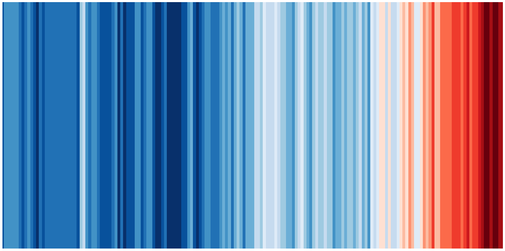

[Click here to open this handout in a new browser tab](#){target="_blank"}

<div class="interlude">
	<p>The material on this page is outside the scope of the module, and is not testable in the assignments or examinations. There is no requirement or expectation to read any of this material: it is presented to provide a selection of interesting things related to the skills and techniques covered in MAS2806-PHY2039.</p>
</div>

<h1><span style="font-size: 25px;">MAS2806/PHY2039 Off-Piste IV:</span><br/>Warming Stripes</h1>

In this edition of MAS2806/PHY2039 off-piste, we're recreating the *warming stripes*, a data visualisation that was originally the brainchild of Professor Ed Hawkins, a climate scientist at the University of Reading. The stripes provided an easy to digest visualisation of the average global temperature compared to a reference period (I've used the Met Office data, which compares to the average from 1961-1990).

##  Walk-through

In the video I show how this can be recreated using Matplotlib's `bar.plot` and some colour maps.

<iframe src="https://campus.recap.ncl.ac.uk/Panopto/Pages/Embed.aspx?id=b4024088-8494-4be2-bb0f-af4f0167294d&autoplay=false&offerviewer=true&showtitle=true&showbrand=false&captions=false&interactivity=all" height="405" width="720" style="border: 1px solid #464646;height: 405px; width: 720px;" allowfullscreen allow="autoplay"></iframe>


## Code

Here's the code that I created, tidied up a little:

```python
"""
Warming stripes example: original idea Ed Hawkins 
-----------------------
Data is from https://www.metoffice.gov.uk/hadobs/hadcrut5/data/current/download.html
(Global (NH+SH)/2 annual CSV)
"""

import numpy as np
import matplotlib.pyplot as plt
from matplotlib.colors import ListedColormap

def normalise(x):
    """
    normalises an array x to [0,1]
    """
    xmin = min(x)
    xmax = max(x)
    x = (x-xmin)/(xmax-xmin)
    return x

# Create a new figure - change the figsize to suit
plt.figure(figsize=(10,5))
plt.axis('off')

# Import data
data = np.loadtxt('data.csv',delimiter=',',skiprows=1)
years = data[:,0]
temps = data[:,1]

# Get the Red-Blue (reversed) colour map
#cmap = plt.get_cmap('RdBu_r')

# Or create our own using Ed's original colours
cmap = ListedColormap(['#08306b', '#08519c', '#2171b5', '#4292c6',
						'#6baed6', '#9ecae1', '#c6dbef', '#deebf7', 
						'#fee0d2', '#fcbba1', '#fc9272', '#fb6a4a', 
						'#ef3b2c', '#cb181d', '#a50f15', '#67000d'])

# bar plot
plt.bar(years,1,width=1, color=cmap(normalise(temps)))

# Optionally add the line plot
#plt.plot(years,normalise(temps),color='black', linewidth=3)

# Tighter layout
plt.xlim([min(years),max(years)])
plt.ylim([0,1])
plt.tight_layout()
```

{width="70%"}

## Useful info

### Data

The data I've used is from the [Met Office Hadley Centre observations datasets](https://www.metoffice.gov.uk/hadobs/hadcrut5/data/current/download.html){target="_blank"}. The stripes can be created from a number of other data sets.

### More warming stripes ideas

The [Wikipedia page](https://en.wikipedia.org/wiki/Warming_stripes){target="_blank"} is a decent enough start if you want to check out other visualisations and goes into more depth on the history of the visualisation. 

