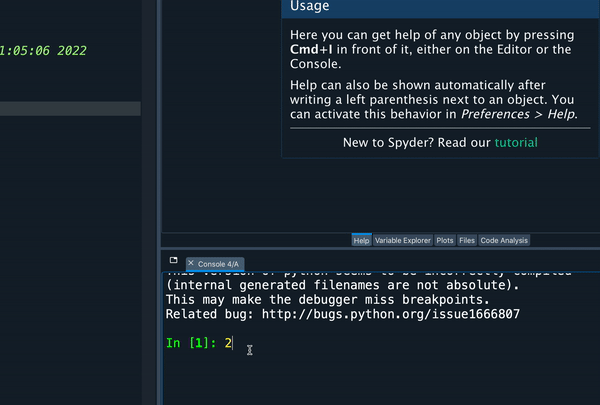

# MAS2806/PHY2039 Handout 1 - Foundations

{style="float: right; width: 40%; max-width: 130px; margin: -30px 0 10px 30px;"}


Welcome to the "handout" for the first week of MAS2806/PHY2039 material. 

During the practical session, myself and my ace team of postgraduate helpers will be floating around. If you have any questions at all then don't hesitate to stick your hand up and give us a shout. I'm granting you a quota of UNLIMITED questions that you can ask us; remember there are **no silly questions**!

> "He who asks is a fool for five minutes, but he who does not ask remains a fool forever." <small>--Mark Twain</small>


## Today's Content

The aim of this week is to establish the foundations that we need for MAS2806/PHY2039. After a little bit of admin (accessing Spyder and how these handouts work) we'll cover the following today:

* **Python Basics** - some of the key concepts and functions that will form the core of our programming in this module.

* **Creating and Manipulating arrays** - arrays will be at the heart of the **week 2** content

* **Using control flow and functions** - we'll be building towards using control flow and our own functions a lot, particularly for the **week 4** content and beyond.

* **Creating basic plots** - we'll need to know how to do some basic 2D plotting, to present our results for the **week 3** content.


If you have done MAS1803, PHY1030 or been through the revision handouts then you'll find that a lot of this week's material covers very similar ground.

Before you start you might like to download the cheat sheet ([online version here](../../background_material/cheat_sheet/index.html){target="_blank"}):

<div style="max-width: 300px; width: 50%; margin-left: 30px; text-align: center; border-bottom: 4px solid #c23abb; padding: 10px; background: #FAFAFA;">
<a href="/static/pdf/python-cheat.pdf" target="_blank">
	
</a>
<h4 style="margin-top: 10px;"><a href="/static/pdf/python-cheat.pdf" target="_blank">Cheat Sheet (PDF version)</a></h4>
</div>


***


## Launching Spyder...


We are going to be using the integrated development environment (IDE) Spyder to run our Python code. Below you will find instructions to launch Spyder in the PC cluster or on your own device.

### ...in a Computer Cluster 

In a computer cluster, press the Windows menu and start typing "Spyder".

{style="border:1px solid #CCC;width:70%;"}


### ...on your own device

The easiest way to access Spyder is through the [Virtual Desktop](https://rdweb.wvd.microsoft.com/arm/webclient/index.html){target="_blank"} using the above instructions, but accessing from your own device. You can also install Anacondao on your own device. 


### ...anywhere, on the Azure Virtual Destop

The easiest way to access Spyder from anywhere is through the [Azure Virtual Desktop (AVD)](https://rdweb.wvd.microsoft.com/arm/webclient/index.html){target="_blank"}.

Go to the above web address.

Once the page loads, select the *tier 1* cluster, then select *Spyder* from the start menu.


***


## Using these handouts

The main content for each week of the course is contained in these virtual handouts. 

If you are on a laptop or desktop then I suggest that you set up your windows so that the handout and Spyder are side by side, so that you can copy and paste commands across from one to the other.

You should try out commands: I suggest copying the bits of code like this one

```python
x = 2
```

into Spyder and exploring them by changing variables and so on. You can copy using *CTRL-C* and past using *CTRL-V*.

The handouts have some items in them along the way. They go like this...


### Interlude {: .interlude}
This is an interlude, which contains something either totally off-topic, usually not assessed and sometimes just there for a bit of fun. :-)


### Exercise {: .exercise}

This is an exercise. Sometimes there'll be an answer, sometimes they are just to get you thinking.  I suggest that you try them as you reach them in the notes - note that your answers won't be saved here, so stick them in a script file if you want to save them. You might need some scrap paper for some of the exercises. 

Note that your answers to these aren't saved, so they'll reset every time the handout is loaded. Click on "show exercise" to open up the exercise.

<numbas-embed data-url="https://numbas.mathcentre.ac.uk/question/129242/intro-to-python-exercises-handout-1-exercise-0/embed/?token=6d93fa53-fa68-44ff-ab49-b2d2d5193015" data-id="exercise-1-0" data-cta="Show exercise >"></numbas-embed>


***


##  Python Foundations 

Let's get going! 

You can find a more detailed version of this chapter in the refresher materials that you can find in the transition material section of our Python course.

We are using **Python 3** throughout this module. Please be aware of this when searching for help, as there are significant differences from the previous Python 2, which although now unsupported, is still widely used.

### Arithmetic operators

Here are Python's arithmetic operators 

Operator       |     Example input   |   Example Output    | Notes
---------------|---------------------|---------------------|-----------------------------------------------------
   +           |     `2 + 2`         |     4               |
   -           |     `3 - 2`         |     1               |
   *           |     `2 * 3`         |     6               |
   /           |     `4 / 2`         |     2               |
   **          |     `2 ** 3`        |     8               | Alternative is the function `pow()`. 
   %           |     `10 % 3`        |     1               | Modulus ("remainder when dividing 10 by 3")


{title="Your first command" style="float: right; width: 50%; max-width: 450px; margin: 10px 0 10px 30px;"}


The simplest way to use Python is to enter a command in the *Console* and allow Python to run it and return the result. 

Type `2+2` (or even better, copy and past using CTRL-C and CTRL-V) into the *Console* part of Spyder (usually the bottom right pane) and it will return back 4.

```python
2+2
```
```output
4
```

Towards the end of the handout, we'll switch  to using Python scripts. If you're familiar with this already then you can go ahead and use it from the start.

### Variable assignment 

To set a variable `x` equal to 5:

```python
x = 5
print(x)
```
```output
5
```

`print()` is a function that prints the value of a variable. More on functions in the next section...

### Exercise 1.1 {: .exercise}

A quick variable assignment question, which also highlights the care that's required when using brackets.

<numbas-embed data-url="https://numbas.mathcentre.ac.uk/question/129404/variable-assignment-handout-1-exercise-1/embed/?token=4587e12e-04aa-4b41-b214-ba115dc3b1b8" data-id="exercise-1-1" data-cta="Show exercise >"></numbas-embed>


### Functions

Here are some "mathsy" functions that we might use from  Python's so-called [*standard library*](https://docs.python.org/3/library/){target="_blank"}

function      |       Description
--------------|---------------------------------------------------------
`abs()`		  |		 Return the absolute value of a number
`len()`       |       Return the length of an object such as a list or an array
`max()`       |       Find the largest value in a list or similar object
`min()` 	  |		 Find the smallest value in a list or similar object
`print()`	  |		 Print the value of an object
`round(x,n)`  |       Round a number `x` to `n` decimal places
`sum()`       |       Sum the values in a list or similar 

### Exercise 1.2 {: .exercise}


Let's have a go at using one of the above functions

<numbas-embed data-url="https://numbas.mathcentre.ac.uk/question/129403/round-function-handout-1-exercise-2/embed/?token=9d7c28da-c2b8-4d56-b1c3-27dd22459894" data-id="exercise-1-2" data-cta="Show exercise >"></numbas-embed>


### Data Types

The following are some of the common, standard data types in Python.

<table class="table table-striped">
<tr>
	<th>Data type </th>
	<th>Example</th>
	<th>Function to convert to this type</th>
	<th>Description</th>
</tr>
<tr>
	<td>Integer   </td>
	<td><code>2</code></td>
	<td><code>int()</code></td>
	<td>Python stores integers as a separate data type which it calls <i>int</i> </td>
</tr>
<tr>
	<td>Floating point numbers</td>
	<td><code>2.0</code></td>
	<td><code>float()</code></td>
	<td>On a computer, "decimal numbers" are called floating-point numbers, and Python refers to them as a <i>float</i>. </td>
</tr>
<tr>
	<td>Boolean   </td>
	<td><code>True</code> or <code>False</code></td>
	<td><code>bool()</code></td>
	<td>A boolean is an object that is either true or false and is referred to as type <i>bool</i> in Python. There are only two values for this data type: <code>True</code>  and <code>False</code> </td>
</tr>
<tr>
	<td>Strings   </td>
	<td><code>"orange juice" </code></td>
	<td><code>str()</code></td>
	<td><i>Strings</i> (words) could be used as part of data that we are working with, or when naming files.</td>
</tr>
</table>

The function `type` can tell us the data type of a variable.

```python
type(2.0)
```
```output
float
```


```python
type(int(2.0))
```
```output
int
```

### Exercise 1.3 {: .exercise}

A short exercise classifying objects into different data types


<numbas-embed data-url="https://numbas.mathcentre.ac.uk/question/75797/data-type-classification/embed/?token=4c2c107a-1f72-4b79-ad0e-3502dad31621" data-id="exercise-1-3" data-cta="Show exercise >"></numbas-embed>


## Lists


Lists are used by Python to store data in a vector-like structure. Values can be placed in a comma-separated list of any data type inside square brackets as follows:

```python
x = [3,8,5,6,10,1,4]]
```

We can try out some of the functions from earlier, e.g.

```python
len(x)
max(x)
```

An element of the list can be accessed using an index number as follows,

```python
x[3]
```
```output
6
```

The following gets the values with indexes from 1 up to, but not including, 5

```python
x[1:5]
```
```output
[8, 5, 6, 10]
```

And individual elements can be set with,

```python
x[3] = 10
```

Note - **very important** - Python 'indexing' begins at 0, not 1, i.e. the element with index 3 above is the fourth in the list! There are long and boring reasons why, which I won't waste pixels with, but importantly this is different in other languages (including R), so take care!


### NumPy - extending Python using modules 


What we can't do with lists is this:

```python
x = [3,6,9]
x/3
```

and hope to get back 

```
[1,2,3]
```

instead we get back the dissapointing message

```
TypeError: unsupported operand type(s) for /: 'list' and 'int'
```

Lists do not support this sort of operation. In addition, we might expect to be able to do the following, but this also returns an error message:

```python
cos(0)
```

Why? Well Python is very *modular*, and its standard library only contains common, but fairly limited functions. To extend Python we can load **modules**. Let's start with the module NumPy...


### NumPy


📖 [NumPy documentation](https://numpy.org/doc/){target="_blank"}

Load NumPy with the command

```python
import numpy as np
```

The `np` lets us refer to the functions and variables inside NumPy using the notation `np.something`

```python
np.cos(np.pi)
```

### Exercise 1.4 {: .exercise}

Here's a little practice with NumPy functions:

<numbas-embed data-url="https://numbas.mathcentre.ac.uk/question/129402/numpy-functions/embed/?token=909e9f01-5d39-4d22-8c9a-8760df3fbbed" data-id="exercise-1-4" data-cta="Show exercise >"></numbas-embed>


## Working with arrays 


NumPy has a new data type called a NumPy array

```python
np.array([3,6,9])
```

Arrays can be created in a number of ways. `np.arange()` creates a sequence of numbers:

```python
np.arange(0,9)
```

The function `np.linspace()` creates an array of linearly spaced values, e.g. 100 values between 0 and 1:

```python
np.linspace(0,1,100)
```

The function `np.zeros()` creates an array filled with zeros:

```python
np.zeros(3)
```

A matrix is represented as a list of lists, with each of the inner list representjng a row. It can help to put each inner list on a new line to try to help visualise what the matrix looks like.

```python
matrix = np.array([[1, 2], 
                   [3, 4]])
print(matrix)
```
```output
[[1 2]
 [3 4]]
```


***

## Control flow and function

We'll use these ideas a little in the first couple of weeks and a lot from week 4:

The range function creates a sequence of integer numbers. With one argument, `range(stop)` for some integer `stop`, the function returns the sequence from 0 up to **but not including** `stop`.  

```python
range(10)
```

creates a sequence of numbers $0,1,2\ldots 9$. To see their values you will need to convert to a list 

```python
list(range(10))
```

If `range` is given two arguments, it treats them as `range(start,stop)` and returns the sequence from `start` up to **but not including** `stop`.  

```python
range(2,10)
```

returns the sequence $2,3,4\ldots 9$.

If range has a third argument: `range(start,stop,step)`, it returns the sequence from `start` up to **but not including** `stop` in step sizes of `step`.

```python
range(2,10,2)
```

returns the sequence $2,4,6,8$. We will use ranges extensively when we come to for loops.


### For loop

### While loop

### If statement

### Creating a function


#### Adding help to your function

#### Raising an error


***

## Working with arrays


### Exercise 1.... Worked example {: .exercise}

Transpose of a matrix

***


## Plotting

In this second section we'll revisit plotting, in a little more detail than we have done so far with the Python basics, as it is the main topic of this week's work.

### The Matplotlib module

📖 [Matplotlib.org documentation](https://matplotlib.org/stable/contents.html){target="_blank"}

We can get access to plotting tools through the *Matplotlib* module. It's a package containing many modules, and we are only interested at the moment in one part, called *pyplot*, which we can reference with `matplotlib.pyplot`. So let's load in that, and create a shortcut to it, `plt`. 


``` python
import matplotlib.pyplot as plt
plt.plot([1,4,9,16])
```

*Note: in the latest version of Spyder your plot will show the figure in the Plots window (usually top right corner).*


### Some plotting practice

Before we get into curve fitting, let's remind ourselves of a bit more NumPy and Matplotlib, so that we can make awesome plots!

Let's load the NumPy module and create an array using the `arange()` function

```python
import numpy as np
x = np.arange(0,10)
```

This is the sequence of numbers $0,1,2,3\ldots 9$. Let's use this to set up an array of `y` values:

```python
y = np.sin(x)
```

And then make a plot of y versus x:

```python
plt.plot(x,y)
```

Put together, your script might now look something like

```python
"""
Script to plot sin(x)
"""
import matplotlib.pyplot as plt
import numpy as np

x = np.arange(0,10)
y = np.sin(x)
plt.plot(x,y)
```

{width=90%}

We can modify the `np.arange()` function to give us a nice smooth range of x values. Earlier we used this to create integer sequences, and if you recall it had a third argument for the step size.  `np.arange()` can also accept float arguments, for example:


```python
x = np.arange(0,10,0.1)
```

Or even better, the function `np.linspace(a,b,n)` defines a list of $n$ linearly-spaced numbers in the interval $[a,b]$, for example

```python
# 100 values between 0 and 10
x = np.linspace(0,10,100)    
```


Let's use this with our plotting command:

```python
"""
Script to plot sin(x)
"""
import matplotlib.pyplot as plt
import numpy as np

x = np.linspace(0,10,100)
y = np.sin(x)
plt.plot(x,y)
```

{width=90%}


Much better! Now let's add some axis labels. By default we get a plot with a line through the points.


```python
"""
Script to plot sin(x)
"""
import matplotlib.pyplot as plt
import numpy as np

x = np.linspace(0,10,100)
y = np.sin(x)
plt.plot(x,y)
plt.xlabel('x') 
plt.ylabel('sin(x)')


```

{width="90%"}


By default we get a plot with a line through the points. The third argument to `plt.plot()` accepts a number of options to change this, for example `bo` will give blue circle markers. 

```
plt.plot(x,y,'bo')
```

We can add multiple lines to a single plot by adding further arguments to the `plot()` function

```python
plt.plot(x,np.sin(x),'b',x,np.cos(x),'r--')
```

Or by using two plot commands. Your script might look like

```python
"""
Script to plot sin(x) and cos(x)
"""
import matplotlib.pyplot as plt
import numpy as np

x = np.linspace(0,10,100)
plt.plot(x,np.sin(x),'b')
plt.plot(x,np.cos(x),'r--')

plt.legend(['sin(x)','cos(x)'],loc=1)
plt.title('A plot of sin and cos')
```

{width="90%"}

The `loc` option in legend sets the location. See `help(plt.legend)` or just mess around changing its value. 

You can create separate plots for your functions by using `plt.figure()` to start a new figure window:

```python
"""
Script to plot sin(x) and cos(x)
"""
import matplotlib.pyplot as plt
import numpy as np

x = np.linspace(0,10,100)

# First plot
plt.plot(x,np.sin(x),'b')
plt.xlabel('x') 
plt.ylabel('sin(x)')

# new figure for the second plot
plt.figure()
plt.plot(x,np.cos(x),'r--')
plt.xlabel('x') 
plt.ylabel('cos(x)')

```


You can view more plotting options by running the following in the console.

```python
help(plt.plot)
```

Or in the [Pyplot online documentation](https://matplotlib.org/api/_as_gen/matplotlib.pyplot.plot.html#matplotlib.pyplot.plot){target="_blank}. There are a lot of options and we'll pretty much just pick them up as we need them in this module.


### Exercise 1.4 {: .exercise}

Let's do a tiny bit of plotting practice before we go any further.

<button class="btn btn-primary toggle" type="button" data-toggle="collapse" data-target="#exercise4" aria-expanded="false" aria-controls="exercise4">
<span id="txt">Show</span> exercise >
</button> 
<div class="collapse" id="exercise4">
<iframe class="numbas" data-src="../../static/numbas/week1/question-88978-plotting-practice-handout-1-exercise-4/index.html" src="about:blank" id="exercise4"></iframe>
</div>


### Getting help

You can find out what a function does, and what it expects as input arguments using another function: `help`

```python
help(pow)
```

There is an alternative interactive way of getting help in Spyder. Click on the Help tab and you will prompted to explore your code using CTRL-I (capital I for indigo) - this can be in the Console or the Editor window when we use that later. Move your cursor immediately before a command, -  say to the `print()` function a couple of commands ago - and press that button combination to get some nicely formatted information.


To get more information you can also consult the online documentation. In the toolbar at the top of Spyder, click on *Help* and then *online documentation* and choose the *Python 3 documentation* item. 

{width=70%}

Note the other options there for other modules we're going to very commonly use in this module: NumPy, Matplotlib and SciPy.


### Interlude 1.1: Searching for solutions {: .interlude}

As a general rule, if you have a problem then somebody, somewhere, has been there before.  Searching through forums for solutions is actually a real skill. There is a lot of truth in this:


Put into your favourite search engine terms like *"change plot font size in Python"*, which have some key words and - definitely - the word Python.

**Key thing** to remember is that the first post on these pages will be the person posing a question, so their code is likely to have errors (that's why they're asking a question). Look for the most *popular* answer instead, usually found in the next post.


### Python Scripts

Whilst the console window is an important part of the environment, especially as it contains the output to our code, it's not a convenient place to put multiple lines of code. And of course we're going to need more code if we want to do amazing things with Python.

You'll have noticed that big space on the left of Spyder. This is the *Editor* and is used to edit files. We'll use files to store our code, so that we can edit, save, re-open and re-use code.

Add the following in the Editor window

```python
import numpy as np
x = np.arange(0,10)
y = np.cos(x)
```
Click the play button, or hit f5 to run the file. You may be prompted to save your file. It's a good idea to give it a sensible name and location, maybe even think about creating a folder for today's session. I would recommend using your University **OneDrive**.

You'll then get a load of other options in a window the first time you run a script: this is just Spyder setting up your configuration and you can go ahead and hit "Run". In the console you'll see a line something like 

```
runfile('H:/python/my_file.py', wdir='H:/python/')
```

Hitting the run button basically called a function `runfile()`, with two arguments: the first is the file location, the second the "working directory". The latter is very important when it comes to working with multiple files later in the module.

You won't see any other output in the Console though. Let's use the `print` function to print out the value of y. Change your code in the editor to 

```python
import numpy as np
x = np.arange(0,10)
y = np.cos(x)
print(y)
```

and you will see the value of `y` printed in the Console. Notice the beauty of not needing to enter the other lines again, you can just add the print command at the bottom of your script.

Next week we'll talk/remind about best practices for commenting your files, which is very important. In brief, lines beginning with a `#` are treated as comments:

```python
# import numpy
import numpy as np

# do some stuff
x = np.arange(0,10)
y = np.cos(x)

# print y
print(y)
```


## Next Week


