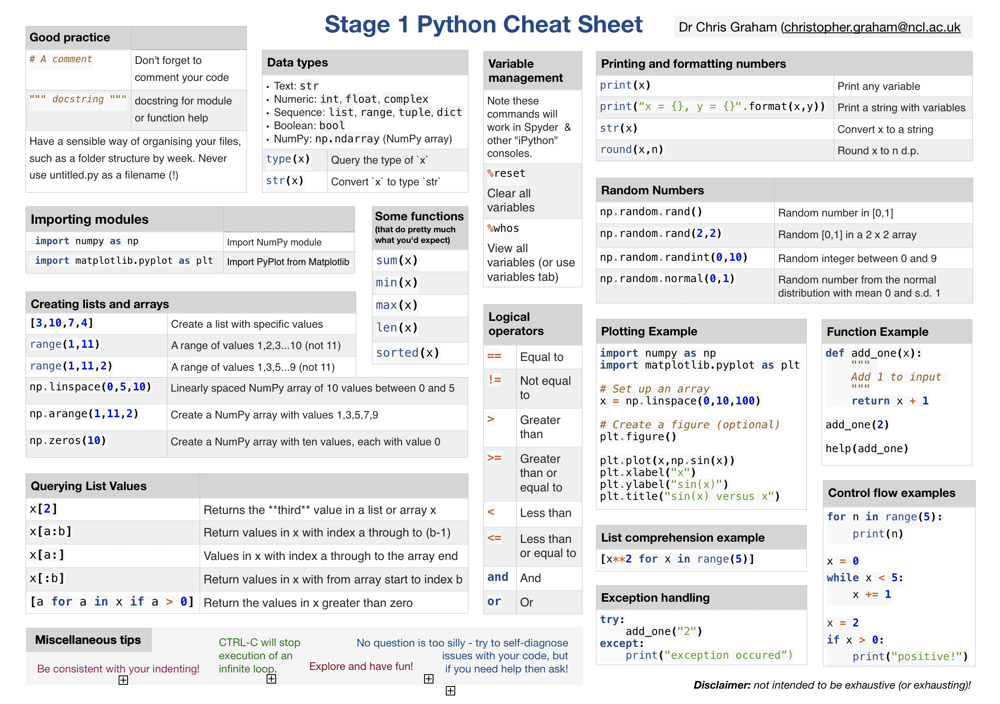
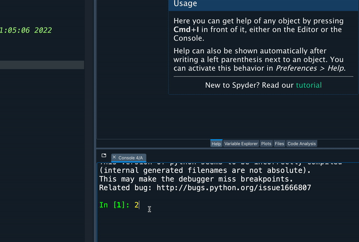

[Click here to open this handout in a new browser tab](#){target="_blank"}

# PHY2039 Handout 1 - Foundations

This is the virtual handout Week 1 of PHY2039. 

During the practical sessions myself and a team of postgraduate demonstrators will be circulating around the cluster. Please don't hesitate to raise your hand, or to come and find us, if you have any questions at all.

**There are no silly questions!** Questions of any type and at any level are welcome:

* Tech support e.g. 'my cursor has disappeared'
* Technical e.g. 'my code won't compile' or 'I get this error'
* Abstract e.g. 'can I accomplish this task with a shorter program?'

## Using these handouts

The main content for each week of the course is contained in these virtual handouts. You should try out the commands, by copying sections of code like this one

```python
x = 2
```

into Spyder and exploring them by changing variables and so on. You copy using *CTRL-C* and paste using *CTRL-V*. Text formatted like this: `x` refers to code.

The handouts also contain the *exercises* and *interludes*.

<div class="exercise" markdown=true>


### Exercise 

This is an exercise. Sometimes there'll be a correct answer, sometimes they are open-ended. I suggest that you try them as you encounter them in the handout. Note that your answers won't be saved in the handout itself (you can use a script to save your solutions if you wish).

Click on 'show exercise' to load it.

<numbas-embed data-url="https://numbas.mathcentre.ac.uk/question/129242/intro-to-python-exercises-handout-1-exercise-0/embed/?token=6d93fa53-fa68-44ff-ab49-b2d2d5193015" data-id="exercise-1-0" data-cta="Show exercise >"></numbas-embed>

</div>

<div class="interlude" markdown=true>

### Interlude
This is an interlude. They contain remarks or material that is outside the scope of the module and therefore not testable, but included for completeness or interest.

</div>

### Spyder

We are going to be using the integrated development environment (IDE) Spyder to run Python code. Spyder is open source and cross-platform, so you can also install it for free on personal devices.


### Launching Spyder in a computer cluster

In a computer cluster:

 1. press the Windows key on your keyboard or click the Start icon, and begin typing 'Anaconda'. 
 2. Open the Anaconda3 folder
 3. Choose the **Anaconda3 Navigator**

{width=90%}

4. Click past any tour, the offer to login, and update notifications. Then select Spyder from the list of applications:

{width=90%}

For instructions on how to install Anaconda on your own device visit the Accessing Python page in our Canvas course.


***


## Week 1 content

<div style="float: right; max-width: 300px; width: 50%; margin-left: 30px; text-align: center; border-bottom: 4px solid #c23abb; padding: 10px; background: #FAFAFA;">
<a href="../../static/pdf/python-cheat.pdf" target="_blank">
	
</a>
<h4 style="margin-top: 10px;"><a href="../../static/pdf/python-cheat.pdf" target="_blank">Cheat sheet (PDF version)</a></h4>
</div>

This handout is split into 3 parts:

1.1) Python Foundations 

1.2) Plotting 

1.3) Curve fitting introduction

We will continue with more complicated curve fitting in Week 2. If you've taken PHY2039, PHY1030, have or been through the transition material handouts then you'll find 1.1) and 1.2) familiar.

Before you start you might like to download the cheat sheet ([HTML version here](../../background_material/cheat_sheet/index.html){target="_blank"}):

It contains many of the commands and functions that are covered in PHY2039.


<br style="clear: both;">

***


## 1.1) Foundations 


This section revisits the set up of Python variables, lists, and the use of modules. 

We are using **Python 3** throughout this module. Please be aware of this when searching for help, as there are significant differences from the previous Python 2. Although Python 2 is no longer supported by the developers of Python it is still widely used, so make sure that any resources you find are designed for Python 3.


### Arithmetic operators

Here are Python's arithmetic operators 

Operator       |     Example input   |   Example Output    | Notes
---------------|---------------------|---------------------|-----------------------------------------------------
   +           |     `2 + 2`         |     4               |
   -           |     `3 - 2`         |     1               |
   *           |     `2 * 3`         |     6               |
   /           |     `4 / 2`         |     2               |
   **          |     `2 ** 3`        |     8               | Alternative is the function `pow()`. 
   %           |     `10 % 3`        |     1               | Modulo ("remainder when dividing 10 by 3")


{title="Your first command" style="float: right; width: 50%; max-width: 550px; margin: 10px 0 10px 30px;"}


The simplest way to use Python is to enter a command in the *Console* and allow Python to run it and return the result. 

Type `2+2` (or even better, copy and paste using CTRL-C and CTRL-V) into the *Console* part of Spyder (usually the bottom right pane) and it will return back 4.

```python
2+2
```
```output
4
```

You can enter a fraction, and it will be converted to a decimal (a.k.a. a floating point number) by Python:

```python
2/3
```
```output
0.6666666666666666
```

You can also write very small or very large numbers using scientific notation. E.g. we enter

```python
1.2e-5
```
```output
1.2e-05
```

to represent $1.2\times 10^{-5}$

### Variable assignment 

Set a variable `x` equal to 5 as follows

```python
x = 5
print(x)
```
```output
5
```

Multiple variables interact as expected

```python
y = x**2
print(y)
```
```output
25
```

Notice that we have used the function `print()` to output the value of a variable to the console.

<div class="exercise" markdown=true>

### Exercise 1.1 

A short question on variable assignment, that also highlights necessary care that must be taken when using brackets.

<numbas-embed data-url="https://numbas.mathcentre.ac.uk/question/129404/variable-assignment-handout-1-exercise-1/embed/?token=4587e12e-04aa-4b41-b214-ba115dc3b1b8" data-id="exercise-1-1" data-cta="Show exercise >"></numbas-embed>

</div>

### Functions

Here are some useful functions from Python's so-called [*standard library*](https://docs.python.org/3/library/){target="_blank"}

function      |       Description
--------------|---------------------------------------------------------
`abs()`		  |		 Return the absolute value of a number
`len()`       |       Return the length of an object
`max()`       |       Find the largest value in a list or similar object
`min()` 	  |		 Find the smallest value in a list or similar object
`print()`	  |		 Print the value of an object
`round(x,n)`  |       Round a number `x` to `n` decimal places
`sum()`       |       Sum the values in a list or similar 

That is, these functions are available immediately (no additional packages are required).

<div class="exercise" markdown=true>

### Exercise 1.2

<numbas-embed data-url="https://numbas.mathcentre.ac.uk/question/129403/round-function-handout-1-exercise-2/embed/?token=9d7c28da-c2b8-4d56-b1c3-27dd22459894" data-id="exercise-1-2" data-cta="Show exercise >"></numbas-embed>

</div>

### Getting help

You can find out what a function does, and what it expects as input, using another function: `help`

```python
help(pow)
```

There is an alternative way to get help in Spyder. Click on the Help tab and you will prompted to explore your code using CTRL-I (capital I for indigo) - this can be in the Console or the Editor window. Move your cursor immediately before a command -  say to the `print()` function a couple of commands ago - and press CTRL-I to access the help.

<div class="interlude" markdown=true>

### Interlude 1.1: Searching for help 

The vast majority of professional programmers Google things multiple times a day, every day of their working lives. Far from being considered 'cheating', this is standard practice.

Please feel free to use your preferred search engine to look for solutions to problems you encounter. Remember to include the term 'python' in your search.

E.g. 'sort list elements python'

</div>

### Data types

So far we haven't thought very much about the **types** of objects we were handling with Python e.g. we used integers `x = 3`, fractions `x = 2/3`, and lists `x = [3,6,9,12]`. We shall now look more in depth at data types and some of their subtleties. An understanding of different data types is important in any programming language. 

Consider a variable `z` 

```python
z = 1/3
```

Here Python does not store `z` as the fraction $1/3$, but as a decimal. The decimal expansion of $1/3$ is $0.333333\ldots$ A computer cannot store infinitely many digits of this decimal expansion; at some point the variable `z` must terminate. For this reason we encounter phenomena like

```python
0.1+0.2
```
```output
0.30000000000000004
```
More information on this and related phenomena is available in the [Python documentation](https://docs.python.org/3/tutorial/floatingpoint.html). There are mathematics packages for Python that allow for symbolic storing of rational numbers such as $1/3$, but we do not need to use them at present. 

In the Variable explorer (usually in displayed in the top-right of the Spyder window) you will find that the type of the variable `z` is a *float*. You might also have some integers with type *int* still in your workspace.

The following are some of the common data types used in Python.

<table class="table table-striped">
<tr>
	<th>Data type </th>
	<th>Example</th>
	<th>Function to convert to this type</th>
	<th>Description</th>
</tr>
<tr>
	<td>Integer   </td>
	<td><code>2</code></td>
	<td><code>int()</code></td>
	<td>Python stores integers as a separate data type which it refers to as <i>int</i>.</td>
</tr>
<tr>
	<td>Floating point number</td>
	<td><code>2.0</code></td>
	<td><code>float()</code></td>
	<td>This is the computing term for so-called 'decimal numbers' or 'decimals', that Python refers to as <i>float</i>.</td>
</tr>
<tr>
	<td>List</td>
	<td><code>[2,4,6]</code></td>
	<td><code>list()</code></td>
	<td>An ordered collection of items, refered to by Python as a <i>list</i>.</td>
</tr>
<tr>
	<td>Boolean   </td>
	<td><code>True</code> or <code>False</code></td>
	<td><code>bool()</code></td>
	<td>A boolean is an object that is either true or false, that Python refers to as a <i>bool</i>. There are only two values for this data type: <code>True</code>  and <code>False</code> </td>
</tr>
<tr>
	<td>String   </td>
	<td><code>"orange juice" </code></td>
	<td><code>str()</code></td>
	<td><i>Strings</i> are sequences of characters that we don't want Python to attempt to run.</td>
</tr>
</table>

The function `type` can tell us the data type of a variable.

```python
type(2.0)
```
```output
float
```


```python
type(int(2.0))
```
```output
int
```

<div class="exercise" markdown=true>

### Exercise 1.3

A short exercise classifying objects into different data types


<numbas-embed data-url="https://numbas.mathcentre.ac.uk/question/75797/data-type-classification/embed/?token=4c2c107a-1f72-4b79-ad0e-3502dad31621" data-id="exercise-1-3" data-cta="Show exercise >"></numbas-embed>

</div>


### The `range` function

The range function creates a sequence of integers. With one argument, `range(stop)` for an integer `stop`, the function returns the sequence from 0 up to **but not including** `stop`.  

The `range` function does not output a list by default. However, it's often useful to convert the output to a list, and we'll cover that shortly.

The command 

```python
range(10)
```

creates a sequence of numbers $0,1,2\ldots 9$. It returns an object of type *range*, as you can see with

```python
x = range(10)
type(x)
```
```output
range
```

The range type is a bit like a *list* but not quite the same.

If `range` is given two arguments, it treats them as `range(start,stop)` and returns the sequence from `start` up to **but not including** `stop`.  

```python
range(2,10)
```

returns the sequence $2,3,4\ldots 9$.

If range has a third argument: `range(start,stop,step)`, it returns the sequence from `start` up to **but not including** `stop` in step sizes of `step`.

```python
range(2,10,2)
```

returns the sequence $2,4,6,8$.


### Lists 

Lists are used by Python to store data in a vector-like structure. You can display a range as a list using the `list` function:

```python
list(range(2,10,2))
```
```output
[2, 4, 6, 8]
```

Alternatively values can be placed in a comma-separated list of any data type inside square brackets as follows:

```python
x = [3,8,5,6,9,4]
```

An element of the list can be accessed using an index number as follows,

```python
x[3]
```
```output
6
```


The following gets the values with indexes from 1 up to (but not including) 5. We'll see more on this notation as we move through the course.

```python
x[1:5]
```
```output
[8, 5, 6, 9]
```

Individual elements of a list can be set with,

```python
x[3] = 10
print(x)
```
```output
[3, 8, 5, 10, 9, 4]
```

**Warning:** indexing in Python starts at $0$, so that `x[0]` is the first element of the list, in this case `3`. This is not always the case in other programming languages (such as R).

### Modules

Having identified how to create a list, I might wish to do something like

```python
x = [3,6,9]
x/3
```

and hope to obtain 

```
[1,2,3]
```
However, we obtain the error

```
TypeError: unsupported operand type(s) for /: 'list' and 'int'
```

Lists do not support this sort of operation. In addition, we might expect to be able to do the following, but this also returns an error message:

```python
cos(0)
```

Why? The Python standard library only contains only basic functions e.g. it does not contain trigonometric functions such as sine and cosine. To extend Python we can load **modules**: prewritten code that adds new functionality to Python.

### NumPy


📖 [NumPy documentation](https://numpy.org/doc/){target="_blank"}

Load NumPy with the command

```python
import numpy
```

NumPy has many functions and variables that are now available e.g.

```python
numpy.cos(0)
numpy.sqrt(numpy.pi)
```

It's pretty laborious writing out `numpy` every time you run a command. Happily we can set up and abbreviation as follows

```python
import numpy as np
np.cos(np.pi)
```

NumPy provides a very useful data type known as an **array**, set up as follows

```python
np.array([3,6,9])
```

An array is similar to a list, but allows for element-wise arithmetic such as

```python
x = np.array([3,6,9])
print(x/3)
```
```output
[1,2,3]
```

NumPy also has support for sequences of numbers similar to `range`, via the function `np.arange()`:

```python
np.arange(0,9)
```

A matrix is represented as a list of lists, with each of the inner list representing a row. It can help to put each inner list on a new line to visualise what the matrix looks like.

```python
matrix = np.array([[1, 2], 
                   [3, 4]])
print(matrix)
```
```output
[[1 2]
 [3 4]]
```

<div class="exercise" markdown=true>

### Exercise 1.4 

Practice with NumPy functions:

<numbas-embed data-url="https://numbas.mathcentre.ac.uk/question/129402/numpy-functions/embed/?token=909e9f01-5d39-4d22-8c9a-8760df3fbbed" data-id="exercise-1-4" data-cta="Show exercise >"></numbas-embed>

</div>

<div class="exercise" markdown=true>

### Worked Example (Exercise 1.5) 

In the 14th century, the Indian astronomer and mathematician, **Madhava of Sangamagrama** made a huge impact in a number of fields, including in laying the foundations of calculus that would develop in the centuries that followed. One of his most significant contributions was in series approximations of trigonometric functions.

Madhava proposed the following method for computing the value of $\pi$:

$$ \pi = \sqrt{12}\sum_{k=0}^{n}\frac{1}{(2k+1)(-3)^{k}} $$

Evaluate this estimate for $n=21$.

## A solution

We can use element-wise arithmetic and the `sum()` function. First we set up an array of containing the numbers $0$ to $21$:

```python
import numpy as np
k = np.arange(0,22)
```

For each value in `A` we must compute the quantity

$$\frac{1}{(2k+1)(-3)^{k}}$$

Element-wise arithmetic allows us to do so

```
t = 1/((2*k+1)*((-3)**k))
```

Notice the careful use of brackets.

The estimate is then given by

```python
np.sqrt(12)*sum(t)
```
```output
3.141592648743835
```

</div>

### Control flow and functions

Control flow (for loops, while loops and if statements) and user-defined functions are used throughout this module. We'll cover both topics in more depth later. For now here are some basic examples:

Repeat command(s) a number of times with a `for` loop:

```python
for n in range(1,6):
  print(n**2)
```

Run command(s) only *if* a condition is satisfied

```python
x = 2
if x >= 2:
   print("True")
```

Run command(s) only *while* a condition is satisfied


```python
n = 2
while n < 5:
	n += 1
	print(n**2)
```

Create your own function:

```python
def cube(x):
	return x**2

print(cube(5))
```

Try all of these out and check that you understand the output.

### Python scripts

While the console window is an important part of the environment (especially as it contains the output to our code) it's not a convenient place write long programs.

You'll have noticed the large space on the left of Spyder. This is the *Editor*, used to edit files. We'll use files to store our code, so that we can edit, save, re-open and re-use code.

Add the following in the Editor window

```python
import numpy as np
x = np.arange(0,10)
y = np.cos(x)
```

The code can be run by clicking the 'play' button in the row above the Editor, pressing F5, or pressing Shift+Enter. You may be prompted to save your file (it's a good idea to give it a sensible name and location).

You'll then be prompted with a number of options the first time you run the file: this is Spyder setting up your configuration and you can go ahead and hit 'Run'. In the console you'll see a line something like 

```
runfile('H:/python/my_file.py', wdir='H:/python/')
```

Behind the scenes, hitting the run button called a function `runfile()`, with two arguments: the first is the file location, the second the 'working directory'. The latter is very important when it comes to working with multiple files later in the module.

You won't see any other output in the Console though. We can use the `print` function to display the value of `y`. Update your code in the editor to read 

```python
import numpy as np
x = np.arange(0,10)
y = np.cos(x)
print(y)
```

When running the new code you will see the value of `y` printed to the Console. Notice the efficiency of not needing to enter the other lines again: you can simply add the print command to your script.

Next week we'll cover best practices for commenting your files. This is very important, especially for longer programs. In brief, lines beginning with `#` are treated as comments and Python ignores them when running code. The characters `"""` are used to create multiline comments:

```python
"""
Script to create an array of cosine values
"""

# import numpy
import numpy as np

# Create arrays for x and y
x = np.arange(0,10)
y = np.cos(x)

# print y
print(y)
```

***


## 1.2) Plotting

We'll now cover plotting with Python: creating and customising plots of data.

From this point on (and for the remainder of the module) it is recommended to use scripts and the Spyder Editor, rather than the Console.

### The Matplotlib module

📖 [Matplotlib.org documentation](https://matplotlib.org/stable/contents.html){target="_blank"}

We can access plotting tools via the *Matplotlib* package (a package is a large collection of many modules). For the moment we are only interested in one module, known as *pyplot*, which we can specify via the syntax `matplotlib.pyplot`

``` python
import matplotlib.pyplot as plt
plt.plot([1,4,9,16])
plt.show()
```

On a cluster computer Spyder will display plots in the *Plots* tab (next to *Help*, *Variable Explorer* etc), as long as the line `plt.show()` is included. If your code compiles but no plot appears make sure to double check that you have included `plt.show()`.

**Important note**: different installations of Spyder behave differently in how they display plots. In older versions of Spyder plots are displayed in the Console. In some never versions the line `plt.show()` is not required, and plots will be displayed in the Plots tab automatically. 


### Some plotting practice

Load the NumPy module and create an array using the `arange()` function

```python
import numpy as np
x = np.arange(0,10)
```

This is the sequence of numbers $0,1,2,3\ldots 9$. Using element-wise arithmetic we can create a new array that is the sine of the elements of `x`

```python
y = np.sin(x)
```

We plot `y` against `x` via

```python
plt.plot(x,y)
```

This can be combined into a script as follows

```python
"""
Script to plot sin(x)
"""
import matplotlib.pyplot as plt
import numpy as np

x = np.arange(0,10)
y = np.sin(x)
plt.plot(x,y)
plt.show()
```

{width=90%}

We can modify the `np.arange()` function to give us a nice smooth range of x values. Earlier we used this to create integer sequences, and if you recall it had a third argument for the step size.  `np.arange()` can also accept float arguments, for example:


```python
x = np.arange(0,10,0.1)
```

Alternatively, the function `np.linspace(a,b,n)` defines a list of $n$ equally-spaced numbers in the interval $[a,b]$, for example

```python
# 100 values between 0 and 10
x = np.linspace(0,10,100)    
```

We can edit our plotting script to use `np.linspace` as follows

```python
"""
Script to plot sin(x)
"""
import matplotlib.pyplot as plt
import numpy as np

x = np.linspace(0,10,100)
y = np.sin(x)
plt.plot(x,y)
plt.show()
```

{width=90%}


PyPlot is extremely flexible, with a huge variety of customisation options. Just scratching the surface, we can add axis labels to the plot as follows


```python
"""
Script to plot sin(x)
"""
import matplotlib.pyplot as plt
import numpy as np

x = np.linspace(0,10,100)
y = np.sin(x)
plt.plot(x,y)
plt.xlabel('x') 
plt.ylabel('sin(x)')
plt.show()
```

{width="90%"}


By default we get a plot with a line through the points. By adding a third argument to `plt.plot()` we can change this. For example `bo` will produce blue circle markers:

```
plt.plot(x,y,'bo')
```

We can add multiple plots to a single set of axes by adding further arguments to the `plot()` function

```python
plt.plot(x,np.sin(x),'b',x,np.cos(x),'r--')
```

Or by using two plot commands. Your script might look like

```python
"""
Script to plot sin(x) and cos(x)
"""
import matplotlib.pyplot as plt
import numpy as np

x = np.linspace(0,10,100)
plt.plot(x,np.sin(x),'b')
plt.plot(x,np.cos(x),'r--')

plt.legend(['sin(x)','cos(x)'],loc=1)
plt.title('A plot of sin and cos')
plt.show()
```

{width="90%"}

The `loc` option in legend sets the location. See `help(plt.legend)` or just experiment changing its value. 

You can also set the legend labels as you create your plots, which is often easier:

```python
plt.plot(x,np.sin(x),'b',label='sin(x)')
plt.plot(x,np.cos(x),'r--',label='cos(x)')

plt.legend()
```

You can create separate plots for your functions by using `plt.figure()` to start a new figure window:

```python
"""
Script to plot sin(x) and cos(x)
"""
import matplotlib.pyplot as plt
import numpy as np

x = np.linspace(0,10,100)

# First plot
plt.plot(x,np.sin(x),'b')
plt.xlabel('x') 
plt.ylabel('sin(x)')
plt.show()

# New figure for the second plot
plt.figure()
plt.plot(x,np.cos(x),'r--')
plt.xlabel('x') 
plt.ylabel('cos(x)')
plt.show()

```


You can view more plotting options by running the following in the console.

```python
help(plt.plot)
```

You can also consult the [PyPlot online documentation](https://matplotlib.org/api/_as_gen/matplotlib.pyplot.plot.html#matplotlib.pyplot.plot){target="_blank}.


<div class="exercise" markdown=true>

### Exercise 1.6

Some plotting practice.

<numbas-embed data-url="https://numbas.mathcentre.ac.uk/question/129456/plotting/embed/?token=728c5cf9-411d-432b-af08-9e79c9c0a9db" data-id="exercise-1-6" data-cta="Show exercise >"></numbas-embed>

</div>

***


## 1.3) Curve Fitting

### Introduction

Curve fitting is an attempt to find a continuous function that gives a good approximation of a set of discrete data points. 

The key questions are:

* What type of function should be used? 
* What is meant by 'good approximation'?

In research or industrial settings the choice of function used can become very complicated. We'll begin with the simplest case: fitting straight lines to data.

### An example 

Consider the following plot of some discrete data points, contained in variables `x` and `y`.

<table class="table" style="width: 300px;">
	<tr><th>x</th><td>1</td><td>2</td><td>3</td><td>4</td></tr>
	<tr><th>y</th><td>5.5</td><td>7.0</td><td>9.5</td><td>9.9</td></tr>
</table>


```python
import matplotlib.pyplot as plt

# The data points
x = [1,2,3,4]
y = [5.5,7.0,9.5,9.9]

# Plot discrete points
plt.plot(x,y,'x')

plt.xlabel('x')
plt.ylabel('y')
```
{width="90%"}

How do we find a line of best fit? As a first pass, we could simply make an educated guess: let's try the function $f(x)=2x+3$.

Let's use element-wise arithmetic to plot the function $f$ (we could define a Python function to replicate $f$, but that would be overkill here).

Either redefine `x`

```python
import numpy as np
x = np.arange(1,5)
```

or use the existing list and convert it to a NumPy array as follows:

```python
x = np.array(x)
```

With either method we can now create a new array `f`

```python
f = 2*x+3
print(f)
```
```output
[ 5,  7,  9, 11]
```

The follow code adds a plot of `f` to the original pair of axes:


```python
import matplotlib.pyplot as plt
import numpy as np

# The data points
x = np.arange(1,5)
y = [5.5,7.0,9.5,9.9]

# Plot discrete points
plt.plot(x,y,'x')

# Plot best fit line
f = 2*x+3
plt.plot(x,f,'-')

plt.xlabel('x')
plt.ylabel('y')
```

{width="90%"}

(Note that it is not necessary to convert `y` to an array at this point.)

How can we quantify how well this line fits the data? Specifically, is there another choice of straight line that fits the data better? We can answer these questions using the follow method.


### The least squares method

The *least-squares method* is a way to decide which choice of straight line $f(x)$ fits the data best. That is, to find the *line of best fit*.

Suppose that we have four data points $(x_0, y_0)$, $(x_1$, $y_1$), ($x_2$, $y_2$) and ($x_3$, $y_3$) and want to fit a straight line $f(x)$ to them.

The difference between $y_i$ and $f(x_i)$ is known as the *residual*

$$ r_i = f(x_i) - y_i $$

For the data given above the residuals are illustrated as follows

{width=70%}
{width=25%}

For example: $f(x_0)=5$ and $y_0 = 5.5$ so that $r_0 = -0.5$.

This particular residual is negative; we avoid having to worry about positive and negative residuals by taking their square $r_i^2$. The quantity $S$ is the sum of the squared residuals

$$ S = \sum_{i} r_i^2 = \sum_i \left[f(x_i) - y_i\right]^2$$

and the line of best fit is precisely the choice of $f$ that minimises $S$.

To fit the line $f(x) = mx + c$ to the data the least squares method will determine the values of the parameters $m$ and $c$ that yield the smallest value for $S$. 

We can also use the least squares method to fit other functions. For example, to fit a quadratic function to the data we must determine values of parameters $a$, $b$ and $c$ so that the function $f(x) = ax^2 + bx + c$ minimises $S$.

Let's calculate $S$ for our example above by creating an array `r` containing the residuals $r_i$ for our guess $f(x)=2x+3$ 

```python
r = f - y
print(r)
```
```output
[-0.5  0.  -0.5  1.1]
```

Notice that we did not need to convert `y` to a NumPy array. If we desired consistency we could add the line `y = np.array(y)`.

We can compute $S$ by squaring the array of residuals and using the function `sum()`

```python
S = sum(r**2)
```

Printing `S` we obtain $S \approx 1.71$. We are now presented with the question: is this the minimum value of $S$? That is, is it possible to find another choice of $ f(x) = ax + b$ that yields a lower value of $S$? For example the choice $f(x) = (1.9)x+3.1$ yields $S \approx 1.39$, so $f(x)=2x+3$ is not the line of best fit.

There are pen-and-paper methods to determine the correct choice $ f(x) = ax + b$, but they are labourious and don't extend to fitting higher degree polynomials such as quadratics. Instead, we can use Python to find the correct values of $a$ and $b$.


### The NumPy `polyfit` function

The NumPy funtion `polyfit` implements the least squares method to fit polynomials of degree $n$

$$ f(x) = a_nx^n + a_{n-1}x^{n-1} + \cdots + a_2x^2 + a_1x + a_0 $$

to a given dataset.

We implement `polyfit` as follows

```python
import numpy as np
p = np.polyfit(x, y, n)

```

The input arguments are

* `x`, a list or array of independent data points.
* `y`, a list or array  of dependent data points.
* `n`, the degree of the polynomial to fit. 

And the output (which I've assigned to `p` here) is a list of coefficients for the specified polynomial, in descending degree order i.e.`[a_n, ..., a_2, a_1, a_0]`. For example, if `n=1` then `p = [a_1, a_0]`, a list with two elements (the gradient `a_1` and $y$-intercept `a_0` of the line of best fit).

Let's fit such a degree $1$ polynomial, $f(x) = ax+b$, to determine the optimal choice of $a$ and $b$ for the dataset given above

```python
import numpy as np

x = np.arange(1,5)
y = np.array([5.5,7.0,9.5,9.9])  # Now a NumPy array for consistency

p = np.polyfit(x, y, 1)
print(p)
```

The output is

```
[1.57, 4.05]
```

Thus the line of best fit is 

$$ 1.57x + 4.05 $$

Recall that the elements can be retrieved by using the index of the vector `p`, for example the first element in `p` has index 0 and

```python
p[0]
```
returns the value $1.5700$. It is often useful to define a variable and set it to the gradient, in order to use this value elsewhere e.g.

```python
m = p[0]
```

<div class="exercise" markdown=true>

### Exercise 1.7 

Let's see how the function compares to the previous estimates, in terms of a value for $S$.

<numbas-embed data-url="https://numbas.mathcentre.ac.uk/question/75815/calculate-residuals-for-polyfit-best-fit-handout-1-exercise-7/embed/?token=3832d0ce-cb4d-448d-8ae8-8530acc917f4" data-id="exercise-1-8" data-cta="Show exercise >"></numbas-embed>

</div>

## Next Week

We will extend these techniques as follows:

* fitting higher degree polynomials
* fitting functions that are not polynomials
* using scripts to import large datasets

{width="90%"}
