[Click here to open this handout in a new browser tab](#){target="_blank"}

# PHY2039 Handout 4

This week is split into two parts:

* Part 1: Control flow and functions
* Part 2: Root finding algorithms

(If you took a Python module in Stage 1 then Part 1 will be mostly revision.)


## 4.1) Functions and control flow

### Logical operators

We can use logical operators to set up Booleans: statements that are either True or False. E.g.

```python
x == 2
x > 2
```

Whether the statements above are True or False depends on the value of `x`, of course.

**Operator**       |    **Description** 
-------------------|-----------------------------------------------------------
<                  |    Less than 
>                  |    Greater than 
<=                 |    Less than or equal to 
>=                 |    Greater than or equal to 
==                 |    Equal to 
!=                 |    Not equal to
a and b            |    True if both a and b are True 
a or b             |    True if at least one of a and b is True 
not a              |    Negation of a; returns True if a is False and vice versa
a in x             |    Query if a is in x (for x a list-like object)

Further examples include:

```python
a = 3
print(a <= 3)        # True
print(a < 5 or a > 25)   # True
print(a < 5 and a > 25)  # False
print(a % 2 == 0)  # False (is remainder when divided by 2 equal to zero - i.e. is the variable a even?)
print(2 in [1,2,3]) # True
print(4 not in [1,2,3]) # True
```

Logical operators such as these form a central part of **control flow**.

### Control flow

#### `for` Loops

A `for` loop is used to repeat a section of code many times (often incrementing a value so that something slightly different happens at each iteration).

The basic construction of a for loop is as follows:

```python
for n in range(1,6):
    # do something with n
```

Notice the syntax: the first line must end with a colon :, and the code that we wish to loop must be indented.

The comment 'do something with n' indicates exactly that: in many cases we use a loop to do something with the current value of $n$. In this case the loop runs 5 times, the first time for $n=1$, then for $n=2$, and so on until $n=5$, at which point it stops. As an example:

```python
for n in range(1,6):
  print(n**2)
```

<div class="interlude" markdown=true>

#### Interlude: string formatting

We could print text along with the current value of $n$ as follows:

```python
for n in range(1,6):
    print("The value squared is {}".format(n**2))
```

Note the syntax too for inserting the variable `n` into the string at each iteration. There are several ways to do this and we could spend an entire practical just looking at string formatting... Here is a brief look at some important points.

In the code above `{}` is a placeholder for the variable that is specified inside `format()`. If we need to insert more than one variable then we separate them with commas as follows:

```python
a = 5

b = 6

print("The values are {} and  {}".format(a,b))
```

The placeholders can be labelled so that a variable can be inserted twice in the same string:

```python
a = 5

b = 6

print("The values are {0} and {1}. Repeat the first value: {0}".format(a,b))
```

The syntax becomes more complicated if we wish to specify the format of the injected variable. Here's an example that prints $\pi$ and $e$ to 2 decimal places:

```python
import numpy as np

print("Constants to 2 decimal places: pi = {:.2f} and e = {:.2f}".format(np.pi,np.e))

# or including the labels 

print("Constants to 2 decimal places... pi = {0:.2f} and e = {1:.2f}".format(np.pi,np.e))
```

In the syntax `{0:.2f}`, the `0` is the label (so that `np.pi` is inserted here), the `:` separates the label from the format specification, `.2` is for 2 decimal places and `f` is for float.

For further information on string formatting see [here](https://docs.python.org/3/tutorial/inputoutput.html){target="_blank"} and [here](https://docs.python.org/3.4/library/string.html#string-formatting){target="_blank"}.
</div>

The `range(1,6)` could be any list-like object. For example

```python
for n in [4,1,5,6]:
    print(n)
```

A loop will iterate over the elements of the list-like object it is given, which need not be number. E.g.

```python
stops = ["Darlington", "Durham", "Newcastle"]
for x in stops:
   print(x)
```

We shall see many examples of the ways in which loops can be used to solve problems. The follow code gives a flavour of more complicated loops:

```python
# Intitialise a variable
s = 0

# Loop through adding n each time
for n in range(1,6):
    s += n

# print final value
print(s)
```

Notice that the line break and subsequent unindent marks the end of the `for` loop.

The code `s += n` adds `n` to the current `s` value, and is equivalent to `s = s + n`. 

The operator `+=` is known as an assignment operator, and it overwrites the value of a variable with a new one. There are other such operators, including `*=` e.g. `s *= n` is equivalent to `s = s * n`.

#### `while` Loops


A `for` loop runs over a specified domain. A `while` loop, on the other hand, continues to run as long as a specified condition is met. A `while` loop is set up as follows

```python
while boolean_object:
    #Code to be repeated

#Code outside of the loop
```

This loop will continue as long as `boolean_object` has the value `True`.

For example, we can use a `while` loop to sum the numbers $1, 2, \ldots$ until the sum becomes larger than $1000$:

```python
s = 0   #Initialise a variable to store value
n = 0   #Initialise a variable to keep track of number of loops

while s < 1000:
   n += 1    #Increment the counter
   s += n    #Add to s  

# Output the results
print("s is equal to {}".format(s))
```

A subtle important point is that the condition `s < 1000` is checked **before** the loop is executed. This means that after the final repetition of the loop the value of `s` is greater than $1000$, despite the `while` condition being `s < 1000`. Why is this the case? Consider the execution of the code:

1. The condition `s < 1000` is checked: if it is `True` the program moves on to the body of the loop, and executes the code.
2. The loop is executed many times. After $43$ iterations `s` is $946$ and `n` is $43$.
3. On the $44$-th iteration the condition `s < 1000` is checked: as `s` is $946$ the condition is `True` and the loop is executed again. The value of `n` is first increased to $44$ and this is then added to `s`, so that `s` is now $990$.
4. On the $44$-th iteration the condition `s < 1000` is checked again: it is still true so the loop is executed. The value of `n` is first increased to $45$ and this is then added to `s`, so that `s` is now $1035$.
5. The condition `s < 1000` is checked for a final time: it is now `False` so the loop terminates.

### Infinite loops

It is easy to accidentally create infinite loops using `while` i.e. loops that will never stop looping as the relevant condition is always `True`. For example

```python
x = 0

while x > 1:
    print("Test")
```

Running this code will cause Spyder to print a stream of `Test` strings. While this is a trivial example, it is not uncommon to inadvertently create such infinite loops when writing programs.

To stop infinite loops we interrupt the console, terminating the running of the program. To do this in the most recent version of Spyder go to *Consoles->Interrupt kernel* from the menu bar at the top of the window:

{width="90%"}


### `if` statements

An `if` statement is similar to a `while` loop in that it will only be executed if a condition is met. However, the piece of code will not be repeated: an `if` statement simply checks if a condition is True, and then runs the code.

As in the case of `for` and `while` loops we set up an `if` statement using a colon and indentation. For example

```python
x = 4

if x >= 2:
   print("Greater than 2")
```

The `print` command is only executed if `x >= 2` is `True`. Setting `x = 1`

```python
x = 1
if x >= 2:
   print("Greater than 2")
```
we see that the `print` command is not executed.

An `if` statement can be followed by an `else` statement. The program will check the condition given in the `if` statement and run the indented code if it is `True`, otherwise it will run the code in the `else` statement. For example

```python
x = 4
if x < 2:
  print("x is less than 2")
else:
  print("x is not less than 2")
```

We can add more cases by using the statement `elif`, as follows

```python
x = 2
if x < 2:
    print("x is less than 2")
elif x == 2:
    print("x is equal to 2")
else:
    print("x is greater than 2")
```

A sequence of `if` and `elif` statements is not required to end with an `else` statement; the result of the code will depend on whether one is included though. For example

```python
x = 3
if x < 2:
    print("x is less than 2")
elif x == 2:
    print("x is equal to 2")
else:
    print("x is greater than 2")
```

produces a different output to the code

```python
x = 3
if x < 2:
    print("x is less than 2")
elif x == 2:
    print("x is equal to 2")
```

### Nested statements and loops

We can combine `for` and `while` loops with `if`, `elif`, and `else` statements, and place loops inside other loops. When doing so we must take care to keep the indentation correct.

As a rule, every time we create a new loop or `if`-like statement we must add another unit of indentation. For example, the code

```python
s = 0
for x in range(1,10):
    for y in range(1,10):
        s += x*y

print(s)
```

computes the product $x y$, where $x$ and $y$ both run from $1$ to $100$, and adds it to the variable `s` (note that there will be lots of double counting e.g. the terms $10\times 9$ and $9\times 10$ are both counted).

The syntax `n%m` represents the *modulo* function: it returns the remainder obtained when $n$ is divided by $m$. For example

```python
10%5
```
```output
0
```

and

```python
34%6
```
```output
4
```

Recall the the `append()` method for lists. Given a list `L = [2,4,6,8]` we can add an element to it as follows

```python
L.append(10)
```
```output
[2,4,6,8,10]
```

Notice that this does not create a new list, but adds the desired element to the existing list. Let's combine these tools to find every number less than $100$ that is divisible by both $3$ and $7$:

```python
#Initialise a list to record desired numbers
L = []

#Check every number less than 100
for k in range(1,100):
    if k%7 == 0:
        if k%3 ==0:
            L.append(k) #Add numbers to L if they pass both checks

print(L)
```

```output
[21, 42, 63, 84]
```

Using the operator `and` we could rewrite our code with one fewer `if` statement:
```python
L = []

for k in range(1,100):
    if k%7 == 0 and k%3 == 0:
        L.append(k)

print(L)
```

```output
[21, 42, 63, 84]
```

Suppose that instead of all such numbers less than $100$ we wanted find the first $25$ examples. The number of elements in a list-like object is accessed via the syntax `len()`. We can use this to stop a `while` loop at the desired point:

```python
#Initialise the list L and a variable k
L = []
k = 1 #We will manually increase k instead of looping over a range

while len(L) < 26:
    if k%7 == 0 and k%3 ==0:
        L.append(k)
    k += 1 #This line is only indented once, as it is not in the if statement

print(L)
```

```output
[21, 42, 63, 84, 105, 126, 147, 168, 189, 210, 231, 252, 273, 294, 315, 336, 357, 378, 399, 420, 441, 462, 483, 504, 525, 546]
```

To consider another example, recall that we can query a single element of a list or array as

```python
x = [2,5,8,5]
print(x[2])
```

We can also overwrite the value inside a list as
```python
x = [2,5,8,5]
x[2] = 4
print(x)
```

To overwrite many values of a list we can use a loop. However, but we cannot overwrite elements that do not exist yet. Specifically, the following code will produce an error:

```python
t = []
for n in range(0,10):
  t[n] = n**2
```
The solution is to either append (as we did above)

```python
t = []
for n in range(0,10):
  t.append(n**2)
```

or, initialise `t` as an array of the desired length using `np.zeros()`

```python
import numpy as np
t = np.zeros(10)
for n in range(0,10):
  t[n] = n**2
```

To check that this has produced the desired array, use

```python
print(t)
```

Note this is the same as using element-wise arithmetic.
```python
n = np.arange(0,10)
t = n**2
```
However, the above code using loops is more flexible.

<div class="interlude" markdown=true>

#### Interlude: code timing

The Python module *time* has a function `time()` that you can use to determine how long it took a piece of code to execute.

```python
# If the code takes a very long time to compile interrupt the kernel as described above

import time
import numpy as np

# Size of array
nmax = 1000000

# Test using for loop
print("Testing for loop")
start = time.time()  
x = np.zeros(nmax)
for n in np.arange(nmax):
    x[n] = n**3+n**2+n
    
end = time.time()
print(end-start)

# Test using element-wise arithmetic
print("Testing element-wise arithmetic")
start = time.time()      
n = np.arange(nmax)
x = n**3+n**2+n
end = time.time()
print(end-start)
```

Which method was faster?

See what happens when you multiply `nmax` by 10. Be careful not to overload your machine though (see the comment at the top of the script).

</div>

### List comprehension

List comprehension is a very flexible technique for doing things with lists. The general syntax is

```python
[expression for item in list]
```

In a nutshell: list comprehension is a way to query which list elements satisfy a condition. For example

```python 
a = [1,2,3,4,5,6]
[x > 2 for x in a]
```
```output
[False, False, True, True, True, True]
```

This returns a new list, with elements `True` or `False`, depending on whether or not the corresponding element of `a` satisfies the condition `x > 2`.

By modifying this syntax, we can return the specific values that satisfy the condition as follows

```python
[item for item in list if expression]
```
This will return the elements that satisfy the condition. For example

```python
even_numbers = [ x for x in a if x % 2 == 0]
print(even_numbers)
```
```output
[2, 4, 6]
```

(Recall that `%` is the modulo operator, so that `a%b` returns the remainder when `a` is divided by `b`.)

The syntax `x for x in a` might seem redundant, but it is very useful if we need to do something more complicated with the elements we pick out from the list. As a very simple example, we could square the even numbers found in the above code as follows

```python
even_numbers = [ x**2 for x in a if x % 2 == 0]
print(even_numbers)
```
```output
[4, 16, 36]
```

<div class="exercise" markdown=true>


### Exercise 4.1 


<numbas-embed data-url="https://numbas.mathcentre.ac.uk/question/77923/list-comprehension/embed/?token=13575975-74e0-49db-899d-0324825f68e1" data-id="exercise-3-2" data-cta="Show Exercise"></numbas-embed>


</div>

### Functions

When using the `opt.curve_fit()` function from SciPy in Week 2 we were required to define a Python function to describe the line we wished to fit. In most examples we used the line $y = mx + c$, coded as

```python
def line(x,m,c):
    return m*x + c
```

However, functions in Python are much more powerful than this. We'll now explore writing new functions, and some of the many things they can be used for.

Recall that the general syntax for defining a Python function is as follows
```python
#Define a function with a given name and input variables
def function_name(arg1, arg2):
    #Function body: code that carries out the desired behaviour of the function
    return #The return statement specifies the output of the function
```

Some important points:

- Function definitions must start with `def`, have a colon `:` after the brackets, and the function body must be indented with a tab (or four spaces).
- A `return` statement is not required for the function to be defined.
- We are free to change `function_name` as we wish, provided that we use lowercase letters and no spaces.

In the examples of curve fitting in Week 2 our functions always contained a `return` statement. This is because we were implementing the mathematical function $y = mx+c$ in Python. In this setting an output is always assigned to a given input. However, when defining more general functions a `return` statement is not needed: we might need a function to add a new element to a list, or to print a statement, neither of which require a `return`.

For example, this function adds a specified element to a (pre-existing) list

```python
def add_element(L,a):
    L.append(a)
```

Here the function takes two inputs: the list `L`, and the object `a` that will be added to `L`. For example

```python
def add_element(L,a):
    L.append(a)

M = [9,8,7]

add_element(M,4)
```

When we run the code above we will receive no output: all Python was instructed to do was append `4` to `M`. To see that this has in fact occurred we can do as follows:

```python
print(M)
```
```output
[9, 8, 7, 4]
```
as desired.

This function prints the square of an input number

```python
def print_square(x):
	print(x**2)

print_square(2)
```
```output
4
```

However, **we cannot use this function to assign the square of a number to a variable**. This is because the affect of the function is to *print a statement*, not *return a value*.

As a result the following code does not assign the value `4` to `x`

```python
x = print_square(2)
```

We can see this by noticing that `x` has the type `NoneType`, whereas we want it to be an `int`.

This is where a `return` statement is required. The following function will return the square of the input number, for variable assignment and any other use:

```python
def square_a_number(x):
	return x**2

x = square_a_number(2)
print(x)
```
```output
4
```

Now `x` has the desired type `int`.

Note that the `x` in the function definition and the `x` variable outside the definition are unrelated. This is an example of the *scope* of a variable i.e. how far its definition persists throughout your code. Arguments that are used in function definitions are local to that definition, and will not affect code outside of the definition.

#### Example: Primes and factors

The following code can be used to check if $51$ is a prime number.

```python
n = 51

for m in range(2,n):
    if n%m == 0:
        print("{} divides 51".format(n))
```

Specifically, the code runs through the numbers less than $51$ and checks if any of them divide $51$.

By defining a function we can use this code to check if any integer is prime:

```python
def prime_check(n):
    for m in range(2,n):
        if n%m == 0:
            print("{0} divides {1}".format(m,n))
```

Some examples:

```python
prime_check(101)
```
produces no output, so $101$ is prime.

```python
prime_check(6523459283)
```
```output
11 divides 6523459283
17 divides 6523459283
41 divides 6523459283
187 divides 6523459283
451 divides 6523459283
697 divides 6523459283
7667 divides 6523459283
850849 divides 6523459283
9359339 divides 6523459283
14464433 divides 6523459283
34884809 divides 6523459283
```

Suppose that instead of simply checking if $n$ is prime and printing a statement, we wish our function to return the smallest factor of $n$. The core of the code remains the same, but we change some important aspects as follows

```python
def smallest_factor(n):
    for m in range(2,n):
        if n%m == 0:
            return m
    else:
        return n
```

Notice:

- Whenever Python encounters a `return` statement in a function it immediately stops executing that function and returns whatever it is instructed to. This means that `return` statements will also stop loops from running, so that this function will automatically stop at the smallest factor of $n$.
- We have added an `else` statement, but it is not related to the `if` inside the `for` loop. We can determine this from the indentation: `if` is indented twice but `else` is indented once. In this case the `else` is related to the `for` loop: the code within the `else` statement will only be executed if the `for` loop finishes running over the entire designated range. (For this to work as intended the `else` must be immediately after the `for`.) In this case, the `else` statement will be executed if the line `return m` is never executed.

Some examples:

```python
smallest_factor(403)
```
```output
13
```

and

```python
smallest_factor(433)
```
```output
433
```

An interesting task is to modify the above code to write a function that finds the *greatest* factor of a number $n$.

**Hints:**

- We can alter the step of a range using a third argument e.g. `range(100,0,-1)` yields $100, 99, 98, \ldots, 1$.
- We can also reverse a range using the function `reversed()` e.g. `reversed(range(1,101))` also yields $100, 99, 98, \ldots, 1$.


<div class="exercise" markdown=true>


#### Exercise 4.2 

<numbas-embed data-url="https://numbas.mathcentre.ac.uk/question/77903/python-factorial-function/embed/?token=522fd000-9e46-41e2-b2cc-0e98c00a297b" data-id="exercise-3-4" data-cta="Show Exercise"></numbas-embed>
</div>

#### Adding help to functions

A comment contained within three sets of quotation marks at the start of a function definition defines the function help i.e. what is displayed if we enter Ctrl+I or call `help()`. Such a comment is known as a  *docstring* (an abbreviation of documentation string). For example:

```python
def smallest_factor(n):
    """Takes an integer input and returns its smallest factor"""
    for m in range(2,n):
        if n%m == 0:
            return m
    else:
        return n
```

Test your help with

```
help(smallest_factor)
```

#### Error handling

Next week we will look at how to add custom error messages to functions. That is, we can anticipate how a user might incorrectly try to call our function, and specify particular error messages for common mistakes. This is very useful in helping us remember what code is supposed to do when returning to it after a break.

### Recursive functions

When defining a Python function it is possible to call another function within the definition. In particular, it is possible for a function to call itself in its definition. Consider this alternative to Exercise 4.2 (to calculate a factorial):

```python
def factorial(n):
    if n == 1:
        return 1
    else:
        return n*factorial(n-1)

print(factorial(20))
```

This takes advantage of the fact that $n! = n \times (n-1)!$.

While recursive functions are often simpler to write, they are likely to take longer to execute than non-recursive functions. This means that there are pros and cons to using recursion to solve problems. The following is an example of a situation in which recursion is very useful.

<div class="exercise" markdown=true>


#### Worked Example 4.3 - GCD algorithm 

<numbas-embed data-url="https://numbas.mathcentre.ac.uk/question/147769/gcd-worked-example-not-marked/embed/?token=1fc10bf7-8e3c-40c3-bc3c-74a3bd163c73" data-id="exercise-4-4" data-cta="Show Exercise"></numbas-embed>

<details markdown=true>
<summary>Click here to reveal a solution.</summary>

To achieve this task we can use a method known as the Euclidean algorithm.

Given integers $a$ and $b$ denote their GCD by $\text{GCD}(a,b)$. The Euclidean algorithm proceeds as follows:

1. Divide $a$ by $b$ and denote the remainder by $c$.
2. As $a = nb + c$ for some $n$ and $\text{GCD}(a,b)$ divides both $a$ and $b$, it follows that $\text{GCD}(a,b)$ divides $c$ also. Therefore $\text{GCD}(a,b) = \text{GCD}(b,c)$.
3. Repeat by dividing $b$ by $c$, and so on.
4. The algorithm terminates when a remainder of 0 is obtained, and GCD$(a,b)$ is the final non-zero remainder.

An example with $a=15$, $b=12$:

1. $15 = 12 \times 1 + 3$
2. $12 = 4 \times 3 + 0$
3. Thus $\text{GCD}(15,12) = 3$

Let's consider what we need to achieve to implement this in Python:

1. Compute the remainder `a%b`.
2. If it is $0$, stop.
3. If it is non-zero, compute the remainder `b%(a%b)`.
4. Repeat until we reach a remainder of `0`.

One implementation using recursion is as follows

```python
def gcd(a,b):
    if a%b == 0:
        return b
    else:
        return gcd(b,(a%b))
```

For example

```python
gcd(15,12)
gcd(272,32)
```
```output
3
16
```

It is instructive to consider how we could implement the Euclidean algorithm *without using recursion*. This would certainly be more complicated. For one thing, the number of repetitions required depends on the input numbers: we can't just use a fixed-length `for` loop as we did with calculating terms of the Fibonacci sequence. However we managed it, the result would be longer and more complicated then the five short lines we produced using recursion.

</details>
</div>


## 4.2) Algorithms

For our purposes the term *algorithm* refers to set of instructions (code) given to a computer (Python) to take a specific input and produce a specific output i.e. to accomplish a specified task.

When writing algorithms it is often useful to **sketch out** on a piece of paper what the algorithm must do. That is, to think about what the input is, what you plan to do with it, and out you will provide the output. You'd be surprised just how much time professional software developers spend [doing things that are not coding](https://en.wikipedia.org/wiki/Rubber_duck_debugging){target="_blank"}.

<div class="exercise" markdown=true>

#### Exercise 4.4

<numbas-embed data-url="https://numbas.mathcentre.ac.uk/question/147765/stern-s-diatomic-series/embed/?token=eebd4b51-6e05-422b-9bf0-424b71b82c86" data-id="exercise-4-4" data-cta="Show Exercise"></numbas-embed>

</div>

## 4.3) Root finding

A root of a (mathematical) function $f $ is a point $x_{\ast}$ such that $f(x_{\ast})=0$. The term root finding refers to solving equations such as

$$ x^2 - 2 = 0 $$

In this case we can solve the equation by hand, and we'll be using it to exemplify some computational root finding methods. We'll then move on to solving more complicated equations using Python (that we couldn't do by hand).


### The bisection method

The bisection method iteratively locates a root of a function $f$ using systematic trial and error:

1. Identify lower and upper bounds $x_d$, $x_u$ as above.
2. Evaluate the function at the midpoint of the bounds to eliminate half of the range.
3. Repeat until $x_u - x_d$ is sufficiently small.

You can use the arrows or slider below to explore the method:

<div class="slideshow-container" style="margin: 20px 0;">
  <div class="mySlides">
    
    <!--<div class="text">Caption Text</div>-->
  </div>
  <div class="mySlides">
    
  </div>
  <div class="mySlides">
    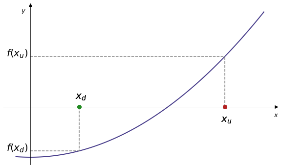
  </div>
  <div class="mySlides">
    
  </div>
  <div class="mySlides">
    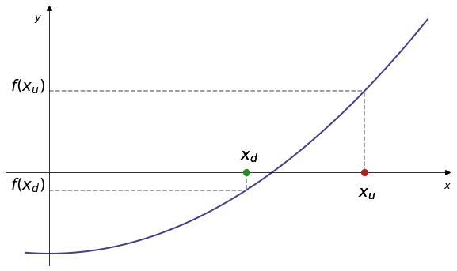
  </div>   
  <div class="mySlides">
    
  </div>  
  <div class="mySlides">
    
  </div>  
  <div class="mySlides">
    
  </div>  
  <div class="mySlides">
    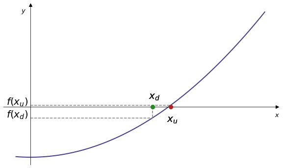
  </div>  
  <div class="mySlides">
    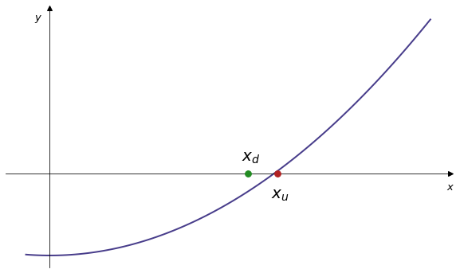
  </div>
  <div class="mySlides">
    
  </div>  
  <div class="mySlides">
    
  </div>   
  <div class="mySlides">
    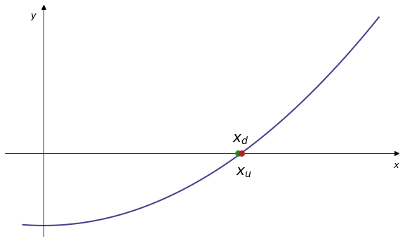
  </div>          
</div>
<br>

<div class="range-slider-container" style="margin-bottom: 50px;">
  <div class="go-left" onclick="plusDivs(-1)" style="font-size: 2em;">&#10094;</div>
  <input type="range" class="range-slider" id="slider" min="1" max="13" value="1" step="1">
  <div class="go-right" onclick="plusDivs(1)" style="font-size: 2em;">&#10095;</div>
</div>


<script>
let slideIndex = 1;
showSlides(slideIndex);

let slider = document.getElementById("slider");

slider.addEventListener("input", function() {
  showSlides(parseInt(slider.value));
});

function plusDivs(n) {
    showSlides(slideIndex += n);
    slider.value = parseInt(slider.value) + n
}

function currentDiv(n) {
  showSlides(slideIndex = n);
}

function showSlides(n) {
  let i;
  let slides = document.getElementsByClassName("mySlides");
  let slidesnext = document.getElementsByClassName("go-right")[0];
  let slidesprevious = document.getElementsByClassName("go-left")[0];

  if (n > slides.length) {slideIndex = 1}    
  if (n < 1) {slideIndex = slides.length}
  for (i = 0; i < slides.length; i++) {
    slides[i].style.display = "none";  
  }
  slideIndex = n; 
  slides[slideIndex-1].style.display = "block";  
  slidesnext.style.display = "block";
  slidesprevious.style.display = "block";
  if (n == 1){slidesprevious.style.display = "none";}
  if (n == 13){slidesnext.style.display = "none";}

}
</script>

The following exercise will guide you through the first few steps in the above process.


<div class="exercise" markdown=true>

#### Exercise 4.5

<numbas-embed data-url="https://numbas.mathcentre.ac.uk/question/77968/bisection-method-first-steps/embed/?token=21257cba-a07d-491c-ad34-04bd8929e76d" data-id="exercise-3-5" data-cta="Show Exercise"></numbas-embed>

</div>


#### Bisection method algorithm

The bisection method can be implemented in Python as follows. We can use a `while` loop to iterate until the upper and lower bound are separated by a value less than some variable specified with `eps` (for epsilon). That is, `eps` represents our desired level of accuracy.

```python
# the function considered
def func(x):
    return x**2-2

# initialise the upper and lower bounds. In this case pick 1 and 2
xd = 1 # Initial lower bound
xu = 2 # Initial upper bound

# Loop while xu - xd is greater than eps, chosen to be small
eps = 1e-8

while xu - xd > eps:

    # find xmid
    xmid = (xd+xu)/2

    # Evaluate at xmid. If it's larger than zero move the upper bound down
    if func(xmid) > 0:
        xu = xmid
    # else move the lower bound up
    else:
        xd = xmid

    # print the midpoint
    print(xmid)

```

Note that this algorithm relies on the upper bound being greater than my lower bound. This works OK for $x^-2$, but in general we might like to modify the code so that it doesn't depend on the sign of `xu-xd`.


#### When are two numbers equal?

Numerical solutions to mathematical problems are almost always not exact. Most algorithms do not lead to an analytic solution, but rather give an approximation to the answer that is accurate to within a certain (controllable) degree of tolerance. You may recall that most of the values we are dealing with in this module are of the type *float* (*floating point numbers*). [This page](https://docs.python.org/3/tutorial/floatingpoint.html){target="_blank"} describes the limitations of floating point numbers for the purposes of arithmetic, that cause effects such as

```python
0.1+0.2
```
```outout
0.30000000000000004
```
```python
0.1+0.2 == 0.3
```
```outout
False
```

Similarly, when we are implementing the bisection method we may expect the two values `xd` and `xu` to eventually become equal. In general usage, the term *machine epsilon* refers to the smallest possible gap between values in computer memory. For our purposes this means the smallest possible difference between two floats, and can be found as follows:

```python
import sys
macheps = sys.float_info.epsilon
print(macheps)
```
```output
2.220446049250313e-16
```

In other words, if $a - b \leq 2.220446049250313\times 10^{-16}$ then Python considers the floats $a$ and $b$ to be equal.

For example, suppose that `xd = 1.0` and `xu = 1.0 + macheps`. Then

```python
xd = 1.0
xu = 1.0 + macheps
xmid = (xd+xu)/2
print(xmid)
```
```output
1.0
```

As there is no floating point number between `xd` and `xu`, the float `xmid` is forced to take the same value as one of `xd` and `xu`. In the above code `xmid` takes the same value as `xd` i.e. there is no midpoint. If this code was in a while loop we would enter an infinite loop, with the values staying at `xd = 1.0` and `xu = 1.0 + macheps`. You can see this in action if you set `eps = 0` in the bisection function above (see the information earlier in the handout regarding interrupting the kernel).


<div class="interlude" markdown=true>

#### Interlude: largest possible float

We have already discussed the smallest possible float. At the other end of the scale, the largest float that Python can store is (this is system dependant but is the same on most modern machines):

```python
import sys
floatmax = sys.float_info.max
print(floatmax)
```
```output
1.7976931348623157e+308
```

Notice that we cannot produce a float larger than this value:

```python
floatmax + 100000000000
```
```output
1.7976931348623157e+308
```

This means that the Boolean

```python
floatmax + 100000000000 > floatmax
```

is False. It is possible to consider a larger value in Python, but it is not a float. The value `floatmax + 1e292` is designated as `inf`

```python
floatmax + 1e292
```
```output
inf
```

</div>


#### Accuracy

We conclude our discussion of the bisection method by noticing that, in a mathematical sense, we can approximate the root to an arbitrary degree of accuracy.

That is, by iterating the algorithm many times we can approximate the root $x_{\ast}$ as accurately as we desire (in a mathematical sense). Of course, as we have discussed above, we cannot achieve this in Python, due to the limitations of number storage.

When we first set the interval we know that the difference between our initial guess $x_0$ and the value of the root $x_*$ is at most the width of the interval

$$ |x_0 - x_*| \le x_u - x_d  $$

As we halve the size of this interval at each step, after $n$ iterations the difference between $x_0$ and $x_*$ is at most

$$ |x_n - x_*| \le \frac{x_u - x_d}{2^n} $$

The quantity $2^n$ is unbounded, so the size of this interval will continue to shrink at every iteration.

### The Newton-Raphson method

#### Description

The Newton-Raphson method (also known as Newton's method) uses the derivative of the function $f$ to move closer to the root $x_{\ast}$, starting from an initial guess for the root (rather than a range as used by the bisection method). 

The method proceeds as follows:

1. Make an initial guess $x_n$.
2. Find the gradient at $f(x_n)$ to locate the intersection of the tangent line and the $x$ axis.
3. This point will generally be closer to the root. Call this $x_{n+1}$ and repeat until the value converges.

Use the slider or arrows to investigate:


<div class="slideshow-container" style="margin: 20px 0;">
  <div class="mySlides2">
    
    <!--<div class="text">Caption Text</div>-->
  </div>
  <div class="mySlides2">
    
  </div>
  <div class="mySlides2">
    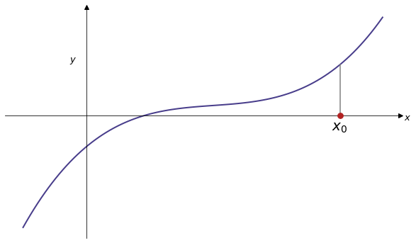
  </div>
  <div class="mySlides2">
    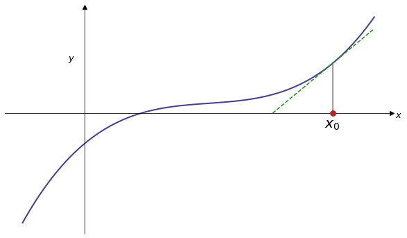
  </div> 
  <div class="mySlides2">
    
  </div> 
  <div class="mySlides2">
    
  </div> 
  <div class="mySlides2">
    
  </div> 
  <div class="mySlides2">
    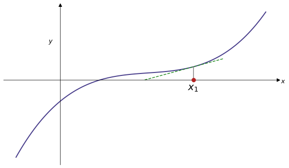
  </div> 
  <div class="mySlides2">
    
  </div> 
  <div class="mySlides2">
    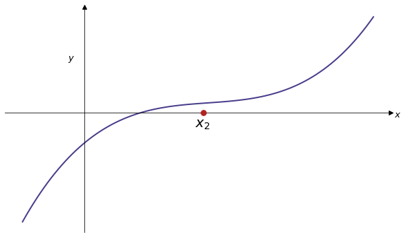
  </div> 
  <div class="mySlides2">
    
  </div> 
  <div class="mySlides2">
    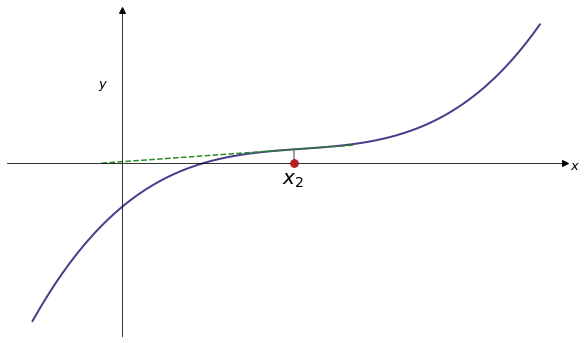
  </div> 
  <div class="mySlides2">
    
  </div> 
  <div class="mySlides2">
    
  </div> 
  <div class="mySlides2">
    
  </div> 
  <div class="mySlides2">
    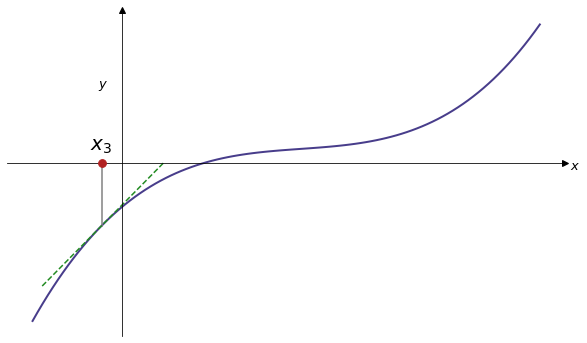
  </div>        
  <div class="mySlides2">
    
  </div> 
</div>
<br>

<div class="range-slider-container" style="margin-bottom: 50px;">
  <div class="go-left2" onclick="plusDivs2(-1)" style="font-size: 2em;">&#10094;</div>
  <input type="range" class="range-slider" id="slider2" min="1" max="17" value="1" step="1">
  <div class="go-right2" onclick="plusDivs2(1)" style="font-size: 2em;">&#10095;</div>
</div>

<script>
let slideIndex2 = 1;
showSlides2(slideIndex2);

let slider2 = document.getElementById("slider2");

slider2.addEventListener("input", function() {
  showSlides2(parseInt(slider2.value));
});

function plusDivs2(n) {
    showSlides2(slideIndex2 += n);
    slider2.value = parseInt(slider2.value) + n
}

function showSlides2(n) {
  let i;
  let slides = document.getElementsByClassName("mySlides2");
  let slidesnext = document.getElementsByClassName("go-right2")[0];
  let slidesprevious = document.getElementsByClassName("go-left2")[0];

  if (n > slides.length) {slideIndex = 1}    
  if (n < 1) {slideIndex2 = slides.length}
  for (i = 0; i < slides.length; i++) {
    slides[i].style.display = "none";  
  }
  slideIndex2 = n; 
  slides[slideIndex2-1].style.display = "block";  
  slidesnext.style.display = "block";
  slidesprevious.style.display = "block";
  if (n == 1){slidesprevious.style.display = "none";}
  if (n == 17){slidesnext.style.display = "none";}

}
</script>

Recall that the straight line starting at the point $(x_1, y_1)$ has equation $y-y_1=m(x-x_1)$, for $m$ the gradient of the line. We can derive the iterative step of the method by solving this equation to obtain the intersection of the $x$-axis and a tangent line to the function $f$. 

Suppose our initial guess for the root is $x_0$, so that the corresponding y-coordinate is $f(x_0)$. The gradient at $x_0$ is $\frac{df}{dx}(x_0) = f'(x_0)$.

We wish to compute the intersection between the tangent line to $f$ at $f(x_0)$ and the $x$-axis. Denote the intersection by $(x_1, 0)$.

Using the equation of a straight line (given above) we have $f(x_0)-0=f'(x_0)(x_0-x_1)$, or

$$x_1 = x_0-\frac{f(x_0)}{f'(x_0)}$$

The iterative steps of the Newton-Raphson method are thus described by the recurrence relation

$$ x_{n}=x_{n-1}-\frac{f(x_{n-1})}{f'(x_{n-1})}$$

In general, the Newton-Raphson method is faster than the bisection method (when it works). However, its applicability is more restricted: $f$ must be smooth (as opposed to just continuous), it is necessary to evaluate the derivative $f'$, and the starting point must be a accurate. If these conditions are not met the algorithm may converge to the root very slowly, or possibly not at all.


#### Implementing the Newton-Raphson method

In this case we set up two Python functions, one for $f$ and one for $f'$

```python
def f(x):
  return x**2 - 2
```

```python
def dfdx(x):
  return 2*x
```

We could store all the approximations `x_n` in an array, but to run the algorithsm we only need to store the most recent approximation. Therefore we can use a single variable `x`, and initialise it with the first guess

```python
x = 3
```

then overwrite it with the new guesses as follows

```python
x = x - f(x)/dfdx(x)
```
```output
1.83
```

Repeated iterations yield

```python
x = x - f(x)/dfdx(x)
```
```output
1.46
```

and

```python
x = x - f(x)/dfdx(x)
```
```output
1.41
```


and so on. This process can be contained in a while loop as follows:

```python
eps = 1e-8
while f(x)>eps:
   x = x - f(x)/dfdx(x)
```

The whole thing might look like

```python
def f(x):
  return x**2 - 2

def dfdx(x):
  return 2*x

# Starting guess
x = 3

# Chose an epsilon value
eps = 1e-8

# While loop 
while abs(f(x))>eps:
   x = x - f(x)/dfdx(x)
   
print(x)
```

Note that using `f(x)>eps` relies on `f(x)` being positive, so in the final while loop this has been changed to `abs(f(x)) > eps`.


<div class="exercise" markdown=true>

#### Exercise 4.6 


<numbas-embed data-url="https://numbas.mathcentre.ac.uk/question/106823/newton-raphson-use-code/embed/?token=3025867d-bffd-4325-86e9-d749ad56fc59" data-id="exercise-3-6" data-cta="Show Exercise"></numbas-embed>

</div>


## Next week

We'll build on the methods described in this handout, implementing them as stand-alone Python functions and tackling more complicated root finding tasks.


