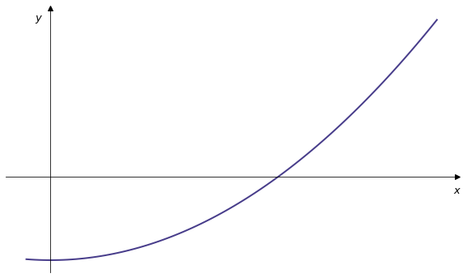
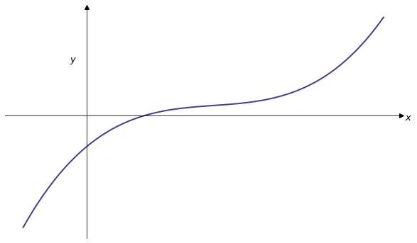
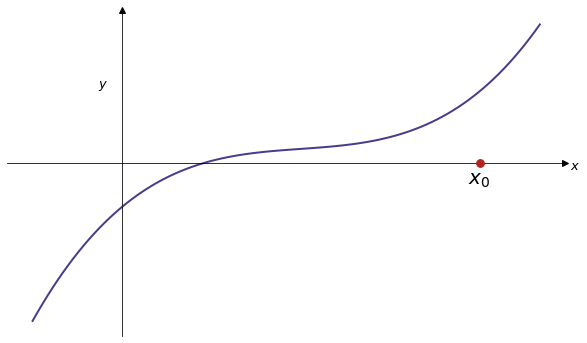
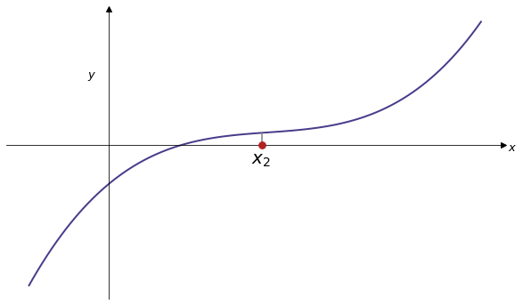
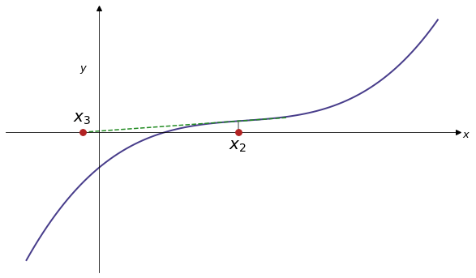
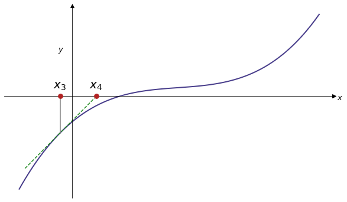

{style="width: 600px;"}

# Lecture 4 - Algorithms & Root finding I

---

## Reminder

* Assessment 1 deadline is this Friday 18th at 16:00.

* Two week gap, then Assessment 2 released on Friday 1st November at 16:00.

---

## Mid-semester module survey

Link on module Canvas homepage.

---

## Root finding

We'll now consider methods to find roots of functions:  

{width="60%"}

that is, given a continuous function $f$, how can we solve $f(x) = 0$?

---

## Motivation

Even seemingly simple problems are extremely difficult to solve algebraically e.g.
$$
e^{-x}-x = 0
$$

Any question of the form $f(x) = c$ can be converted into question of finding roots, as $f(x) - c = 0$.


---

## Algorithms

So far we have used functions provided to us by various modules to solve problems e.g. `polyfit`, `curve_fit`, etc.

We'll now begin to write more complicated code ourselves, rather than exclusively relying on built-in functions.

In other words, we'll write our own problem-solving *algorithms*, a key ingredient of which is *control flow*.


---

## Control flow

By default Python code is executed line-by-line. I.e. Every line is compiled, one after the other.

*Control flow* is an umbrella term for ways to selectively compile sections of code. This allows us to write much more complicated code, by choosing what to run and when.

----

#### `if` statements

```runnable lang="python"
x = 2
if x > 0:
    print("x is larger than zero") 
```

----

#### `for` loops

```runnable lang="python"
for n in range(1,5):
    print(n**2)  
```

----

#### `while` loops

```runnable lang="python"
x = 0;
while x < 5:
    x = x + 1;
    print(x)  
```

---

### What is an algorithm?

For our purposes the term *algorithm* refers to set of instructions (code) given to a computer (Python) to take a specific input and produce a specific output i.e. to accomplish a specified task. Examples include:

* Given $n$ find all prime numbers less than $n$.
* Given a continous function $f$ find all roots of $f$.
* Given two locations in a network find the shortest path between then.
* ...


---


### Complexity

For any task there are often (infinitely) many ways to accomplish it. Therefore writing an algorithm is only part of the story: we also should like to know

* How long does the algorithm take (as a function of the input)?
* How much computer memory does the algorithm use (as a function of the input)?
* Is there another algorithm that's faster or uses less memory?

---

```python
n = 500
A = np.zeros([n,n])
for i in range(n):
    for j in range(n):
        A[i,j] = i + j
```

What does this code do?

How does the time taken for this code to run increase as $n$ increases?

---

## Root finding algorithms

We can use iterative algorithms to find the roots, as follows

* Start with an initial (perhaps informed) guess.
* Use an algorithm to find a new (hopefully improved) value.
* Repeat until the value converges sufficiently.

----

### The bisection method 

The Intermediate Value Theorem implies that if $f$ is a continuous function and $f (x_d) < 0$, $f (x_u) > 0$ then there exists $x_d < x_\ast < x_u$ such that $f(x_\ast)=0$. The *bisection method* evaluates $x_\ast$ as follows:

1. Identify lower and upper bounds $x_d$, $x_u$ as above.
2. Evaluate the function at the midpoint of the bounds to eliminate half of the range.
3. Repeat until $x_u - x_d$ is sufficiently small.

---

<div class="slideshow-container">
  <div class="mySlides">
    
    <!--<div class="text">Caption Text</div>-->
  </div>  
  <div class="mySlides">
    
    <!--<div class="text">Caption Text</div>-->
  </div>
  <div class="mySlides">
    
  </div>
  <div class="mySlides">
    
  </div>
  <div class="mySlides">
    
  </div>
  <div class="mySlides">
    
  </div>   
  <div class="mySlides">
    
  </div>  
  <div class="mySlides">
    
  </div>  
  <div class="mySlides">
    
  </div>  
  <div class="mySlides">
    
  </div>  
  <div class="mySlides">
    
  </div>
  <div class="mySlides">
    
  </div>  
  <div class="mySlides">
    
  </div>   
  <div class="mySlides">
    
  </div>          
</div>
<br>

<div class="range-slider-container">
  <div class="go-left" onclick="plusDivs(-1)">&#10094;</div>
  <input type="range" class="range-slider" id="slider" min="1" max="14" value="1" step="1">
  <div class="go-right" onclick="plusDivs(1)">&#10095;</div>
</div>


<script>
let slideIndex = 1;
showSlides(slideIndex);

let slider = document.getElementById("slider");

slider.addEventListener("input", function() {
  showSlides(parseInt(slider.value));
});

function plusDivs(n) {
    showSlides(slideIndex += n);
    slider.value = parseInt(slider.value) + n
}

function currentDiv(n) {
  showSlides(slideIndex = n);
}

function showSlides(n) {
  let i;
  let slides = document.getElementsByClassName("mySlides");
  let slidesnext = document.getElementsByClassName("go-right")[0];
  let slidesprevious = document.getElementsByClassName("go-left")[0];

  if (n > slides.length) {slideIndex = 1}    
  if (n < 1) {slideIndex = slides.length}
  for (i = 0; i < slides.length; i++) {
    slides[i].style.display = "none";  
  }
  slideIndex = n; 
  slides[slideIndex-1].style.display = "block";  
  slidesnext.style.display = "block";
  slidesprevious.style.display = "block";
  if (n == 1){slidesprevious.style.display = "none";}
  if (n == 14){slidesnext.style.display = "none";}

}
</script>

---

### When to stop?

In practice we are free to choose when to stop our algorithm i.e. when we have found the root to a desired degree of precision.

In general, using a computer to determine if two numbers are equal turns out to be quite subtle

```runnable lang="python"
import sys
macheps = sys.float_info.epsilon
print(macheps)
```

---

### Bisection method code

Let's try this out with a test function for which we know the roots:

$$f(x) = x^2 - 2$$


---

### Bisection Method First Steps

```python
def f(x):
    return x**2 - 2

# Starting values
xu = 2
xd = 1

# Evaluate mid-point
xmid = (xd+xu)/2 

# f(xmid) is positive, so move xu down
xu = 1.5

# etc
```

---

```python
# tolerance
eps = 1e-10

while xu-xd > eps:

    # Evaluate mid-point
    xmid = (xd+xu)/2 

    if f(xmid)>0:
        xu = xmid
    else:
        xd = xmid

    print(xmid)
```

Note this will fail to find the root of the function that we discussed earlier ($f(x)= e^{-x}-x$). We need to make some improvements over the course of the next week...

---

### Bisection method accuracy

Another running theme as we move forward will be numerical accuracy. 

When we first set the interval we know that the difference between our midpoint, let's call it $x_0$, and the actual root $x_*$ is at most the width of the interval

$$ |x_0 - x_*| \le x_u - x_d  $$

and since we halve the interval with each step, after $n$ iterations

$$ |x_n - x_*| \le \frac{x_u - x_d}{2^n} $$

---

### The Newton-Raphson Method

* Make an initial guess $x_n$.

* Find the gradient at $f(x_n)$ to locate the intersect of the tangent line with the $x$ axis.

* This point will generally be closer to the root. Call this $x_{n+1}$ and repeat until the value converges.


---

### Newton-Raphson Method Steps

<div class="slideshow-container">
  <div class="mySlides2">
    
    <!--<div class="text">Caption Text</div>-->
  </div>
  <div class="mySlides2">
    
  </div>
  <div class="mySlides2">
    
  </div>
  <div class="mySlides2">
    
  </div> 
  <div class="mySlides2">
    
  </div> 
  <div class="mySlides2">
    
  </div> 
  <div class="mySlides2">
    
  </div> 
  <div class="mySlides2">
    
  </div> 
  <div class="mySlides2">
    
  </div> 
  <div class="mySlides2">
    
  </div> 
  <div class="mySlides2">
    
  </div> 
  <div class="mySlides2">
    
  </div> 
  <div class="mySlides2">
    
  </div> 
  <div class="mySlides2">
    
  </div> 
  <div class="mySlides2">
    
  </div> 
  <div class="mySlides2">
    
  </div>        
  <div class="mySlides2">
    
  </div> 
</div>
<br>

<div class="range-slider-container">
  <div class="go-left2" onclick="plusDivs2(-1)">&#10094;</div>
  <input type="range" class="range-slider" id="slider2" min="1" max="17" value="1" step="1">
  <div class="go-right2" onclick="plusDivs2(1)">&#10095;</div>
</div>


<script>
let slideIndex2 = 1;
showSlides2(slideIndex2);

let slider2 = document.getElementById("slider2");

slider2.addEventListener("input", function() {
  showSlides2(parseInt(slider2.value));
});

function plusDivs2(n) {
    showSlides2(slideIndex2 += n);
    slider2.value = parseInt(slider2.value) + n
}

function showSlides2(n) {
  let i;
  let slides = document.getElementsByClassName("mySlides2");
  let slidesnext = document.getElementsByClassName("go-right2")[0];
  let slidesprevious = document.getElementsByClassName("go-left2")[0];

  if (n > slides.length) {slideIndex = 1}    
  if (n < 1) {slideIndex2 = slides.length}
  for (i = 0; i < slides.length; i++) {
    slides[i].style.display = "none";  
  }
  slideIndex2 = n; 
  slides[slideIndex2-1].style.display = "block";  
  slidesnext.style.display = "block";
  slidesprevious.style.display = "block";
  if (n == 1){slidesprevious.style.display = "none";}
  if (n == 17){slidesnext.style.display = "none";}

}
</script>

---

### Newton-Raphson vs bisection

In general Newton-Raphson is faster than bisection, but requires calculating the derivative $f'(x)$.

---

{width="60%"}

The material sketched in this lecture is covered in greater detail in Handout 4.

