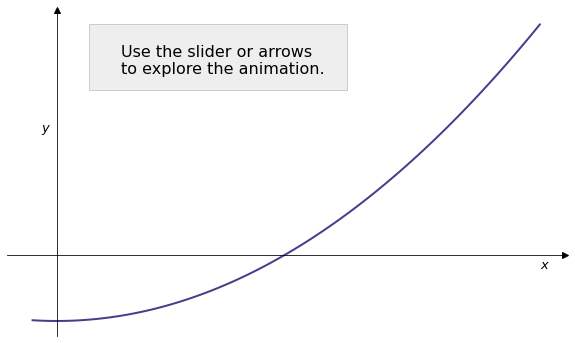
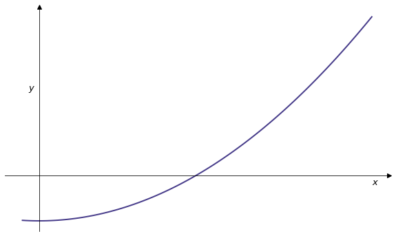
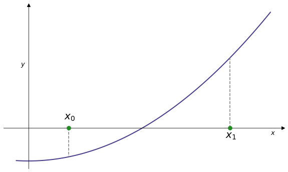
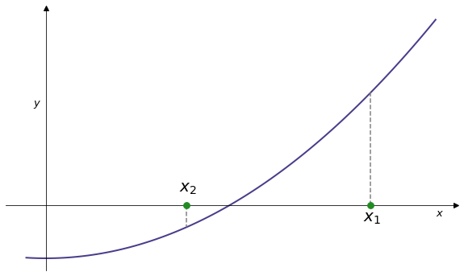
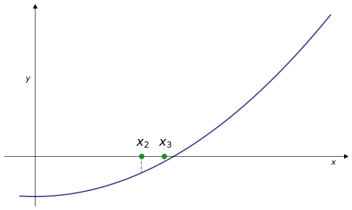
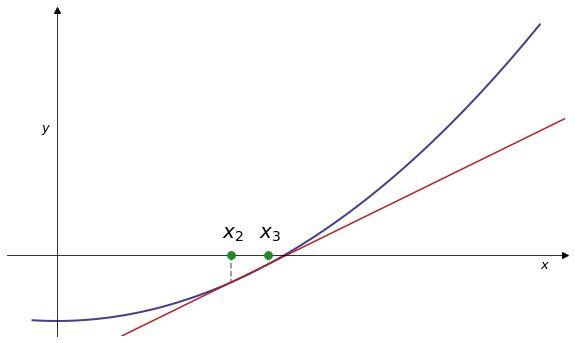
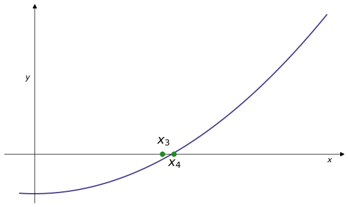

[Click here to open this handout in a new browser tab](#){target="_blank"}

# PHY2039 Handout 5

This handout covers:

* A recap of the bisection method, including looking at error handling.
* Further root finding methods, and in-built root finding functions.
* An investigation of the sensitivity of the Newton-Raphson method, and related fractal phenomena.


## 5.1) The bisection method, continued

Last week we implemented the bisection method in Python, as follows 

```python
# Function whose roots we wish to find
def func(x):
    return x**2-2

# initialise the upper and lower bounds, in this case 1 and 2
xd = 1 # Initial lower bound
xu = 2 # Initial upper bound

# Loop while xu - xd is greater than eps, with eps chosen to be small
eps = 1e-10

while abs(xu - xd) > eps:

    # find xmid
    xmid = (xd+xu)/2

    # Evaluate f at xmid. If f(xmid) is greater than zero move the upper bound down
    if func(xmid) > 0:
        xu = xmid
    # else move the lower bound up
    else:
        xd = xmid

    # print the midpoint
    print(xmid)

```

### Improving the algorithm

As written above, the algorithm is not able to find both roots of $f(x)=x^2-2$. For instance, setting

```python
xd = -2 # Initial lower bound
xu = -1 # Initial upper bound
```

will not cause the algorithm to find the root $-\sqrt{2}$. This is due to the line `if func(xmid) > 0`: in the case of `xd = -2` and `xu = -1` the value of `func(xmid)` is negative. We might naively wish to chanage the algorithm to use

```python
if func(xmid) < 0:
```

However, this will cause the algorithm to miss the positive root $\sqrt{2}$.

To properly handle situations such as this we must determine if `f(xmid)` and `f(xu)` have the same sign. We can do this as follows

```python
if f(xmid)*f(xu) > 0:
``` 

This will allow us to correctly choose the next interval, whatever the signs of `f(xmid)`, `f(xd)`, and `f(xu)`.


### Bisection method as a function

Let's make these improvements to the algorith, and write it as a function:

```python

def bisection(f,xd,xu,eps):

    while abs(xu - xd) > eps:

        # Find xmid
        xmid = (xd+xu)/2

        # Evaluate f at xmid. If f(xmid) has same sign as f(xu) move bound down
        if f(xmid)*f(xu) > 0:
            xu = xmid
        # Else move the lower bound up
        else:
            xd = xmid

    return xmid
```

We can now apply the bisection method in a single line:

```python
def func(x):
    return x**2-2

r1 = bisection(func,1,2,1e-10)
r2 = bisection(func,-2,-1,1e-10)
print(r1,r2)
```

### Error handling

Calling `bisection` with the following options yields an undesirable result

```python
r = bisection(func,7,8,1e-10)
```

```output
7.000000000058208
```

This is a very bad estimate of a root, as $7^2 - 2 = 47$. Recall that the bisection method relies on the Intermediate Value Theorem: if one of $f(x_d)$ and $f(x_u)$ is negative and one positive then there is guaranteed to be a root in the interval $\left[ x_d, x_u \right]$. But the function `bisection` does not check if this it the case. E.g. $7^2 - 2 = 47$ and $8^2 - 2 = 62$ both have the same sign, leading to the result above.

Perhaps the easiest way fix this is to consider the sign of `f(xd)*f(xu)`. If `f(xd)*f(xu)` positive then `f(xd)` and `f(xu)` have the same sign and we cannot proceed with the bisection method.


To properly inform the user that they have entered incorrect bounds we can use Python's built-in **exceptions** framework. We will only scratch the surface of what's possible, [but here's a link to the documentation if you'd like more detail](https://docs.python.org/3/tutorial/errors.html){target="_blank"}. A `ValueError` is most appropriate here (quoting from the documentation: "Raised when an operation or function receives an argument that has the right type but an inappropriate value") and can be raised as follows

```python
def bisection(f,xd,xu,eps):
    if f(xd)*f(xu) > 0:
        raise ValueError("The function has the same sign at the lower and upper bound.")
```

As a final improvement we can count the number of iterations needed to estimate the root, and return it along with the root

The final code is:

```python
def bisection(f,xd,xu,eps):
    """
    Estimate the root x* of the function f(x) to tolerance eps
    with starting bounds xd and xu
    """

    if f(xd)*f(xu) > 0:
        raise ValueError("The function has the same sign at the lower and upper bound.")

    n = 0

    while abs(xu - xd) > eps:
        xmid = (xd+xu)/2
        
        if f(xmid)*f(xu) > 0:
            xu = xmid
        else:
            xd = xmid

        n += 1

    return xmid, n

r,n = bisection(lambda x : x**2 - 2,1,2,1e-10)
print("root found at {} after {} iterations".format(r,n))

```

### Lambda functions

It can be tedious to formally define functions that we are only going to use once. That is, it would be preferable to be able to use the syntax

```python
bisection(x**2 - 2,1,2,1e-10)
```

to apply `bisection` to the function $f(x) = x^2 - 2$.

While the above syntax doesn't work, there is a construction that allows for something almost as simple: **lambda functions**. These are so-called anonymous functions, that can be defined quickly using the syntax

```python
lambda arguments : expression
```

where `expression` is some expression of the `arguments`. E.g.

```python
lambda x, y : x**y
```

Most useful for us, we can define a lambda function inside a function call. For example

```python
bisection(lambda x : x**2 - 2,1,2,1e-10)
```

In addition to being faster to write, they are also quicker to edit e.g.

```python
bisection(lambda x : x**2 - 3,1,2,1e-10)
```

<!--
<div class="exercise" markdown=true>

#### Exercise 5.1 

We're not quite done with our function...

<numbas-embed data-url="https://numbas.mathcentre.ac.uk/question/78653/bisection-ve-root/embed/?token=88b1efad-e31c-4b3f-aa97-ba499e4d32be" data-id="exercise-4-1" data-cta="Show Exercise"></numbas-embed>

</div>
-->


## 5.2) Newton-Raphson, continued

Last week we implemented the Newton-Raphson method as follows:

```python
def f(x):
  return x**2 - 2

def dfdx(x):
  return 2*x

# Initial estimate
x = 3

# Chose an epsilon value
eps = 1e-10

# While loop 
while abs(f(x))>eps:
   x = x - f(x)/dfdx(x)
   
print(x)
```

As we did for the bisection method, we can place the above algorithm into a function:

```python
import numpy as np

def newraph(f,dfdx,x0,eps):

    x = x0
    n = 0
    
    while abs(f(x)) > eps:
        x = x - f(x)/dfdx(x)
        n += 1      
    return x, n


r,n = newraph(lambda x : np.sin(x), lambda x : np.cos(x), 3, 1e-10)
print("root found at {} after {} iterations".format(r,n))

```

## 5.3) More root finding algorithms

Finding the roots of a function is one of the most well-studied problems in the history of mathematics. There is archeological evidence of humans developing root finding methods at least $3000$ years ago. It is therefore no surprise that there are many different methods for accomplishing this task, each with there own pros and cons.

### The secant method

A secant line, also simply called a secant, is a line passing through two points of a curve. The secant method estimates a root of a function using secant lines, as follows:

* Start with two initial guesses $x_0$ and $x_1$. 

* Find the intersection of the secant between $x_0$ and $x_1$ and the $x$ axis.

* Define $x_2$ to be this intersection.

* Find the intersection of the secant between $x_1$ and $x_2$ and the $x$ axis.

* Repeat until the value $x_{n-1} - x_n $ converges sufficiently.


<div class="slideshow-container" style="margin: 40px 0;">
  <div class="mySlides">
    
    <!--<div class="text">Caption Text</div>-->
  </div>
  <div class="mySlides">
    
  </div>
  <div class="mySlides">
    
  </div>
  <div class="mySlides">
    
  </div>
  <div class="mySlides">
    
  </div>   
  <div class="mySlides">
    
  </div>  
  <div class="mySlides">
    
  </div>  
  <div class="mySlides">
    
  </div>  
  <div class="mySlides">
    
  </div>  
  <div class="mySlides">
    
  </div>
  <div class="mySlides">
    
  </div>  
  <div class="mySlides">
    
  </div>           
</div>
<br>

<div class="range-slider-container">
  <div class="go-left" onclick="plusDivs(-1)">&#10094;</div>
  <input type="range" class="range-slider" id="slider" min="1" max="12" value="1" step="1">
  <div class="go-right" onclick="plusDivs(1)">&#10095;</div>
</div>


<script>
let slideIndex = 1;
showSlides(slideIndex);

let slider = document.getElementById("slider");

slider.addEventListener("input", function() {
  showSlides(parseInt(slider.value));
});

function plusDivs(n) {
    showSlides(slideIndex += n);
    slider.value = parseInt(slider.value) + n
}

function currentDiv(n) {
  showSlides(slideIndex = n);
}

function showSlides(n) {
  let i;
  let slides = document.getElementsByClassName("mySlides");
  let slidesnext = document.getElementsByClassName("go-right")[0];
  let slidesprevious = document.getElementsByClassName("go-left")[0];

  if (n > slides.length) {slideIndex = 1}    
  if (n < 1) {slideIndex = slides.length}
  for (i = 0; i < slides.length; i++) {
    slides[i].style.display = "none";  
  }
  slideIndex = n; 
  slides[slideIndex-1].style.display = "block";  
  slidesnext.style.display = "block";
  slidesprevious.style.display = "block";
  if (n == 1){slidesprevious.style.display = "none";}
  if (n == 12){slidesnext.style.display = "none";}

}
</script>


By considering the formulae for the secants between $x_{n-1}$ and $x_n$ we obtain the recursive formula

$$ x_{n}=x_{n-1}-f(x_{n-1}){\frac {x_{n-1}-x_{n-2}}{f(x_{n-1})-f(x_{n-2})}} $$

The full derivation of this formula [given here](https://en.wikipedia.org/wiki/Secant_method){target="_blank"}. 

As we did with the bisection and Newton-Raphson methods we can implement the secand method as follows:

```python
def secant(f,x0,x1,eps):

    n = 0
    
    while abs(x1 - x0) > eps:
        x2 = x1 - f(x1)*(x1-x0)/(f(x1)-f(x0))
        x0, x1 = x1, x2
        n += 1
        
    return x1, n

r,n = secant(lambda x : x**2 - 2, 3, 4, 1e-6)

print("root found at {} after {} iterations".format(r,n))
```

### The regula falsi (a.k.a. false position) method  

The so-called 'false position' method shares similarities with both the bisection and secant methods, as explored in the following exercise.

<div class="exercise" markdown=true>

#### Exercise 5.1

<numbas-embed data-url="https://numbas.mathcentre.ac.uk/question/148008/regula-falsi-method-worked-example/embed/?token=acff388a-1745-48ad-a669-9588503c6035" data-id="exercise-5-2" data-cta="Show Exercise"></numbas-embed>

</div>


#### A custom root-finding module

We now have several root finding methods

* Bisection
* Newton-Raphson
* Secant
* Regula Falsi

We can create a custom Python module containing the implementations of these methods, so that we can easily reuse them.

Place the implementations we've written for these methods into a script i.e. copy the functions `bisection, `newraph`, etc into a single script. Save this script as *root_finding.py*, in a convenient location on your computer e.g. a Python folder you've created.

In the same location create a new script and add import the custom module as follows

```python
import root_finding as rm
```

We can now use the functions we defined previously at will e.g.

```python
r,n = rm.newraph(lambda x : np.sin(x), lambda x : np.cos(x), 3, 1e-10)
print("root found at {} after {} iterations".format(r,n))
```

#### Comparing Methods

As in many situations across science and industry, there is no perfect algorithm to find the roots of a function. That is, each method has pros and cons, so that deciding which method to use is an interesting task. There are many hybrid methods that combine elements of the algorithms we have discussed.

<div class="exercise" markdown=true>

#### Exercise 5.2

<numbas-embed data-url="https://numbas.mathcentre.ac.uk/question/148009/comparing-algorithms-in-root-finding-module/embed/?token=a9a85bc7-8e4f-4f4d-bccb-a56da55fc838" data-id="exercise-5-3" data-cta="Show Exercise"></numbas-embed>

</div>


## 5.4) NumPy and SciPy root finding functions

In some cases it is sufficient to use a built-in function to find the roots of a function.

### NumPy `roots`

The NumPy function `np.roots` will return roots of **a polynomial**.

The function `np.roots` takes as input a list (or array) of the coefficients of the polynomial, in descending degree order. That is, the polynomial

$$
f ( x ) = a_n x^n + a_{n-1} x^{n-1} + \cdots + a_1 x + a_0
$$

is given by the list $\left[ a_n, a_{n-1}, \ldots , a_1, a_0 \right]$.

For example, we can calcuate the roots $f(x) = x^3 + x^2 + x - 3$ as follows

```python
import numpy as np
p = [1,1,1,-3]
r = np.roots(p)
print(r)
```

Notice that the result contains complex numbers. An important note: [for a variety of reasons](https://bugs.python.org/issue10562){target="_blank"} the square root of $-1$ is denoted in Python by $j$ rather than $i$ (as is traditional in mathematics).

Note that we often need to insert zeroes into the array `p` in order to describe the intended polynomial. For example, the polynomial $f(x)= x^5$ is given by the array `p = [1,0,0,0,0,0]`, and to find the roots of $f(x) = x^2 - 2$ use the syntax

```python 
p = [1,0,-2]   
r = np.roots(p)
print(r)
```

<div class="exercise" markdown=true>

#### Exercise 5.3

<numbas-embed data-url="https://numbas.mathcentre.ac.uk/question/79309/using-roots-ii/embed/?token=bf346f1f-c216-4f78-88d0-7cd57a72103f" data-id="exercise-4-2" data-cta="Show Exercise"></numbas-embed>

</div>

<div class="exercise" markdown=true>

#### Exercise 5.4


<numbas-embed data-url="https://numbas.mathcentre.ac.uk/question/78691/numpy-roots/embed/?token=4d2bf00f-ea76-4606-adf8-14aa054f22d9" data-id="exercise-4-3" data-cta="Show Exercise"></numbas-embed>
</div>


### SciPy's `fsolve`

The Scipy Optimize package provide the function `fsolve`, that can be used to find roots of general functions. Unlike `roots`, it does not find every root of the input function, just the root given by an initial guess.

For example, to find the roots of $\sin(x)$ we use the syntax

```python
import scipy.optimize as opt
import numpy as np

def func(x):
    return  np.sin(x)

r = opt.fsolve(func, 4)
print(r)
```
```output
[3.14159265]
```

We could also use a lambda function in this situation

```python
import scipy.optimize as opt
import numpy as np

r = opt.fsolve(lambda x : np.sin(x), 4)
print(r)
```
```output
[3.14159265]
```

We can hand an array of initial guesses to `fsolve` as follows:

```python
r = opt.fsolve(lambda x : np.sin(x), [3,7])
print(r)
```
```output
array([3.14159265, 6.28318531])
```

It is important to note that `fsolve` is *not* finding the root that is closest to the initial guess. For instance,

```python
r = opt.fsolve(lambda x : np.cos(x), 3)
print(r)
```
```output
array([-17.27875959])
```

In this case `fsolve` has approximated the root of $\cos(x)$ at $-\frac{11\pi}{2}$, rather than the root at $\frac{3\pi}{2}$ that is much closer to the initial guess of $3$.

We shall investigate this phenomenon in more detail in the next section of the handout.

<div class="exercise" markdown=true>

#### Exercise 5.5

<numbas-embed data-url="https://numbas.mathcentre.ac.uk/question/147889/fsolve-f-x-e-x-x/embed/?token=ffbbd3f2-5774-4627-bb17-ee41ce16da6f" data-id="exercise-4-3" data-cta="Show Exercise"></numbas-embed>
</div>

## 5.5) Basins of attraction

### `plt.imshow`

In what follows we'll use the Matplotlib function `imshow` to visualise 2D arrays, that we now illustrate via an example. Consider the following $5\times 5$ array:

```python
# Create a 5 x 5 example array
M = np.arange(25).reshape([5,5])
print(M)
```
```output
array([[ 0,  1,  2,  3,  4],
       [ 5,  6,  7,  8,  9],
       [10, 11, 12, 13, 14],
       [15, 16, 17, 18, 19],
       [20, 21, 22, 23, 24]])
```

We can visualize this as a grid of coloured tiles, with certain colours corresponding to small numbers and others corresponding to large numbers. Helpfully, MatPlotLib has a large number of preset colour schemes, known as colormaps (note the North American spelling). Further detaile [are available here](https://matplotlib.org/stable/users/explain/colors/colormaps.html){target="_blank"}: to get started try `'viridis'`, `'plasma'`, or `'magma'`.

```python
plt.imshow(M, cmap='viridis')
plt.colorbar()
```

{width=400px}

<div class="interlude" markdown=true>

### Colormaps and colour blindness

The most common type of colour blindness (red–green) affects up to 1 in 12 males and 1 in 200 females. It's therefore likely that some of you are not seeing a plot like the one above in its intended colours.

Where possible we should try to avoid representing things by colour only (e.g. use different dash styles in line plots, or text descriptions). Where this is not possible we can try to ensure that all users receive the same information, even if they don't see the same colours.

It is widely accepted that the two best colormaps in terms of colour blindness are `viridis` and `cividis`. Both formed using a uniform gradient: this means that the intensity of the colours are identical when viewed in colour or black and white. For example, here is the above plot (that used `viridis`) in black and white:

{width=400px}

</div>

<div class="exercise" markdown=true>

### Exercise 5.6

<numbas-embed data-url="https://numbas.mathcentre.ac.uk/question/148018/imshow-plots/embed/?token=50cf4c01-1b81-4ef7-9f00-3ad85df91ace" data-id="exercise-4-4" data-cta="Show Exercise"></numbas-embed>

</div>

### Basins of attractions

Many of the root finding methods we have covered are heavily dependent on the initial estimate. That is, changing the initial estimate can cause large changes to the output root, as sketched in the following exercise.

<div class="exercise" markdown=true>


### Exercise 5.7

<numbas-embed data-url="https://numbas.mathcentre.ac.uk/question/79321/basins-of-attraction/embed/?token=a73d6b19-2c82-4193-8979-57977ddd23d8" data-id="exercise-4-4" data-cta="Show Exercise"></numbas-embed>

</div>

### Sensititve dependence on initial estimate

Consider applying Newton-Raphson to the function $f(x) = \sin(x)$. As we can see below, a small change in the initial estimate can lead to a very large change in the output root:


{width=55%}

```python
r,n=newraph(lambda x:np.sin(x),lambda x:np.cos(x),2.0,1e-8)
print("root found at {} after {} iterations".format(r,n))
```
```output
root found at 3.1415926536808043 after 5 iterations
```


{width=55%}

```python
r,n=newraph(lambda x:np.sin(x),lambda x:np.cos(x),1.8,1e-8)
print("root found at {} after {} iterations".format(r,n))
```
```output
root found at 6.283185301417648 after 3 iterations
```


{width=55%}

```python
r,n=newraph(lambda x:np.sin(x),lambda x:np.cos(x),1.6,1e-8)
print("root found at {} after {} iterations".format(r,n))
```
```output
root found at 31.41592653589652 after 7 iterations
```


{width=55%}

```python
r,n=newraph(lambda x:np.sin(x),lambda x:np.cos(x),1.57,1e-8)
print("root found at {} after {} iterations".format(r,n))
```
```output
root found at -1253.4954687820234 after 4 iterations
```

To describe this phenomenon more concretely, we use the following definition. A **basin of attraction** of a root $x_{\ast}$ is a region $\left[ a, b \right]$ such that picking an initial estimate $x_0$ in $\left[ a, b \right]$ causes the given root finding method to output $x_{\ast}$.

In the example above, we can see that the estimates $2.0$, $1.8$, $1.6$, and $1.57$ all lie in distinct basins of attraction, as they all lead to distinct roots under Newton-Raphson.

### Basins of attraction in the complex plane

As we saw above, polynomials such as $f(x) = x^3 + x^2 + x - 3$ generically have complex roots. It turns out that even simple polynomials can have very complicated basins of attraction. To fully understand this we need to allow for polynomials with complex arguments. That is, given $f(x) = x^3 + x^2 + x - 3$ we consider the polynomial $f(z) = z^3 + z^2 + z - 3$ where $z$ is a complex number.

#### Complex numbers in Python

A complex number can be created in Python via the syntax

```
z = complex(2,3)
```

The real and imaginary parts of `z` can be accessed via

```
z.real
z.imag
```


#### The basins of attraction of $z^4-1$

Our aim is to visualize the basins of attraction for $f(z) = z^4 - 1$ i.e. given the initial estimate $z$, determine the root found by Newton-Raphson, and visualize this somehow. It turns out that we'll obtain the following fractal:

{width=40%}

The function $f(z) = z^4 - 1$ has four roots: $1$, $-1$, $i$ and $-i$ e.g. $(i)^4 - 1 = (-1)^2 - 1 = 0$ as $i^2= -1$. We can verify that this using `roots`

```python
p = [1,0,0,0,-1]
r = np.roots(p)
print(r)
```
```output
[-1.00000000e+00+0.j  8.32667268e-17+1.j  8.32667268e-17-1.j
  1.00000000e+00+0.j]
```

Notice that the output contains very small floats such as `8.32667268e-17`; see the discussion on machine epsilon in Handout 4. For our purposes in this handout we treat such numbers as being equal to $0$: they are caused by imprecisions of the root finding algorithm used by `roots`.

To determine the basins of attraction we'll do the following:

1. Pick a complex number $z = a + ib$.
2. Apply Newton-Raphson to find the root given with the initial estimate $z$.
3. Vary $a$ and $b$ to see how the outputted root changes.

We can use the following code to do this

```python
def f(x):
    return x**4 - 1

def dfdx(x):
    return 4*x**3

eps = 1e-6

# Create a complex number
a = 0.5
b = -1
z = complex(a,b)

while abs(f(z))>eps:
    z = z - f(z)/dfdx(z)
print(z)
```

Run this code with some values of `a` and `b` in the range $[-1,1]$. For example `complex(0.8,0.7)` outputs the root $i$, but `complex(0.7,0.8)` outputs the root $1$. Some choices of `a` and `b` do not lead to a root i.e. the method does not converge and you will need to interrupt the kernel to terminate the while loop. The reasons behind this are too technical for this module, but it boils down to the fact that $f'(z)$ also has roots, at which the tangent is horizontal.

To handle the starting values at which the method does not converge we can adjust the code above, stopping after some number of iterations as follows

```python
max_iterations = 100

for k in range(max_iterations):
    z = z - f(z)/dfdx(z)
    if abs(f(z)) < eps:
        break
```

This code stops if a root is found within the tolerance `eps` or if `max_iterations` is reached, whichever comes first. Note that we require `abs(f(z))` as `f(z)` is a complex number.

#### Identifying the output root

A final subtlety is presented by the fact that the Newton-Raphson method can only estimate the roots, rather than find them exactly. If Newton-Raphson returns the estimate $1.0001746$, a human can determine by inspection that this corresponds to the known root $1$. However, to visualize the basins of attraction we need to run the code above for thousands of choices of `a` and `b`, so we cannot check every output of Newton-Raphson manually. We must therefore edit the above code to allow Python to do these checks for us.

Consider the code

```python
p = [1,0,0,0,-1]
r = np.roots(p)

def get_root_index(z,r,eps):
    """
    Returns the index in the list r of the root closest to z
    """ 
    root = 0
    for j in range(0,len(r)):
        if np.isclose(z,r[j],eps):
            root = j + 1
    return root

# Apply Newton-Raphson to find root estimate z
get_root_index(z,r,eps)
```

Here we are using the NumPy function `np.isclose(a,b,tol)`, that returns `True` if `a` and `b` are within `tol` i.e. if `abs(a-b) < tol`. The function `get_root_index` loops through the list of roots `r`, checking if the estimate `z` (outputted by Newton-Raphson) is close to any of them. If it is, `get_root_index` returns the index of the corresponding root in `r`, plus $1$. The plus $1$ is for the purposes of visualization and will be explained in more detail below. 

For example

```python
import numpy as np

p = [1,0,0,0,-1]
r = np.roots(p)

def get_root_index(z,r,eps):
    """
    Returns the index of the root closest to z
    """ 
    root = 0
    for j in range(0,len(r)):
        if np.isclose(z,r[j],eps):
            root = j + 1
    return root

def f(x):
    return x**4 - 1

def dfdx(x):
    return 4*x**3

eps = 1e-6
max_iterations = 100

# Create a complex number
a = 0.5
b = -1
z = complex(a,b)

while abs(f(z))>eps:
    z = z - f(z)/dfdx(z)

print(z)
print(r)
print(get_root_index(z,r,eps))
```

```output
(4.0892100754927893e-10-0.9999999977920765j)
[-1.00000000e+00+0.j  8.32667268e-17+1.j  8.32667268e-17-1.j
  1.00000000e+00+0.j]
3
```

The function `get_root_index` outputs `3`, so that the estimate found by Newton-Raphson corresponds to the root at `r[2]` (recall we added one to the index). This is as desired, as the root at `r[2]` is `8.32667268e-17-1.j`, and the estimate given by Newton-Raphson is `4.0892100754927893e-10-0.9999999977920765j`, which both correspond to $-i$.


#### Newton fractals

We are now in a position to visualize the basins of attraction of $f(z) = z^2 -1$. Recall that we plan to do this via

1. Pick a complex number $z = a + ib$.
2. Apply Newton-Raphson to find the root given with the initial estimate $z$.
3. Vary $a$ and $b$ to see how the outputted root changes.

To do this we'll build on the following code. Initially, take $n$ steps through $[-1,1]$ and produce a complex number at each step, printing the values

```python
import numpy as np
n  = 4
a = np.linspace(-1,1,n)
b = np.linspace(-1,1,n)
for i in range(n):
    for j in range(n):
        print(complex(a[i],b[j]))
```

We'll apply Newton-Raphson to the generated complex numbers. We'll store these in an array, initialised with `m = np.zeros([n,n])`. Note you can expect the following code to take quite a few seconds:

```python
import numpy as np

p = [1,0,0,0,-1]
r = np.roots(p)
print(r)

def f(x):
    return x**4 - 1

def dfdx(x):
    return 4*x**3

def get_root_index(z,r,eps):
    """
    Returns the index of the root closest to z
    """ 
    root = 0
    for j in range(0,len(r)):
        if np.isclose(z,r[j],eps):
            root = j + 1
    return root
        

eps = 0.0001
max_iterations = 100

# Create an array to store roots in
n  = 250
a = np.linspace(-1,1,n)
b = np.linspace(-1,1,n)
m = np.zeros([n,n])

for i in range(n):
    for j in range(n):
        z = complex(a[i],b[j])
        for k in range(max_iterations):
            z = z - f(z)/dfdx(z)
            if abs(f(z)) < eps:
                break
        root = get_root_index(z,r,eps)
        m[i,j] = root
        
```

Take a look at `m` and you will see a collection of values from 0 to 4 in an array:

```python
print(m)
```
```output
[[0. 2. 2. ... 3. 3. 0.]
 [4. 0. 1. ... 1. 3. 4.]
 [4. 3. 0. ... 0. 2. 4.]
 ...
 [1. 3. 0. ... 0. 2. 1.]
 [1. 1. 4. ... 4. 0. 1.]
 [0. 2. 2. ... 3. 3. 0.]]
```

Recall that $0$ corresponds to points at which the Newton-Raphson method did not converge.

Finally we can plot using the Matplotlib function `imshow` introduced above to visualize this array:

```python
import matplotlib.pyplot as plt
from matplotlib import cm

# Make a larger figure than default
plt.figure(figsize=(15,15))

# Turn the axis off for aesthetics
plt.axis('off')

# Make the image using the plasma colour map
# origin='lower' puts (0,0) in the bottom left
plt.imshow(m,cmap='plasma',origin='lower')
```

Increase `n` in the code to increase the resolution of the plot. Be warned: large values of $n$ can take a very long time to compute (recall that you can interrupt the terminal to stop running the code). With $n=500$ we obtain the following:

{width=50%}

This is an example of a **Newton fractal**.

#### Adjusting the colours

You can edit the `cmap` parameter to edit the colour scheme; some work better than others. See [this Matplotlib page](https://www.analyticsvidhya.com/blog/2020/09/colormaps-matplotlib/){target="_blank"} for further details.

You can specify colours instead of using a preset colour map. To do this you can create your own colour map using the Matplotlib colour list. Note that you will need to have the correct number of colours to make this look good (I've got 5 to match values 0 through to 4 here). For example:

```python
from matplotlib.colors import ListedColormap

# Create a custom colour map
my_cmap = ListedColormap(["black","firebrick","goldenrod","seagreen","darkslateblue"])

# Use my colour map
plt.imshow(m,cmap=my_cmap,origin='lower') 
```

<div class="exercise" markdown=true>

#### Exercise 5.8
 
Modify the code to create fractals for $f(z) = z^3-1$ and $f(z) = z^5-1$.

{width=50%}

{width=50%}


Hint: You'll need to change the `p` line before the `roots` function and also the Newton-Raphson functions.

You can to edit the range of `a` and `b` in the code (while keeping the same number of values `n`). This allows you to investigate the **self-similarity** of the fractal.

For instance, here is the $f(z)=z^4-1$ plotted with $a$ and $b$ in $[0.3,0.8]$ and on the much smaller region $[0.3,0.35]$ 

{width=50%}

{width=50%}

</div>


## Next week

We'll investigate more advanced plotting techniques, expanding on the 2D plotting described here, and 3D plotting.

</div>
