{style="width: 600px;"}

#Lecture 5 - Root finding II

---

## This week

 * More root finding algorithms
 * Basins of attraction
 * Complex roots and Newton fractals

---

### The bisection method

Last week we used the bisection method to estimate roots of a function

---

```python
# The function whose roots we wish to find
def func(x):
    return x**2-2

xd = 1        # Initial lower bound
xu = 2        # Initial upper bound
eps = 1e-10   # Tolerance

while abs(xu - xd) > eps:

    # Find the midpoint
    xmid = (xd+xu)/2

    # Evaluate at xmid and decide how to proceed
    if func(xmid) > 0:
        xu = xmid
    else:
        xd = xmid
```

----

### What can break this algorithm?

* If function has no roots i.e. $f(x)=e^x$.
* If initial bounds are chosen incorrectly e.g. $f(x_u), f(u_d) > 0$.
* ...

---

### Handling errors

We can make the algorithm more robust to these and other problems by writing it as a (Python) function and raising errors. E.g.

```python
raise ValueError
```


---

```python

def bisection(f,xd,xu,eps):

    if f(xd)*f(xu) > 0:
        raise ValueError("Function does not change sign between bounds.")

    while xu - xd > eps:
        xmid = (xd+xu)/2
        
        if f(xmid)*f(xu) > 0:
            xu = xmid
        else:
            xd = xmid

    return xmid

bisection(lambda x : x**2 - 2,1,2,1e-10)
```

---

### Lambda functions

It can be tedious to formally define functions if we only need to use them once. The **lambda** construction allows us to quickly define a single-use function via the syntax `lambda arguments : expression` e.g.

```python
lambda x,y : x**y
```

Note that this can only be used to produce functions that return an expression in their arguments i.e. the function `bisection` defined above cannot be written as a lambda function.

---

## The Newton-Raphson method

We also covered the Newton-Raphson root finding method:

* Make an initial guess $x_n$.

* Find the gradient at $f(x_n)$, and locate the intersection of the associated tangent and the $x$ axis.

* This point will generally be closer to the root. Define this as $x_{n+1}$ and repeat until the value converges sufficiently.

---

<div class="slideshow-container">
  <div class="mySlides2">
    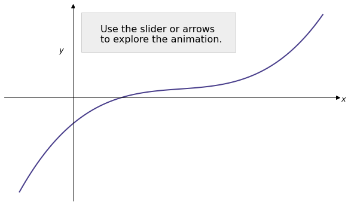
    <!--<div class="text">Caption Text</div>-->
  </div>
  <div class="mySlides2">
    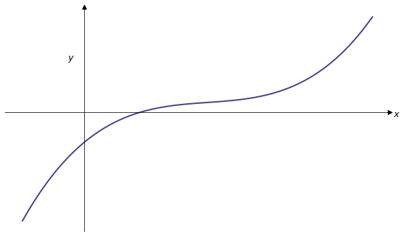
    <!--<div class="text">Caption Text</div>-->
  </div>
  <div class="mySlides2">
    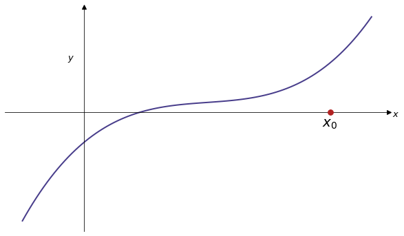
  </div>
  <div class="mySlides2">
    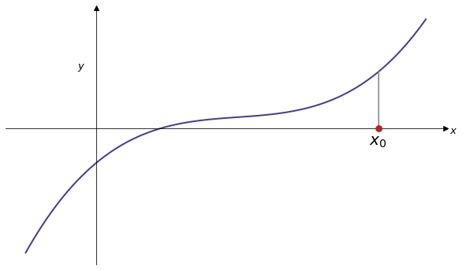
  </div>
  <div class="mySlides2">
    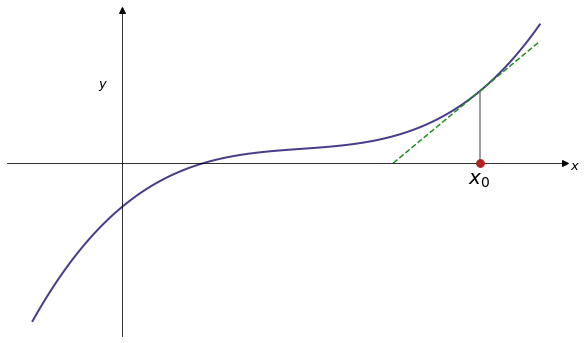
  </div> 
  <div class="mySlides2">
    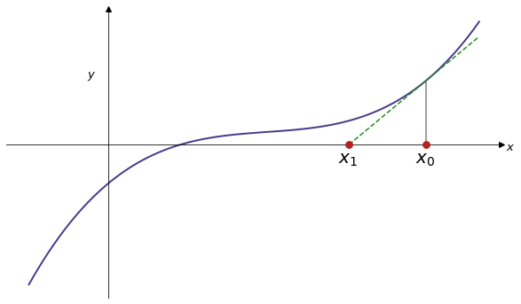
  </div> 
  <div class="mySlides2">
    
  </div> 
  <div class="mySlides2">
    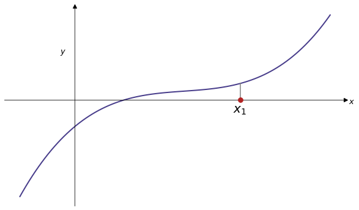
  </div> 
  <div class="mySlides2">
    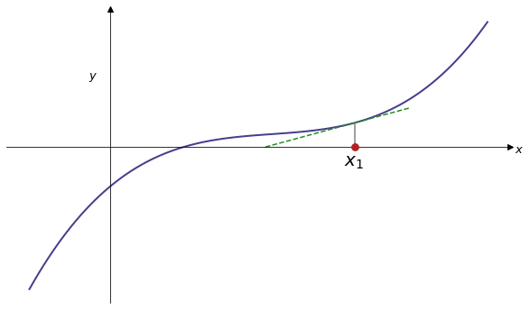
  </div> 
  <div class="mySlides2">
    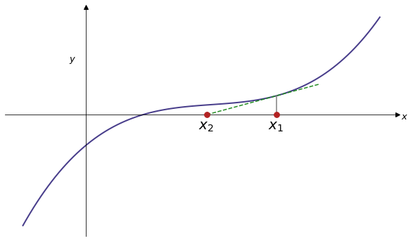
  </div> 
  <div class="mySlides2">
    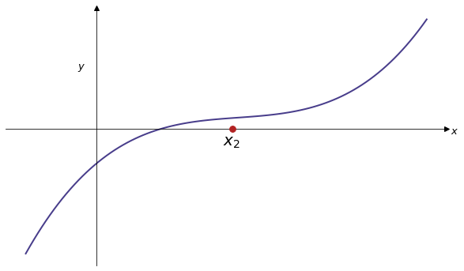
  </div> 
  <div class="mySlides2">
    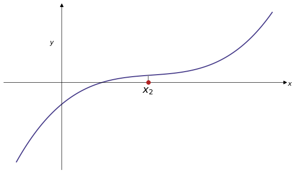
  </div> 
  <div class="mySlides2">
    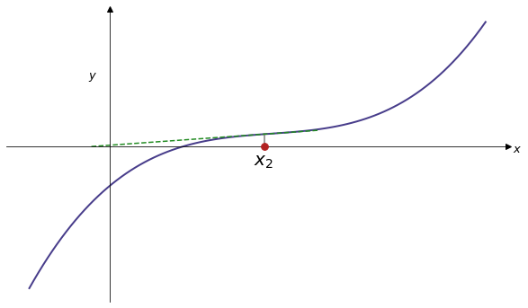
  </div> 
  <div class="mySlides2">
    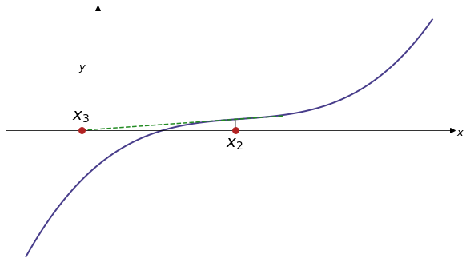
  </div> 
  <div class="mySlides2">
    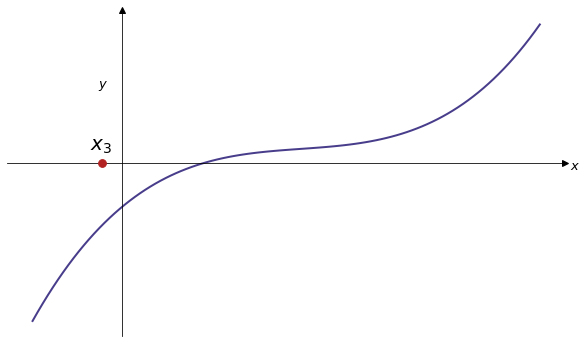
  </div> 
  <div class="mySlides2">
    
  </div> 
  <div class="mySlides2">
    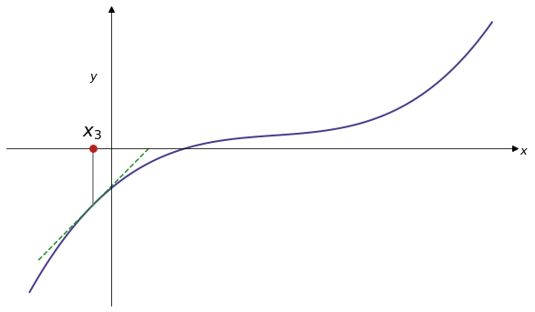
  </div>        
  <div class="mySlides2">
    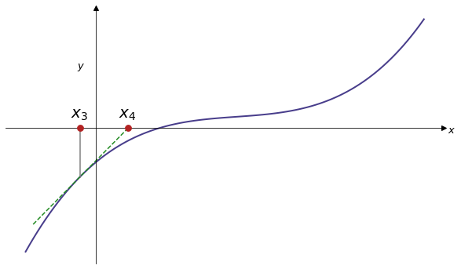
  </div> 
</div>
<br>

<div class="range-slider-container">
  <div class="go-left2" onclick="plusDivs2(-1)">&#10094;</div>
  <input type="range" class="range-slider" id="slider2" min="1" max="18" value="1" step="1">
  <div class="go-right2" onclick="plusDivs2(1)">&#10095;</div>
</div>


<script>
let slideIndex2 = 1;
showSlides2(slideIndex2);

let slider2 = document.getElementById("slider2");

slider2.addEventListener("input", function() {
  showSlides2(parseInt(slider2.value));
});

function plusDivs2(n) {
    showSlides2(slideIndex2 += n);
    slider2.value = parseInt(slider2.value) + n
}

function showSlides2(n) {
  let i;
  let slides = document.getElementsByClassName("mySlides2");
  let slidesnext = document.getElementsByClassName("go-right2")[0];
  let slidesprevious = document.getElementsByClassName("go-left2")[0];

  if (n > slides.length) {slideIndex = 1}    
  if (n < 1) {slideIndex2 = slides.length}
  for (i = 0; i < slides.length; i++) {
    slides[i].style.display = "none";  
  }
  slideIndex2 = n; 
  slides[slideIndex2-1].style.display = "block";  
  slidesnext.style.display = "block";
  slidesprevious.style.display = "block";
  if (n == 1){slidesprevious.style.display = "none";}
  if (n == 18){slidesnext.style.display = "none";}

}
</script>

---

### The Secant method

A secant line, also simply called a secant, is a line passing through two points of a curve. We can use secants to estimate roots as follows:

* Start with two initial guesses $x_0$ and $x_1$. 

* Find the intersection of the secant between $x_0$ and $x_1$ and the $x$ axis.

* Define $x_2$ to be this intersection.

* Find the intersection of the secant between $x_1$ and $x_2$ and the $x$ axis.

* Repeat until the value $x_{n-1} - x_n$ converges sufficiently.

---

<div class="slideshow-container">
  <div class="mySlides">
    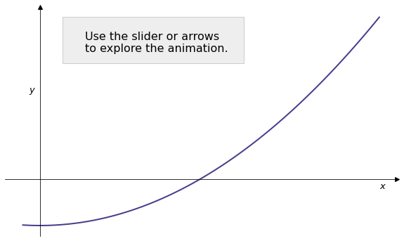
    <!--<div class="text">Caption Text</div>-->
  </div>
  <div class="mySlides">
    
  </div>
  <div class="mySlides">
    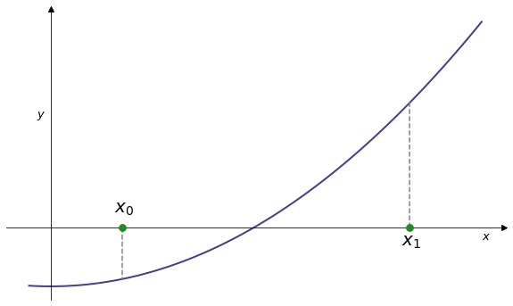
  </div>
  <div class="mySlides">
    
  </div>
  <div class="mySlides">
    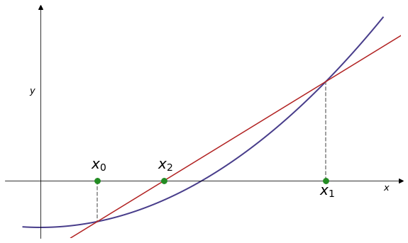
  </div>   
  <div class="mySlides">
    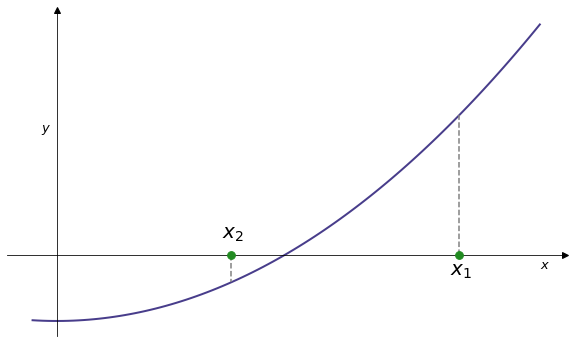
  </div>  
  <div class="mySlides">
    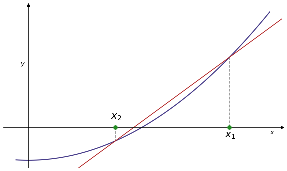
  </div>  
  <div class="mySlides">
    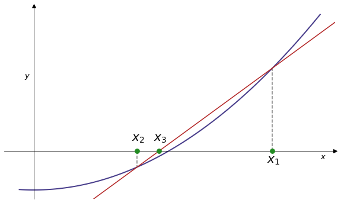
  </div>  
  <div class="mySlides">
    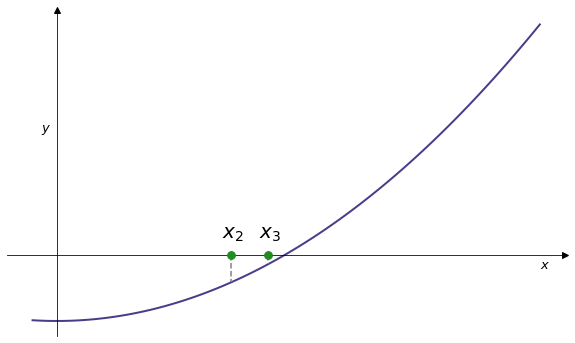
  </div>  
  <div class="mySlides">
    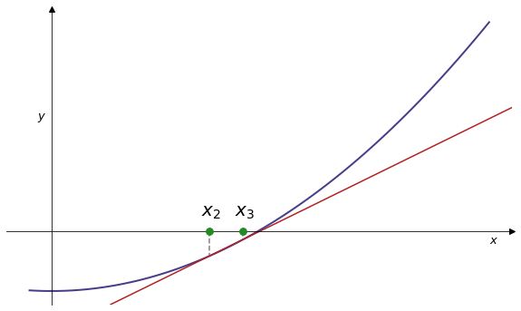
  </div>
  <div class="mySlides">
    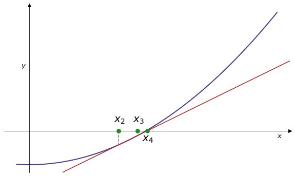
  </div>  
  <div class="mySlides">
    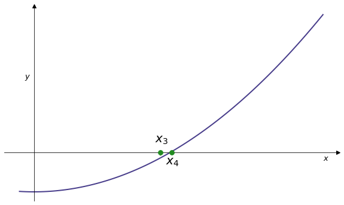
  </div>           
</div>
<br>

<div class="range-slider-container">
  <div class="go-left" onclick="plusDivs(-1)">&#10094;</div>
  <input type="range" class="range-slider" id="slider" min="1" max="12" value="1" step="1">
  <div class="go-right" onclick="plusDivs(1)">&#10095;</div>
</div>


<script>
let slideIndex = 1;
showSlides(slideIndex);

let slider = document.getElementById("slider");

slider.addEventListener("input", function() {
  showSlides(parseInt(slider.value));
});

function plusDivs(n) {
    showSlides(slideIndex += n);
    slider.value = parseInt(slider.value) + n
}

function currentDiv(n) {
  showSlides(slideIndex = n);
}

function showSlides(n) {
  let i;
  let slides = document.getElementsByClassName("mySlides");
  let slidesnext = document.getElementsByClassName("go-right")[0];
  let slidesprevious = document.getElementsByClassName("go-left")[0];

  if (n > slides.length) {slideIndex = 1}    
  if (n < 1) {slideIndex = slides.length}
  for (i = 0; i < slides.length; i++) {
    slides[i].style.display = "none";  
  }
  slideIndex = n; 
  slides[slideIndex-1].style.display = "block";  
  slidesnext.style.display = "block";
  slidesprevious.style.display = "block";
  if (n == 1){slidesprevious.style.display = "none";}
  if (n == 12){slidesnext.style.display = "none";}

}
</script>


---

## Implementing the secant method

By considering the formulae for the secants between $x_{n-1}$ and $x_n$ we obtain the recursive formula

$$ x_{n}=x_{n-1}-f(x_{n-1}){\frac {x_{n-1}-x_{n-2}}{f(x_{n-1})-f(x_{n-2})}} $$

We can use this to implement the secant method in Python.

---

```python
def secant(f,x0,x1,eps):

    n = 0
    
    while abs(x1 - x0) > eps:
        x2 = x1 - f(x1)*(x1-x0)/(f(x1)-f(x0))
        x0, x1 = x1, x2
        n += 1
        
    return x1, n

r,n = secant(lambda x : x**2 - 2, 3, 4, 1e-6)

print("Root found at {} after {} iterations".format(r,n))
```

---

## Comparing root finding methods

We've now seen three root finding methods. It is natural to ask which method is best in various situations:

* Bisection: will always converge for continuous functions $f$.
* Newton-Raphson: generally faster, but requires computation of derivative $f'$.
* Secant: also generally faster than bisection, but is not guaranteed to converge for continuous functions.

---

## NumPy `roots`

The NumPy function `roots` will find roots of **a polynomial**.

E.g. for  $f(x) = x^3 + x^2 + x - 3$ we have

```runnable lang="python"
import numpy as np
p = [1,1,1,-3]
r = np.roots(p)
print(r)
```

---

## SciPy `fsolve`

SciPy provides a function `fsolve`, part of `scipy.optimize`. This will find a root of a function given an initial estimate.

```runnable lang="python"
import scipy.optimize as opt
import numpy as np

def func(x):
    return  np.sin(x)

r = opt.fsolve(func, 3)
print(r)

# Or using a lambda function
# r = opt.fsolve(lambda x: np.sin(x), 3)
```

----

## Newton-Raphson sensitivity

The use of the tangent to find the next estimate means that the Newton-Raphson method is (extremely) sensitive to initial conditions.

This is most apparent for functions with infinitely many roots e.g. $f(x)=\sin(x)$.

---

{width=55%}

```python
r,n=newraph(lambda x:np.sin(x),lambda x:np.cos(x),2.0,1e-8)
print("root found at {} after {} iterations".format(r,n))
```
```output
root found at 3.1415926536808043 after 5 iterations
```

---


{width=55%}

```python
r,n=newraph(lambda x:np.sin(x),lambda x:np.cos(x),1.8,1e-8)
print("root found at {} after {} iterations".format(r,n))
```
```output
root found at 6.283185301417648 after 3 iterations
```

---


{width=55%}

```python
r,n=newraph(lambda x:np.sin(x),lambda x:np.cos(x),1.6,1e-8)
print("root found at {} after {} iterations".format(r,n))
```
```output
root found at 31.41592653589652 after 7 iterations
```

---


{width=55%}

```python
r,n=newraph(lambda x:np.sin(x),lambda x:np.cos(x),1.57,1e-8)
print("root found at {} after {} iterations".format(r,n))
```
```output
root found at -1253.4954687820234 after 4 iterations
```


---

## Basins of attraction


Consider the function

$$ f(z) = z^4 - 1$$


```runnable lang="python"
import numpy as np
p = [1,0,0,0,-1]
r = np.roots(p)
print(r)
```

---

The following diagram shows which root is found by the Newton-Raphson method given starting values $z_0 = a+bi$ with $a$ and $b$ in $[-1,1]$

{width=80%}

---

{width="60%"}

The material sketched in this lecture is covered in greater detail in Handout 5.
