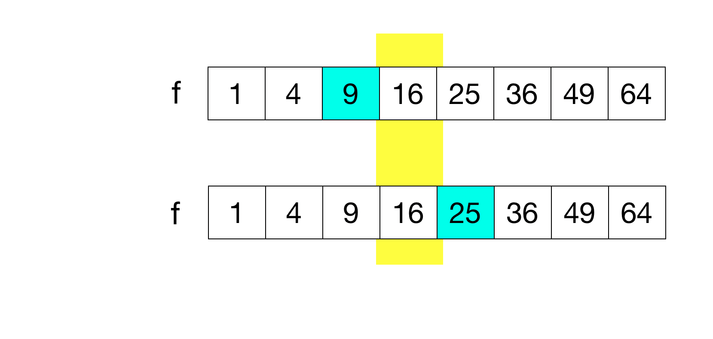
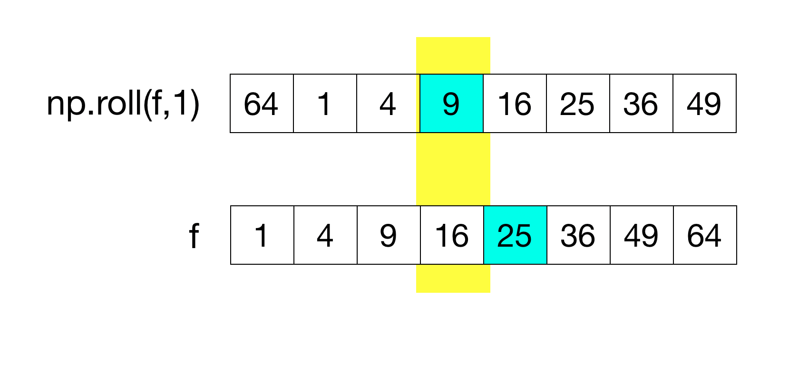
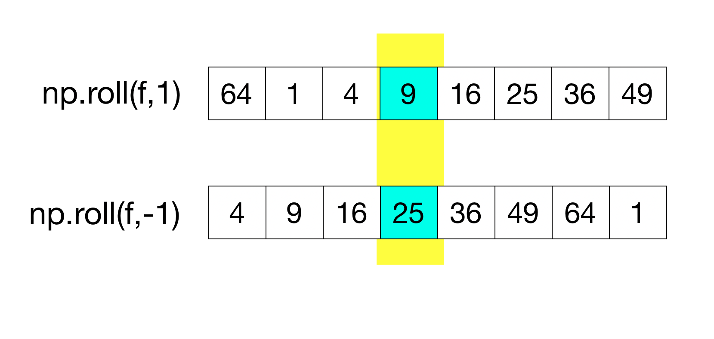
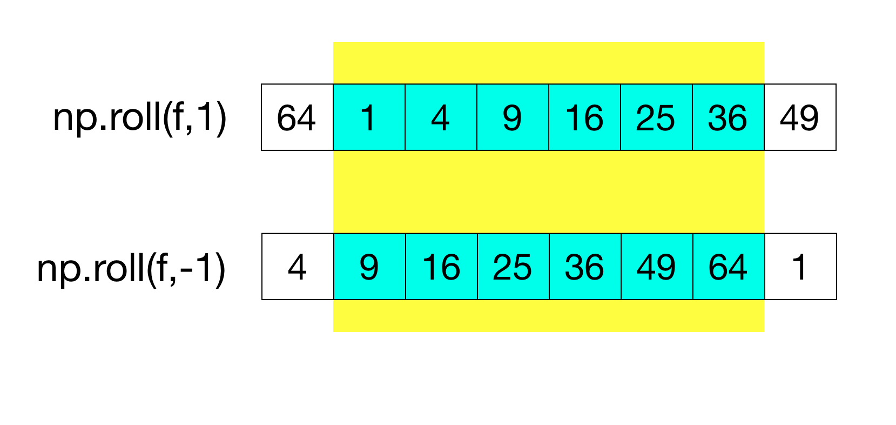

{style="width: 600px;"}

# Lecture 7 - Numerical differentiation and integration

---

## This week

* Using Python to approximate derivatives and integrals, including functions that cannot be handled analytically.
* Extending these methods to multivariable functions.

---

## Assessment 2

* Due on **Wednesday 20th November** at 16:00.
* See Preparing for Assessment 2 page in module Canvas.
* Email me to ask questions or book office hours.

---

## Exam

* Reminder of format of exam
    * In-person, in a campus computer cluster. Two hour duration.
    * Open book: consulting the module Canvas page, your notes, and previous code you have written are all permitted.
    * No communication: discussing the exam with another individual or an AI tool is not permitted.

Mock exams will be posted to the module Canvas page in Week 8.

---

## Numerical differentiation

Suppose we have a finite dataset made up of a values for an independent and a dependent variable, $x_i$ and $y_i$.

We can interpret this dataset as providing a finite list of values of a function i.e. $f(x_i)=y_i$. In other words, we don't know the form of the function $f$ but we do know its value at a finite set of points.

We can use the techniques of *numerical differentation* to estimate the derivative of $f$, just using this dataset.

----

### `gradient`

The NumPy function `gradient` approximates the first derivative of $f$, given the dataset.

```python
import numpy as np
y = [0,1,4,9,16,25]
dydx = np.gradient(y)
```

```
array([1., 2., 4., 6., 8., 9.])
```


* By default `gradient` assumes that the $x_i$ values are separated by $1$ e.g. $x_1 = 0$, $x_2 = 1$, etc.
* This can be changed using a second argument e.g. `np.gradient(y,0.5)`.

---

## Method

* `gradient`, and many other implementations of numerical differentiation, use so-called **finite difference methods**.

* We shall only consider numerical differentiation for single-variable functions $f(x)$, but they extend to multivariable functions and are very widely used.

---

We would like to approximate $f'(x)$, the derivative of a function $f(x)$ at the point $x$. We consider $f(x+h)$ for $h$ small:

{width=60%}

---

### Forward difference method

{width=60%}

$$ f'(x) = \frac{f(x+h)-f(x)}{h} + \mathcal{O}(h) $$

---

### Central difference method

{width=70%}

$$ f'(x) = \frac{f(x+h)-f(x-h)}{2h} + \mathcal{O}(h^2)  $$

---

### Right-sided second-order method

{width=70%}

$$ f'(x_0) = \frac{-3f(x_0)+4f(x_1)-f(x_2)}{2h}  + \mathcal{O}(h^2) $$


----

### Left-sided second-order method

{width=70%}


$$ f'(x_n) = \frac{3f(x_n)-4f(x_{n-1})+f(x_{n-2})}{2h}  + \mathcal{O}(h^2) $$

---

### Python implementation

We'll rely on the NumPy function `roll` to implement the finite difference methods above:

```runnable lang="python"
import numpy as np
x = [1,2,3,4]
print(np.roll(x,1))
```

---

Consider again the central difference method:

$$ f'(x) = \frac{f(x+h)-f(x-h)}{2h} + \mathcal{O}(h^2)  $$

Suppose that we have the independent variables in an array `x` and the dependent variables in an array `f`. To calculate the above approximation we might try to use elementwise arithmetic.

However, this will not work as the values $f(x+h)$ and $f(x-h)$ have different indices in the array `f`.

---

<div class="slideshow-container">
  <div class="mySlides">
    
  </div>  
  <div class="mySlides">
    
  </div>  
  <div class="mySlides">
    
  </div>  
  <div class="mySlides">
    
  </div>           
</div>
<br>

<div class="range-slider-container">
  <div class="go-left" onclick="plusDivs(-1)">&#10094;</div>
  <input type="range" class="range-slider" id="slider" min="1" max="4" value="1" step="1">
  <div class="go-right" onclick="plusDivs(1)">&#10095;</div>
</div>


<script>
let slideIndex = 1;
showSlides(slideIndex);

let slider = document.getElementById("slider");

slider.addEventListener("input", function() {
  showSlides(parseInt(slider.value));
});

function plusDivs(n) {
    showSlides(slideIndex += n);
    slider.value = parseInt(slider.value) + n
}

function currentDiv(n) {
  showSlides(slideIndex = n);
}

function showSlides(n) {
  let i;
  let slides = document.getElementsByClassName("mySlides");
  let slidesnext = document.getElementsByClassName("go-right")[0];
  let slidesprevious = document.getElementsByClassName("go-left")[0];

  if (n > slides.length) {slideIndex = 1}    
  if (n < 1) {slideIndex = slides.length}
  for (i = 0; i < slides.length; i++) {
    slides[i].style.display = "none";  
  }
  slideIndex = n; 
  slides[slideIndex-1].style.display = "block";  
  slidesnext.style.display = "block";
  slidesprevious.style.display = "block";
  if (n == 1){slidesprevious.style.display = "none";}
  if (n == 4){slidesnext.style.display = "none";}

}
</script>

---

## Numerical integration

When presented with a function $f(x)$ it can often be very difficult, or (provably) impossible, to compute its integral.

E.g. the integral of $e^{-x^2}$ cannot be expressed in terms of polynomials, trigonometric functions, logarithms, or exponentials.

It's very common in scientific or industry settings to encounter functions like this: we handle these situations by using Python to approximate the integrals, rather than computing them exactly.

We might also wish to approximate the integral of a function given only a finite set of data points (as in the case of numerical differentiation above).

---

### `quad` 

The SciPy function `quad` approximates a given function numerically. E.g.

$$ \int_0^{2\pi} \frac{\sin(x)}{x} \mathrm{d}x $$

```python
import numpy as np
from scipy import integrate
def myfunc(x):
   return np.sin(x)/x;
myint = integrate.quad(myfunc,0,2*np.pi)
```

```
(1.4181515761326284, 2.5246396982818194e-14)
```

---

###  `trapezoid`

The SciPy function `trapezoid` approximates the integral of a function given by a set of data points (i.e. its exact form is not known) using the trapezoid method.

```python
from scipy import integrate

x = [1,2.5,7,10,25]
y = [0.3,0.6,2.2,8.3,100]

myint = integrate.trapezoid(y,x)
```

* `trapezoid` can cope with non-uniform separation of points (unlike `gradient`).
* `trapz` in older versions of SciPy.

---

## Method

{width=70%}

$$ \int _{a}^{b}f(x)\,dx\approx (b-a){\tfrac {1}{2}}(f(a)+f(b)) $$

---

{width="60%"}

The material sketched in this lecture is covered in greater detail in Handout 7.


