{style="width: 600px;"}

<h1 style="text-align: center;">Lecture 9 - Differential equations II</h1>

---

## Announcements

* [Preparation advice for the January exam](https://ncl.instructure.com/courses/59162/pages/preparing-for-the-mas2806-phy2039-exam) has been posted to the module Canvas page.
* Includes mock exams; please email me with any particular questions from these papers you'd like to go through in Week 11.

---

## Recap: `odeint`

```python
import numpy as np
import matplotlib.pyplot as plt 
from scipy.integrate import odeint

# Function for the RHS
def rhs(y,t):
    return -y/2

t = np.linspace(0,5,100)     # t values to solve over
y0 = 5                       # initial value

y = odeint(rhs,y0,t)         # solve with odeint

plt.plot(t,y)                # plot
```

----

## The Lorenz equations

The following system of first-order ODEs models atmospheric convection

\begin{align}
\frac{dx}{dt} &= \sigma(y - x) \\
\frac{dy}{dt} &= x(\rho - z) - y \\
\frac{dz}{dt} &= xy - \beta z \\
\end{align}

The variables $x(t)$, $y(t)$, $z(t)$ are certain properties of an atmospheric layer that evolve as it is heated from below and cooled from above, and $\sigma$, $\rho$, $\beta$ are constants.

---

```python
def lorenz(v, t, sigma, rho, beta):
    x, y, z = v
    dxdt = sigma * (y - x)
    dydt = x * (rho - z) - y
    dzdt = x * y - beta * z
    return [dxdt, dydt, dzdt]
```

---

```python
# Parameters
sigma = 10
rho = 28
beta = 8/3

# Initial values and t array
v0 = [1,0,0]
t = np.linspace(0, 50, 10000)

v = odeint(lorenz, v0, t, args=(sigma, rho, beta))
```

---


---

{style="width: 49%} {style="width: 49%}

---

## Numerical methods to solve differential equations

We will investigate the following numerical methods for solving ODEs

* The Euler method
* The Runge-Kutta (rk4) method

---

### The Euler method

Recall the ODE considered in Week 8

$$ y'(t)=-\frac{y(t)}{2}, \quad y(0)=5 $$

---


<div class="slideshow-container">
  <div class="mySlides2">
    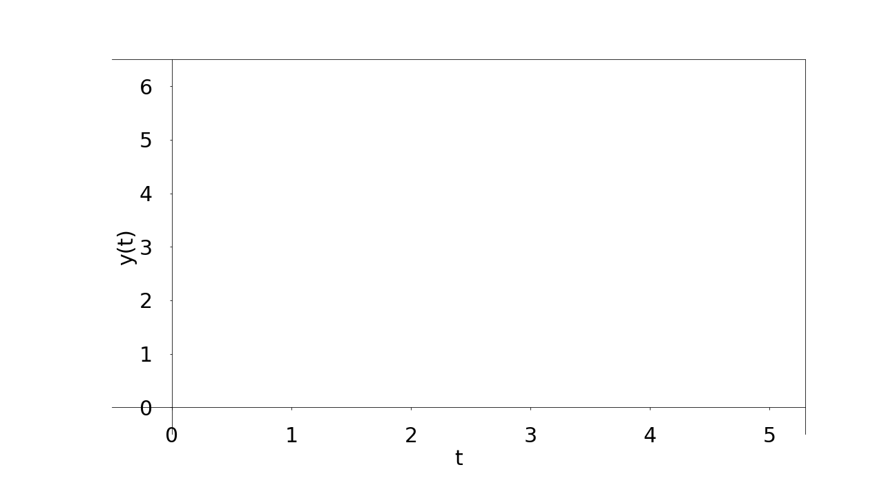
    <p>Aim:</p>
  </div>
  <div class="mySlides2">
    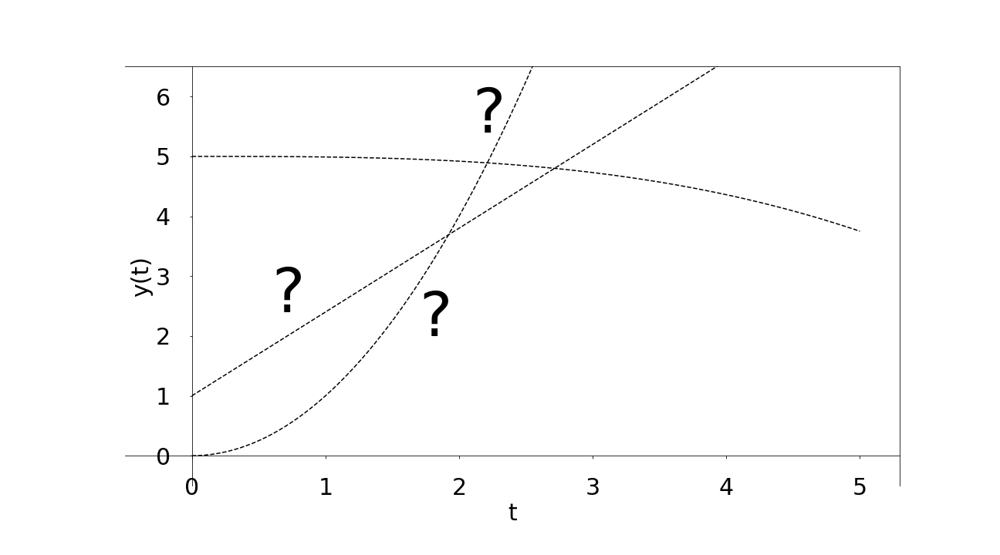
    <p>Approximate the solution y(t)</p>
  </div>
  <div class="mySlides2">
    
    <p>We are given the following:</p>
  </div>   
  <div class="mySlides2" markdown=true>
    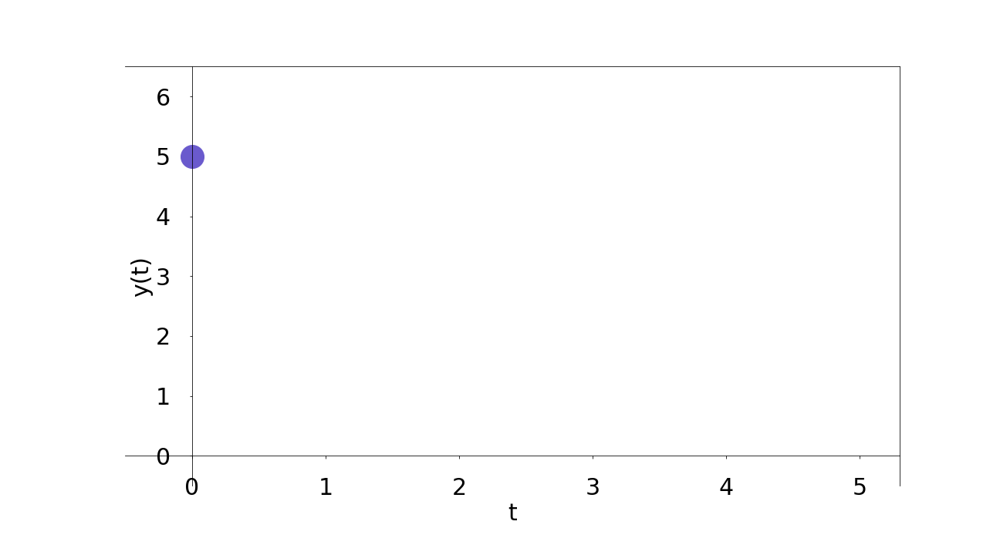
    <p>y(0)=5</p>
  </div> 
  <div class="mySlides2" markdown=true>
    
    <p>y'(0)=-2.5</p>
  </div>     
  <div class="mySlides2">
    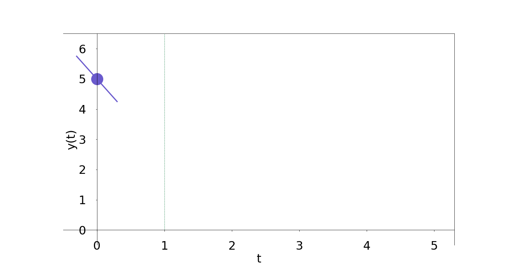
    <p>Use this to estimate y(1)</p>
  </div> 
  <div class="mySlides2">
    
    <p>Set y(1) = 5 -(2.5)h, for h the *step size*</p>
  </div>  
  <div class="mySlides2">
    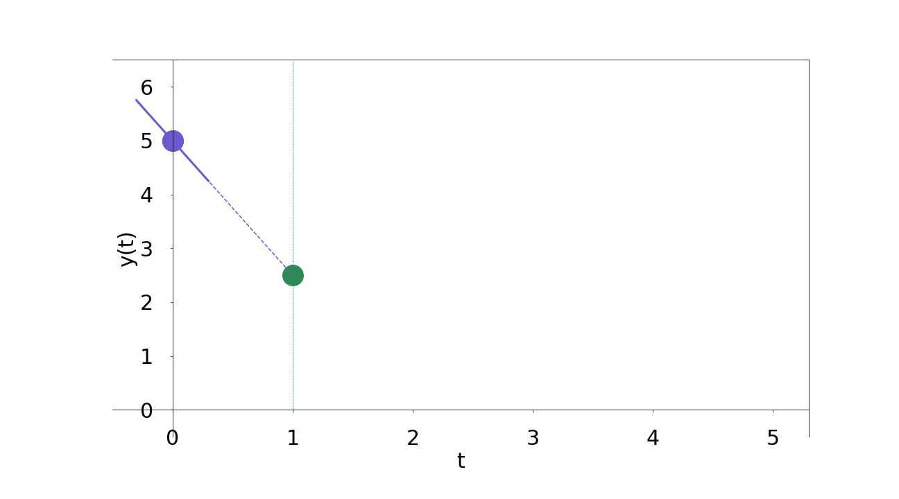
    <p>Pick h=1, then y(1) = 2.5</p>
  </div>
  <div class="mySlides2">
    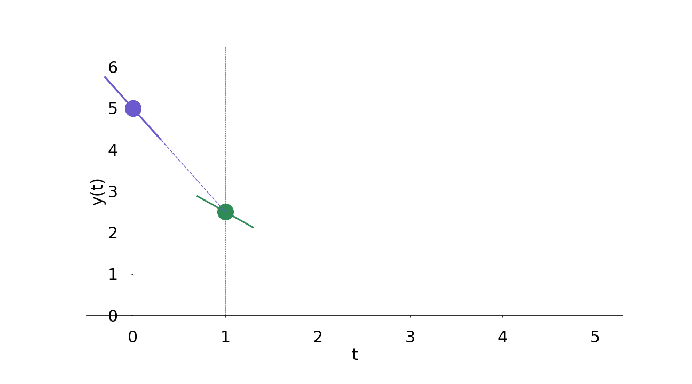
    <p>y'(2.5)=-1.25</p>
  </div> 
  <div class="mySlides2">
    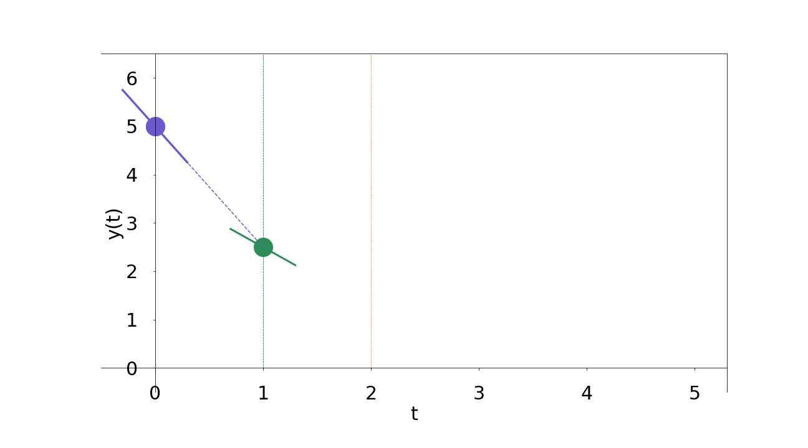
    <p>Etc</p>
  </div>   
  <div class="mySlides2">
    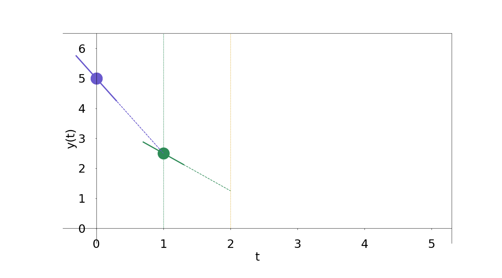
    <p>Etc</p>
  </div>   
  <div class="mySlides2">
    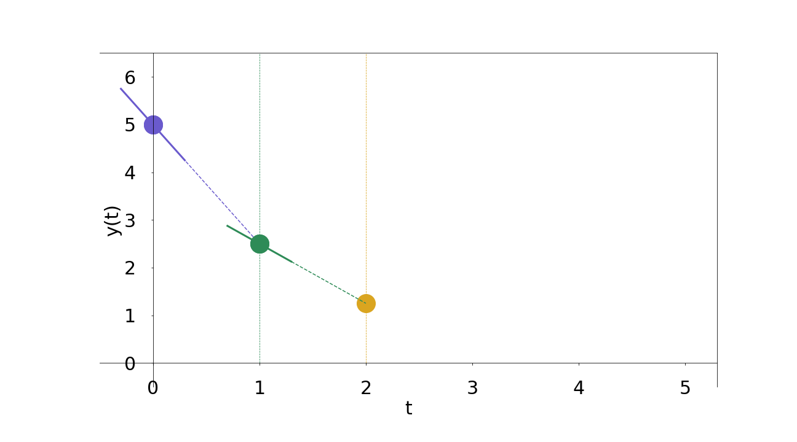
    <p>Etc</p>
  </div>   
  <div class="mySlides2">
    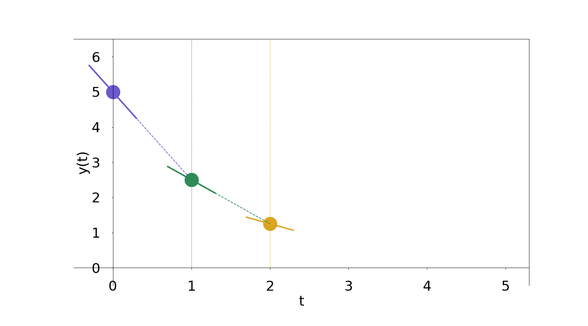
    <p>Etc</p>
  </div>   
  <div class="mySlides2">
    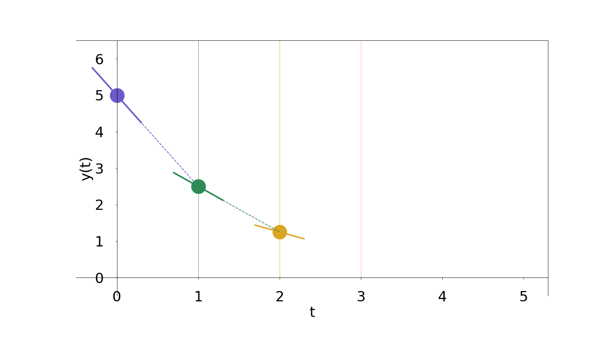
    <p>Etc</p>
  </div>   
  <div class="mySlides2">
    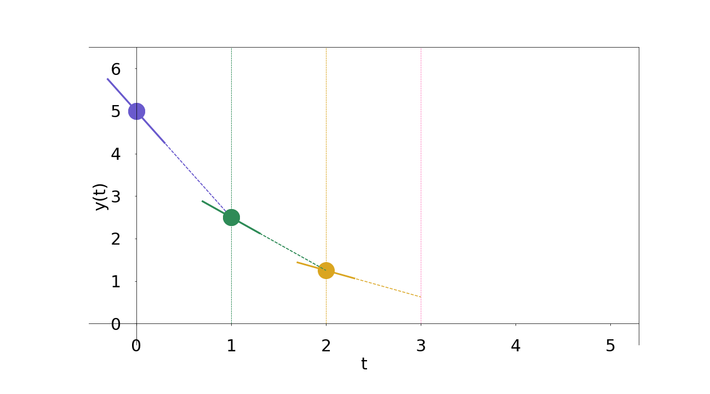
    <p>Etc</p>
  </div>   
  <div class="mySlides2">
    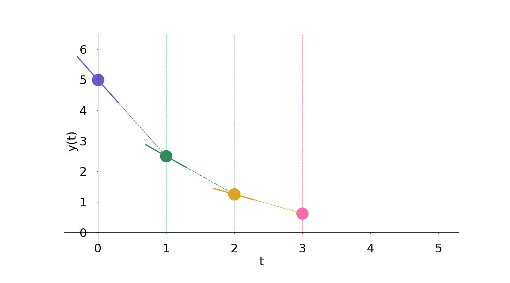
    <p>Etc</p>
  </div>   
  <div class="mySlides2">
    
    <p>Etc</p>
  </div>   
  <div class="mySlides2">
    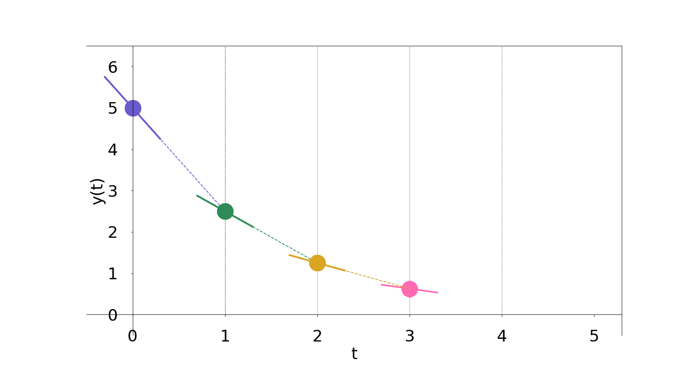
    <p>Etc</p>
  </div>   
  <div class="mySlides2">
    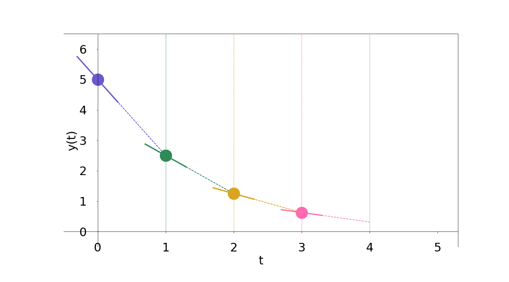
    <p>Etc</p>
  </div>   
  <div class="mySlides2">
    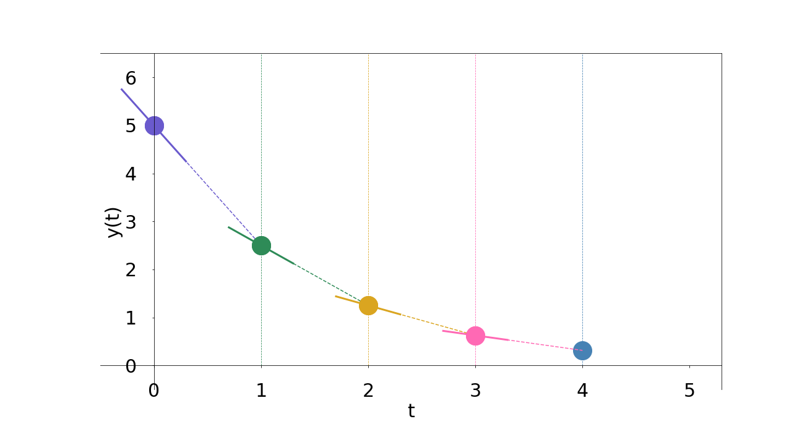
    <p>Etc</p>
  </div>   
  <div class="mySlides2">
    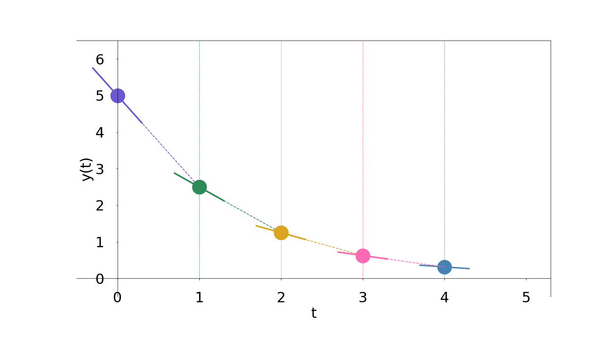
    <p>Etc</p>
  </div>
</div>

<div class="range-slider-container">
  <div class="go-left2" onclick="plusDivs2(-1)">&#10094;</div>
  <input type="range" class="range-slider" id="slider2" min="1" max="19" value="1" step="1">
  <div class="go-right2" onclick="plusDivs2(1)">&#10095;</div>
</div>


<script>
let slideIndex2 = 1;
showSlides2(slideIndex2);

let slider2 = document.getElementById("slider2");

slider2.addEventListener("input", function() {
  showSlides2(parseInt(slider2.value));
});

function plusDivs2(n) {
    showSlides2(slideIndex2 += n);
    slider2.value = parseInt(slider2.value) + n
}

function showSlides2(n) {
  let i;
  let slides = document.getElementsByClassName("mySlides2");
  let slidesnext = document.getElementsByClassName("go-right2")[0];
  let slidesprevious = document.getElementsByClassName("go-left2")[0];

  if (n > slides.length) {slideIndex = 1}    
  if (n < 1) {slideIndex2 = slides.length}
  for (i = 0; i < slides.length; i++) {
    slides[i].style.display = "none";  
  }
  slideIndex2 = n; 
  slides[slideIndex2-1].style.display = "block";  
  slidesnext.style.display = "block";
  slidesprevious.style.display = "block";
  if (n == 1){slidesprevious.style.display = "none";}
  if (n == 19){slidesnext.style.display = "none";}

}
</script>


---

{style="margin: 0; width: 80%;"}

----

The general formula to numerically solve a first-order ODE

$$ \frac{dy}{dt}= f(y,t) $$

via the Euler method is

$$ \displaystyle y_{n+1} = y_{n} + h f(y_n,t_n) $$


---

The accuracy of the numerical solution depends heavily on the step size $h$:

---

$h = 1$

{style="margin: 0; width: 80%;"}

---

$h = 0.5$

{style="margin: 0; width: 80%;"}

---

$h = 0.25$

{style="margin: 0; width: 80%;"}

---

{style="margin: 0; width: 80%;"}

---

### Errors and stability

Errors are a fact of life when applying methods such as this in real-world settings: they will always occur, and we need to live with them rather then trying to avoid them.

To do so we will investigate errors in the Euler method in more detail, separating them into two familes: *local truncation error*, introduced in a single iteration, and *global truncation error*, that appears over the course of the whole process.

We shall also identify values of $h$ at which the Euler method is *unstable* i.e. it yields numerical solutions that are not mathematically meaningful.


----

### Logistic equation

Let's apply the Euler Method to the *logistic equation*

$$ x' =r x (1-x)$$

where $x(t)$ depends on $t$, $x(0) \in [0,1]$, and $r$ is a constant.

---

{width=80%}


---

## Runge-Kutta methods

The classical Runge-Kutta method (a.k.a. RK4) numerically solves the ODE

\[ \frac{dy}{dt}=f(t,y)\] 

by setting $y(0) = y_0$ and applying the iterative formula

\[ y_{n+1}=y_{n}+\frac{1}{6}h\left(k_1+2k_2+2k_3+k_4\right) \]

---

where $h$ is the step size and

\[
\begin{align}
k_1 &= f(t_n,y_n) \\[0.7em]
k_2 &= f\left(t_n+\frac{h}{2},y_n+h\frac{k_1}{2}\right) \\[0.7em]
k_3 &= f\left(t_n+\frac{h}{2},y_n+h\frac{k_2}{2}\right) \\[0.7em]
k_4 &= f\left(t_n+h,y_n+hk_3\right)
\end{align}
\]

---

{width=100%}


---

{width=80%}

---

{width="60%"}

The material sketched in this lecture is covered in greater detail in Handout 9.


